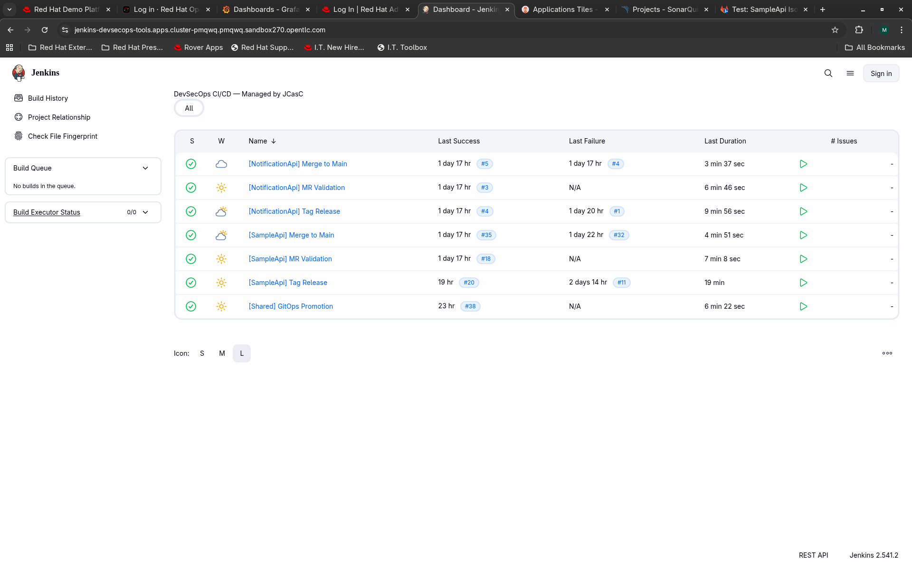
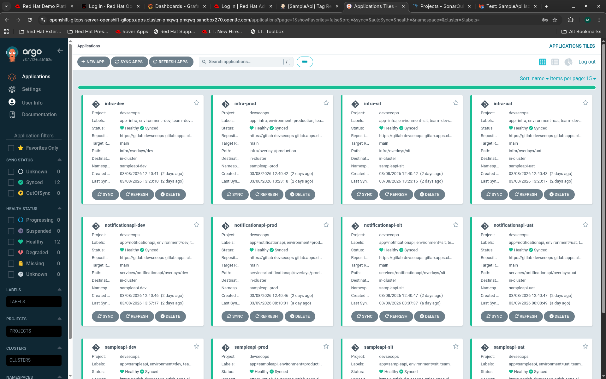
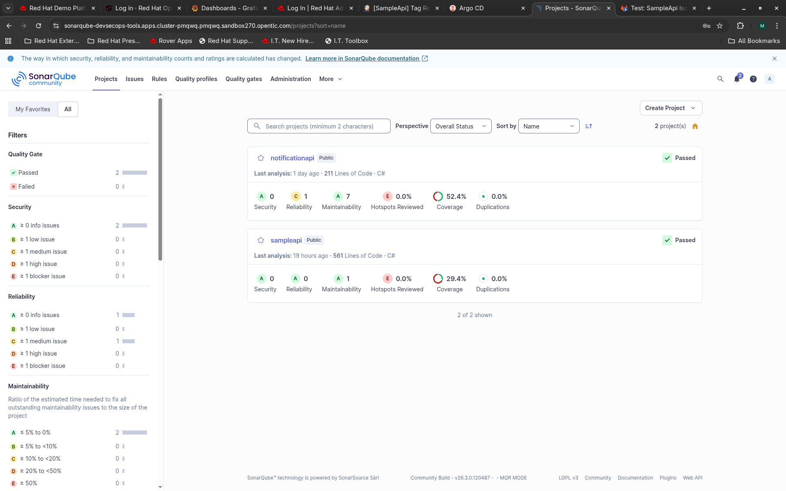
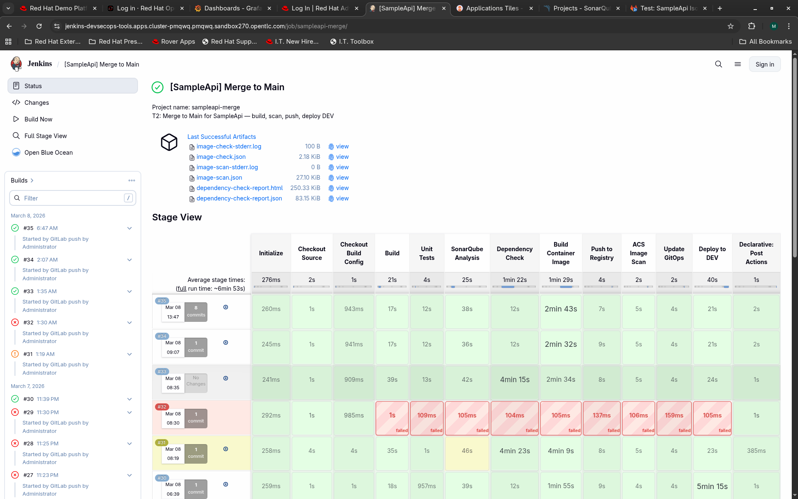
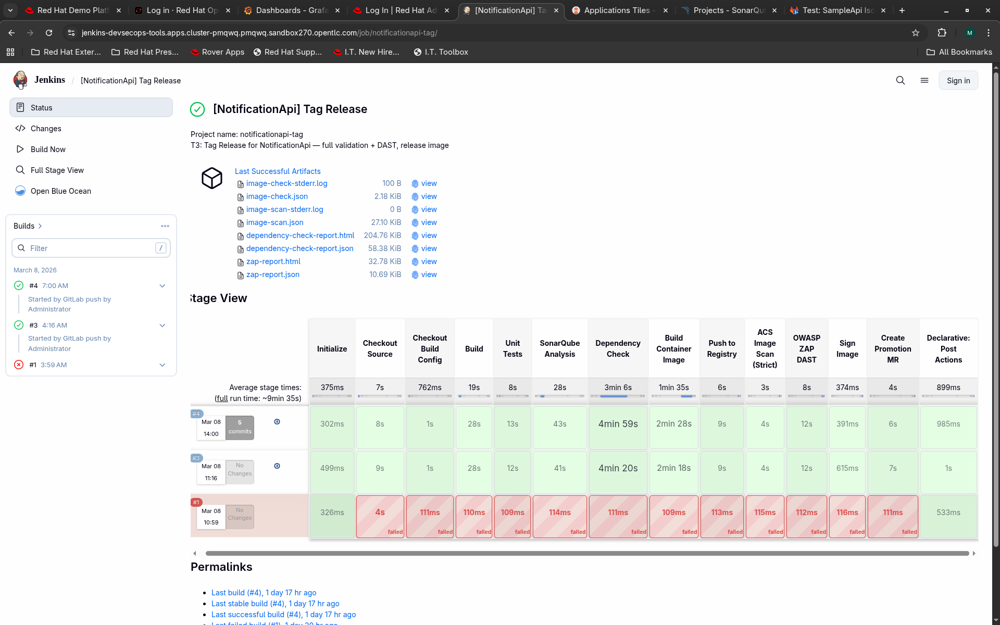
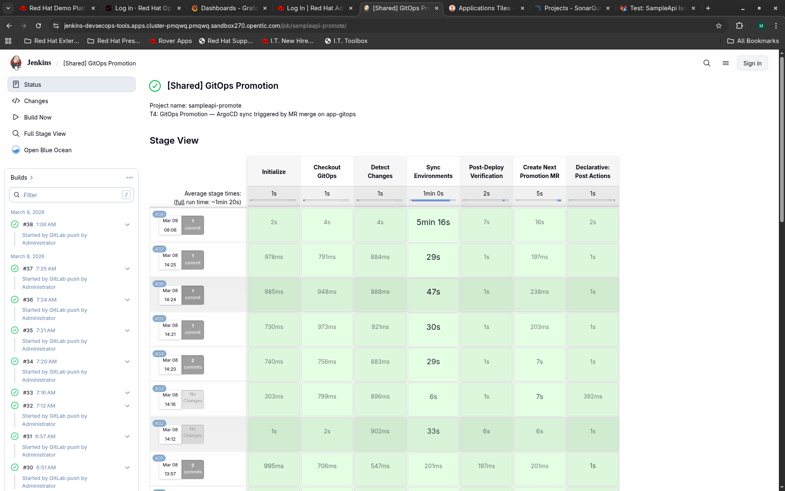
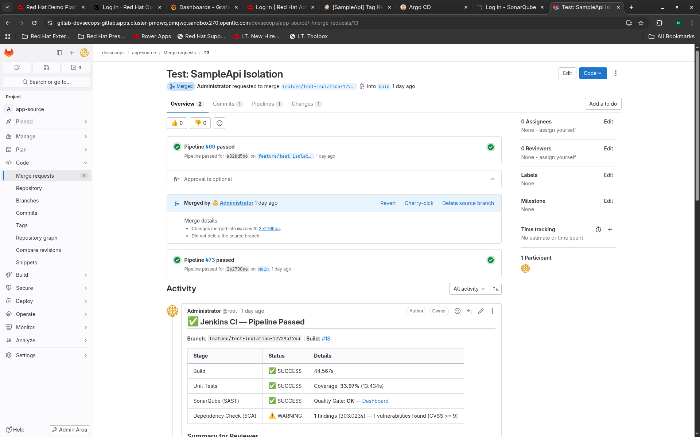
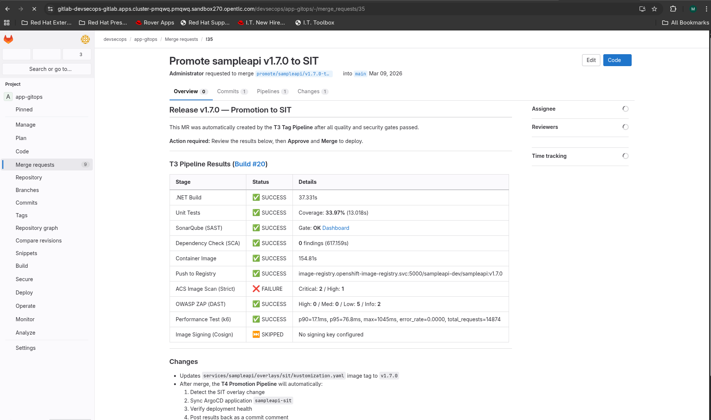
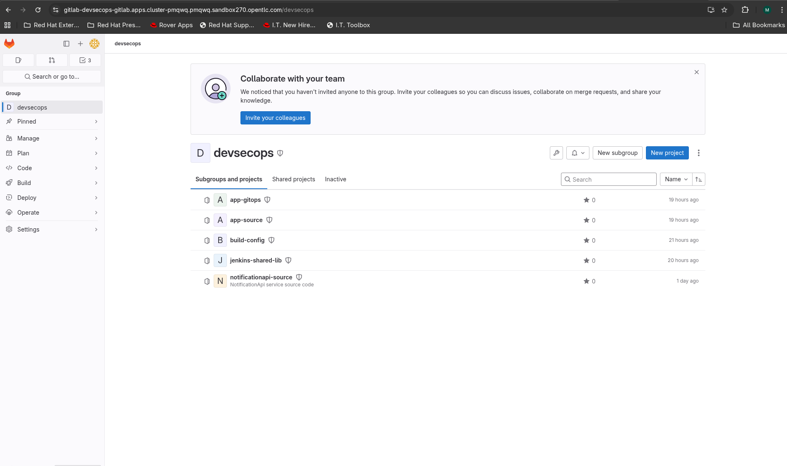

# DevSecOps on OpenShift -- Production-Grade CI/CD Platform

Production-grade DevSecOps CI/CD for .NET 8 and Java (Spring Boot) microservices on
Red Hat OpenShift 4.x. Trunk-Based Development with 3+1 pipeline triggers, GitOps
promotion across 4 environments (DEV / SIT / UAT / PROD), full observability stack
(logging, monitoring, tracing), and supply chain security (SBOM, image signing, verification).

**5 microservices (2 .NET + 3 Java) -- all deployed and verified end-to-end across 4 environments.**

---

## Architecture Overview

In production, these are 5 separate GitLab repositories. This GitHub repo consolidates
them for reference:

| Directory | GitLab Repo | Purpose |
|-----------|-------------|---------|
| `services/sampleapi/` | app-source | .NET 8 primary API (EF Core + Redis + health checks) |
| `services/notificationapi/` | notificationapi-source | .NET 8 internal microservice (POST /api/Notify) |
| `services/order-service/` | order-service | Java Spring Boot -- order management (calls inventory + payment) |
| `services/inventory-service/` | inventory-service | Java Spring Boot -- stock tracking and product catalog |
| `services/payment-service/` | payment-service | Java Spring Boot -- payment processing with fraud check |
| `build-config/` | build-config | Dockerfile (.NET), Dockerfile.java, sonar config, ZAP, k6 perf tests |
| `jenkins-shared-lib/` | jenkins-shared-lib | Pipeline logic: 29 vars/ functions including 4 orchestrators (T1/T2/T3/T4) |
| `app-gitops/` | app-gitops | Kustomize base + per-env overlays, 28 ArgoCD Application CRDs |

```
  Pipeline Triggers (Trunk-Based Development)
  +--------+-------------------+------------------------------------------------------+
  | T1: MR | MR opened/updated | Unit test + SAST + SCA --> report pass/fail to MR    |
  | T2:    | MR merged to main | Same + build image + ACS scan + deploy to DEV        |
  | T3:    | Version tag push  | Same + DAST + perf test + release image (NO deploy)  |
  | T4:    | GitOps MR merged  | Detect service+env changed --> sync ArgoCD --> next  |
  +--------+-------------------+------------------------------------------------------+

  Promotion Flow
  DEV (auto) --> SIT (Team Lead MR) --> UAT (QA Lead MR) --> PROD (CAB MR)
```

```
  Application Architecture

  sampleapi-{env} namespace                    javaapp-{env} namespace
  +--------------------------------------+     +--------------------------------------+
  |  +-------------+  +----------------+ |     |  +--------------+  +--------------+  |
  |  | SampleApi   |->| NotificationApi| |     |  | OrderService |->|InventoryServ.|  |
  |  | (.NET 8)    |  | (.NET 8)       | |     |  | (Java 21)    |  | (Java 21)    |  |
  |  | Port 8080   |  | Port 8081      | |     |  | Port 8080    |  | Port 8081    |  |
  |  +------+------+  +-------+--------+ |     |  +------+-------+  +--------------+  |
  |         |                  |          |     |         |                             |
  |  +------+------+  +-------+--------+ |     |  +------+-------+  +--------------+  |
  |  | PostgreSQL  |  | Redis 7        | |     |  |PaymentService|  | PostgreSQL   |  |
  |  | 16          |  | (StatefulSet)  | |     |  | (Java 21)    |  | 16 + Redis 7 |  |
  |  +-------------+  +---------------+ |     |  | Port 8082    |  |              |  |
  +--------------------------------------+     |  +--------------+  +--------------+  |
                                               +--------------------------------------+
```

---

## Platform Stack

| Category | Tool | Purpose |
|----------|------|---------|
| **Platform** | OpenShift 4.x | Container platform (3 master + 3 worker) |
| **CI** | Jenkins + Shared Library | Pipeline orchestration, 16 jobs, inline CPS |
| **Source** | GitLab CE | 8 repositories, merge requests, webhooks |
| **CD** | ArgoCD (OpenShift GitOps) | 28 Applications, auto-sync DEV, manual others |
| **SAST** | SonarQube CE v26 | Code quality gates (.NET + Java) |
| **SCA** | OWASP Dependency-Check | Dependency CVE scanning |
| **DAST** | OWASP ZAP | Dynamic security testing (T3 sidecar) |
| **Image Security** | ACS / StackRox | Image scan, admission control, runtime |
| **Registry** | OCP Internal Registry | Image storage, cross-namespace pull |
| **Build** | Podman | Rootless container builds |
| **SBOM** | CycloneDX + Trustify | SBOM generation, upload to RHTPA, vulnerability gate |
| **Signing** | Cosign + RHTAS | Keyless image signing (Fulcio/Rekor) + SBOM attestation |
| **Logging** | LokiStack + Vector | Centralized logs, LogQL queries |
| **Monitoring** | Prometheus + Alertmanager | Metrics, SLO burn-rate alerting |
| **Dashboards** | Grafana Operator v5 | 7 dashboards (app, pipeline, SLO, logs, infrastructure, traces, k6) |
| **Tracing** | Tempo + OpenTelemetry | Distributed tracing, auto-instrumentation |
| **Perf Testing** | k6 | Load testing as pipeline quality gate |

---

## Screenshots

| Jenkins 7 Jobs | ArgoCD 12 Apps | SonarQube |
|:-:|:-:|:-:|
|  |  |  |

| SampleApi T2 Pipeline | NotificationApi Tag Pipeline | GitOps Promotion |
|:-:|:-:|:-:|
|  |  |  |

| GitLab MR Pipeline | Promotion MR Detail | GitLab 5 Repos |
|:-:|:-:|:-:|
|  |  |  |

---

## Repository Structure

```
devsecops-project/
  app-gitops/            GitOps manifests (Kustomize + 28 ArgoCD Application CRDs)
    services/sampleapi/    Per-service base + overlays (dev/sit/uat/production)
    services/notificationapi/
    services/order-service/
    services/inventory-service/
    services/payment-service/
    infra/                 Shared .NET infra (PostgreSQL, Redis, ServiceAccount)
    infra-javaapp/         Shared Java infra (PostgreSQL, Redis, ServiceAccount)
    argocd/                28 Application CRDs (5 services + 2 infra x 4 envs)

  build-config/          Build & scan configurations
    Dockerfile             Parameterized multi-stage .NET 8 build
    Dockerfile.java        Multi-stage Java 21 / Maven build
    sonar-project.properties
    tests/performance/     k6 load test scripts (load, stress, soak, multi-service)

  jenkins-shared-lib/    ALL pipeline logic (no Jenkinsfiles in app repos)
    vars/                  25 pipeline functions + 4 orchestrators (29 total)
    src/                   PipelineConfig, SecurityGate, ImageTagger classes

  services/              Application source code (2 .NET + 3 Java)
    sampleapi/             .NET 8 Web API (EF Core + Redis + NotificationClient)
    notificationapi/       .NET 8 internal microservice (POST /api/Notify)
    order-service/         Java 21 Spring Boot (orders, calls inventory + payment)
    inventory-service/     Java 21 Spring Boot (stock tracking, product catalog)
    payment-service/       Java 21 Spring Boot (payments, fraud check)

  infra/                 Infrastructure manifests (phases 1-24)
    phase1/                Namespaces, RBAC, NetworkPolicies, quotas
    phase2/                GitLab CE
    phase3/                SonarQube CE
    phase4/                Registry configuration (pull secrets, image-pusher RBAC)
    phase5/                ACS / StackRox
    phase6/                ArgoCD (OpenShift GitOps)
    phase7/                Jenkins + custom agent image
    phase12/               Jenkins job definitions, webhook setup
    phase13/               Security policies (ACS, SonarQube, gitleaks)
    phase14/               Basic monitoring enablement
    phase15/               Execution runbook and validation scripts
    phase17/               Multi-service NetworkPolicies
    phase19/               Logging (LokiStack, Vector, ClusterLogForwarder)
    phase20/               Monitoring (ServiceMonitor, PrometheusRule, AlertmanagerConfig)
    phase21/               Grafana dashboards (Operator v5, datasources, 5 dashboards)
    phase22/               Distributed tracing (Tempo, OTel Collector, auto-instrumentation)
    phase23/               Performance testing (k6 pipeline integration, 1 dashboard)
    phase24/               Production hardening (chaos tests, backups, compliance)

  docs/                  Documentation & tutorials
    tutorial/              23-module hands-on learning path (~30 hours, 6 tracks)
    screenshot/            23 screenshots from live cluster
    ARCHITECTURE.md        Platform architecture
    INFRASTRUCTURE.md      Every deployed component
```

---

## Tutorial

23 modules organized into 6 tracks (~30 hours total). Each module follows
**Tell -- Show -- Do -- Verify** pedagogy.

| Track | Modules | Duration | Topics |
|-------|---------|----------|--------|
| **Foundation** | 1-4 (incl. 2B) | ~6h | OpenShift fundamentals, containers, GitLab, Jenkins, ArgoCD |
| **Security** | 5-7 | ~4h | SAST (SonarQube), container security (ACS), DAST (ZAP) |
| **Integration** | 8-10 (incl. 9B) | ~5h15m | 3-trigger pipeline, per-env config, multi-service, E2E |
| **Observability** | 11-13 | ~4h15m | LokiStack logging, Prometheus alerting, Grafana + tracing |
| **Advanced** | 14-15 | ~3h | k6 performance testing, production hardening |
| **Supply Chain & Multi-Language** | 16-20 (incl. 16B) | ~8h | Java microservices, distributed tracing, SBOM + Trustify, image signing (RHTAS), T4 promotion, 5-service E2E |

See [docs/tutorial/README.md](docs/tutorial/README.md) for the full curriculum.

---

## Supply Chain Security

```
  Pipeline Supply Chain Stages (T3)
  +--------+------------------------+--------------------------------------------+
  | Stage  | Tool                   | What it does                               |
  +--------+------------------------+--------------------------------------------+
  | SBOM   | CycloneDX + Trustify   | Generate SBOM, upload to RHTPA, gate on    |
  |        |                        | critical/high vulnerabilities               |
  | Sign   | Cosign + RHTAS         | Keyless signing via Fulcio/Rekor, SBOM     |
  |        |                        | attestation, transparency log entry        |
  | Verify | cosign verify          | Verify signature + attestation at pull     |
  +--------+------------------------+--------------------------------------------+
```

---

## Key Design Decisions

- **App repo stays clean** -- zero CI/CD files in application repositories
- **Language-aware pipelines** -- `PipelineConfig.activeLanguage` drives dotnet/java build, test, and scan stages
- **Dual Dockerfiles** -- `Dockerfile` for .NET 8, `Dockerfile.java` for Java 21 / Maven
- **Per-service GitOps isolation** -- each service has own ConfigMap, Secret, ArgoCD app, image tag
- **Service-parameterized pipelines** -- `pipelineMerge(service: 'order-service')` reuses all logic
- **Auto-instrumentation for tracing** -- OTel Operator for .NET, OTel Java agent baked into image
- **SLO-based alerting** -- multi-window burn-rate alerts instead of threshold-based
- **Supply chain security** -- CycloneDX SBOM + Trustify vulnerability analysis + RHTAS keyless signing

---

## Documentation

| Document | Description |
|----------|-------------|
| [docs/ARCHITECTURE.md](docs/ARCHITECTURE.md) | Platform architecture, component diagrams, data flows |
| [docs/INFRASTRUCTURE.md](docs/INFRASTRUCTURE.md) | Every component: name, version, namespace, URL, access |
| [docs/tutorial/README.md](docs/tutorial/README.md) | Tutorial curriculum and module index (23 modules, 6 tracks) |

---

## License

This project is for educational and sharing purposes.
