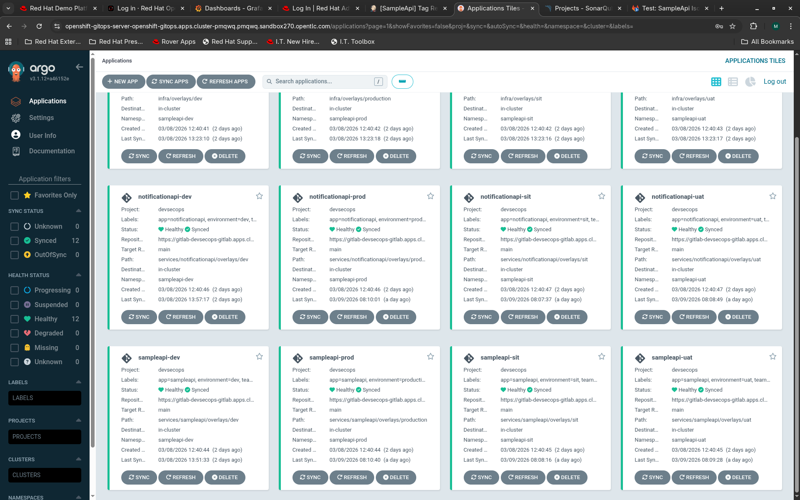

# Module 4: GitOps with ArgoCD

**Duration:** ~60 minutes | **Track:** Foundation | **Prerequisites:** Modules 1, 2B

---

## What You'll Learn

By the end of this module, you will be able to:

1. Explain why GitOps exists and what problem it solves compared to imperative deployments
2. Install the OpenShift GitOps Operator and navigate the ArgoCD UI
3. Structure a multi-service GitOps repository using per-service Kustomize base + overlays
4. Create 12 ArgoCD Application CRDs with auto-sync (DEV) and manual sync (SIT/UAT/PROD) policies
5. Promote a single service between environments without affecting other services
6. Describe how per-service isolation prevents merge conflicts in multi-service architectures

---

## Prerequisites

Before starting this module, you need:

- **Module 1 completed** -- namespaces `sampleapi-dev`, `sampleapi-sit`, `sampleapi-uat`, `sampleapi-prod` exist
- **Module 2B completed** -- GitLab CE running with a personal access token
- **`oc` CLI** authenticated as cluster-admin (`oc whoami` returns `admin`)
- **`kustomize` CLI** installed (`kustomize version` returns v5.x)
- **`argocd` CLI** installed (`argocd version --client` returns v2.x)

> **Environment variables:** Before running any commands, source the environment file:
> ```bash
> source ./env.sh
> ```
> This sets `$OC`, `$APPS_DOMAIN`, `$NS_TOOLS`, and all other cluster-specific variables used throughout this module. See `env.sh` for the full variable list.

Verify now:

```bash
$OC get ns $NS_DEV $NS_SIT $NS_UAT $NS_PROD
# All four namespaces should exist

kustomize version
argocd version --client
```

---

## Concepts: Why GitOps?

### The Problem with Imperative Deployments

Consider how most teams deploy today. Someone runs `oc apply -f deployment.yaml` or clicks a button in Jenkins. This works -- until it does not. Three months from now, someone asks: "What exactly is running in production right now?" And nobody can answer with certainty, because the cluster state has drifted from what anyone remembers deploying.

This is the **configuration drift** problem. The cluster is the source of truth, but nobody audits cluster state. Humans run ad-hoc commands. Hotfixes bypass the pipeline. The gap between "what we think is deployed" and "what is actually deployed" widens silently.

### The GitOps Solution

GitOps flips the model. Instead of pushing changes to the cluster, you declare the desired state in a Git repository, and an operator (ArgoCD) continuously reconciles the cluster to match Git.

```
Traditional:  Developer --> kubectl apply --> Cluster (source of truth)
GitOps:       Developer --> git push --> Git (source of truth) --> ArgoCD --> Cluster
```

This gives you three things for free:

1. **Audit trail** -- every change is a Git commit with author, timestamp, and diff
2. **Rollback** -- reverting a deployment means `git revert` on a commit
3. **Drift detection** -- ArgoCD alerts you when cluster state diverges from Git

> **Key insight:** In GitOps, if it is not in Git, it does not exist. Git is the single source of truth for what should be running in every environment.

### The Pizza Analogy for Kustomize (Multi-Service Edition)

Think of Kustomize like a restaurant kitchen, not just one pizza. You have multiple dishes on the menu (services), each with its own base recipe and per-customer toppings (environment overlays). The kitchen also has shared infrastructure -- ovens, fridges, prep stations -- that all dishes depend on.

```
Services (each dish has its own recipe):
    SampleApi:        Deployment, Service, Route, per-env ConfigMap + Secret
    NotificationApi:  Deployment, Service (no Route -- internal only), per-env ConfigMap + Secret

Infrastructure (shared kitchen equipment):
    PostgreSQL:       StatefulSet, Service
    Redis:            StatefulSet, Service
    ServiceAccount:   Shared across services

Per-environment toppings (applied to EACH service independently):
    DEV:  1 replica,  debug logging,  Swagger ON,   500m CPU
    SIT:  2 replicas, info logging,   Swagger ON,   1 CPU
    UAT:  2 replicas, info logging,   Swagger OFF,  1 CPU
    PROD: 2-3 replicas, warning logging, Swagger OFF, higher CPU + anti-affinity + PDB
```

You never duplicate the full Deployment YAML four times per service. You write it once in each service's `base/` and patch the differences in each overlay. Each service is independent -- updating SampleApi does not touch NotificationApi.

### The Promotion Flow

Here is how an image moves from DEV to PROD in this project. The critical rule: **the same image SHA is promoted across all environments.** You never rebuild for a different environment -- you only change the configuration around it.

```
                    PIPELINE BUILDS IMAGE
                           |
                     main-abc1234
                           |
                    +------+------+
                    |             |
              [T2 Pipeline]      |
              updates ONLY       |
              sampleapi's DEV    |
              overlay in Git     |
                    |             |
              ArgoCD auto-       |
              syncs sampleapi-   |
              dev app            |
                    |             |
              Test in DEV        |
                    |             |
              [T3 Pipeline]      |
              creates v1.2.0     |
              tag, pushes to     |
              registry           |
                    |             |
         +-------- | --------+---|--------+
         |         |         |            |
    SIT overlay  UAT overlay   PROD overlay
    MR: change   MR: change    MR: change
    newTag to    newTag to     newTag to
    v1.2.0       v1.2.0        v1.2.0
         |         |         |            |
    Team Lead    QA Lead     CAB          |
    approves     approves    approves     |
         |         |         |            |
    ArgoCD       ArgoCD      ArgoCD       |
    syncs        syncs       syncs        |
    sampleapi-   sampleapi-  sampleapi-   |
    sit app      uat app     prod app     |
         |         |         |            |
         +-------- + --------+------------+
                   |
             Same image SHA
             in all environments
```

> **Why separate the GitOps repo from the app source repo?** Because a commit to the app source repo should trigger a build. A commit to the GitOps repo should trigger a deployment. If they live in the same repo, updating an environment variable would trigger a full CI build -- wasteful and confusing.

### Why Per-Service Isolation?

In a multi-service architecture, two pipelines may run concurrently. If SampleApi and NotificationApi share the same Kustomize overlay directory, their `updateGitOps` steps race to push commits -- causing merge conflicts. Per-service directories eliminate this:

```
WRONG (shared overlay -- merge conflicts):
    overlays/dev/kustomization.yaml
        images:
          - name: sampleapi       <-- T2 for sampleapi updates this
            newTag: main-abc
          - name: notificationapi <-- T2 for notificationapi updates this simultaneously
            newTag: main-def      <-- GIT PUSH REJECTED: conflict!

RIGHT (per-service overlays -- no conflicts):
    services/sampleapi/overlays/dev/kustomization.yaml
        images:
          - name: sampleapi
            newTag: main-abc      <-- only sampleapi pipeline touches this file

    services/notificationapi/overlays/dev/kustomization.yaml
        images:
          - name: notificationapi
            newTag: main-def      <-- only notificationapi pipeline touches this file
```

Each service has its own ArgoCD Application, its own sync lifecycle, and its own image tag. This is the key architectural decision that makes multi-service GitOps work at scale.

---

## Step 1: Install the OpenShift GitOps Operator

**WHY:** The OpenShift GitOps Operator installs and manages an ArgoCD instance for you. It handles upgrades, HA configuration, and integration with OpenShift's RBAC. You could install ArgoCD manually with Helm, but the Operator approach is the supported path on OpenShift and gives you a managed lifecycle.

### 1.1 Apply the Operator Subscription

The Subscription resource tells OpenShift's Operator Lifecycle Manager (OLM) to install the GitOps operator from the Red Hat catalog.

```yaml
# infra/phase6/gitops-operator-subscription.yaml
# OLM Subscription for OpenShift GitOps (ArgoCD) Operator
# Installs into openshift-gitops-operator namespace
# Creates a default ArgoCD instance in openshift-gitops namespace
---
apiVersion: operators.coreos.com/v1alpha1
kind: Subscription
metadata:
  name: openshift-gitops-operator
  namespace: openshift-operators          # <-- OLM watches this namespace
  labels:
    team: devsecops
spec:
  channel: latest                         # <-- tracks the latest stable channel
  installPlanApproval: Automatic          # <-- auto-approve upgrades
  name: openshift-gitops-operator
  source: redhat-operators                # <-- Red Hat's certified catalog
  sourceNamespace: openshift-marketplace
```

Apply it:

```bash
$OC apply -f infra/phase6/gitops-operator-subscription.yaml
```

### 1.2 Wait for the Operator to Install

The operator needs to download its container image, create CRDs, and spin up the default ArgoCD instance. This typically takes 2-3 minutes.

```bash
# Poll until the CSV (ClusterServiceVersion) shows Succeeded
echo "Waiting for GitOps Operator..."
while ! $OC get csv -n $NS_GITOPS 2>/dev/null | grep openshift-gitops | grep -q Succeeded; do
  sleep 10
  echo "  still waiting..."
done
echo "GitOps Operator installed"
```

### 1.3 Wait for the ArgoCD Server Pod

```bash
$OC wait --for=condition=ready pod \
  -l app.kubernetes.io/name=openshift-gitops-server \
  -n $NS_GITOPS \
  --timeout=300s
```

### Verify: Your First Look at ArgoCD

```bash
# Confirm the server pod is running
$OC get pods -n $NS_GITOPS -l app.kubernetes.io/name=openshift-gitops-server
# Expected output:
#   NAME                                       READY   STATUS    RESTARTS   AGE
#   openshift-gitops-server-555f8875b6-v2mz9   1/1     Running   4          3d

# Get the ArgoCD route URL
ARGOCD_URL=$($OC get route openshift-gitops-server -n $NS_GITOPS -o jsonpath='{.spec.host}')
echo "ArgoCD UI: https://${ARGOCD_URL}"

# Get the admin password (auto-generated by the operator)
ARGOCD_PASS=$($OC get secret openshift-gitops-cluster -n $NS_GITOPS \
  -o jsonpath='{.data.admin\.password}' | base64 -d)
echo "Admin password: ${ARGOCD_PASS}"

# Verify CLI login -- use the internal service for reliable gRPC
argocd login openshift-gitops-server.$NS_GITOPS.svc:443 \
  --username admin \
  --password "${ARGOCD_PASS}" \
  --insecure \
  --grpc-web
# Expected: 'admin' logged in successfully

argocd account get-user-info
# Expected: Logged In: true, Username: admin
```

> **Note:** The command above uses the cluster-internal service address, which works from Jenkins agent pods and `oc rsh` sessions. If you are running commands from your **workstation**, use the external route instead:
> ```bash
> ARGOCD_HOST=$($OC get route openshift-gitops-server -n $NS_GITOPS -o jsonpath='{.spec.host}')
> argocd login $ARGOCD_HOST --username admin --password "${ARGOCD_PASS}" --insecure --grpc-web
> ```

Open `https://<ARGOCD_URL>` in your browser, log in as `admin`, and you will see an empty Applications screen. By the end of this module, it will have twelve applications.

> **Gotcha -- gRPC connection timeouts:** When connecting from inside the cluster (e.g., from a Jenkins agent pod), always use the internal service `openshift-gitops-server.openshift-gitops.svc:443` with the `--grpc-web` flag. The external Route uses TLS edge termination, which can cause gRPC connection timeouts. This burned us in production and is worth remembering.

---

## Step 2: Understand the Per-Service GitOps Repository Structure

**WHY:** A well-structured GitOps repo is the difference between "I can promote in 30 seconds" and "I need to edit 47 lines across 12 files." The per-service Kustomize base + overlays pattern gives you independent deployment lifecycles for each service while keeping the shared structure DRY.

### 2.1 The Complete Directory Layout

Here is the complete structure of the `app-gitops` repository in this project:

```
app-gitops/
|
+-- services/                              <-- Per-service deployment manifests
|   |
|   +-- sampleapi/                         <-- Service 1: the main API
|   |   +-- base/                          <-- The "plain cheese pizza" for sampleapi
|   |   |   +-- kustomization.yaml         <-- Lists base resources
|   |   |   +-- deployment.yaml            <-- Shared Deployment (envFrom: sampleapi-env + sampleapi-secret)
|   |   |   +-- service.yaml               <-- ClusterIP Service
|   |   |   +-- route.yaml                 <-- OpenShift Route (external traffic)
|   |   |
|   |   +-- overlays/                      <-- Per-environment "toppings" for sampleapi
|   |       +-- dev/
|   |       |   +-- kustomization.yaml     <-- namespace, image tag, patches
|   |       |   +-- configmap-env.yaml     <-- sampleapi-env: DB_URL, REDIS, logging, etc.
|   |       |   +-- secret-env.yaml        <-- sampleapi-secret: DB_PASSWORD, API_KEY, JWT
|   |       |   +-- patch-deployment.yaml  <-- 1 replica, lower resources
|   |       +-- sit/
|   |       |   +-- ...                    <-- Same 4 files, different values (2 replicas)
|   |       +-- uat/
|   |       |   +-- ...                    <-- Same 4 files (2 replicas, Swagger OFF)
|   |       +-- production/
|   |           +-- kustomization.yaml
|   |           +-- configmap-env.yaml
|   |           +-- secret-env.yaml
|   |           +-- patch-deployment.yaml  <-- 3 replicas, anti-affinity, higher resources
|   |           +-- pdb.yaml                <-- PROD-only: PodDisruptionBudget
|   |
|   +-- notificationapi/                   <-- Service 2: internal notification service
|       +-- base/
|       |   +-- kustomization.yaml
|       |   +-- deployment.yaml            <-- envFrom: notificationapi-env + notificationapi-secret
|       |   +-- service.yaml               <-- ClusterIP Service (NO Route -- internal only)
|       |
|       +-- overlays/
|           +-- dev/
|           |   +-- kustomization.yaml     <-- ONE image tag: notificationapi
|           |   +-- configmap-env.yaml     <-- notificationapi-env: ASPNETCORE, REDIS, logging
|           |   +-- secret-env.yaml        <-- notificationapi-secret: REDIS_PASSWORD
|           |   +-- patch-deployment.yaml
|           +-- sit/
|           |   +-- ...
|           +-- uat/
|           |   +-- ...
|           +-- production/
|               +-- ...                    <-- Same structure + pdb.yaml
|
+-- infra/                                 <-- Shared infrastructure (PostgreSQL, Redis)
|   +-- base/
|   |   +-- kustomization.yaml
|   |   +-- serviceaccount.yaml            <-- ServiceAccount for app pods
|   |   +-- postgresql/
|   |   |   +-- statefulset.yaml           <-- Uses infra-secret for PG creds
|   |   |   +-- service.yaml
|   |   +-- redis/
|   |       +-- statefulset.yaml           <-- Uses infra-secret for Redis creds
|   |       +-- service.yaml
|   |
|   +-- overlays/
|       +-- dev/
|       |   +-- kustomization.yaml
|       |   +-- secret-env.yaml            <-- infra-secret: PG_USER, PG_PASS, PG_DB, REDIS_PASS
|       +-- sit/
|       |   +-- ...
|       +-- uat/
|       |   +-- ...
|       +-- production/
|           +-- kustomization.yaml
|           +-- secret-env.yaml
|           +-- patch-postgresql.yaml      <-- PROD: higher resources for PostgreSQL
|
+-- argocd/                                <-- 12 ArgoCD Application CRDs (App-of-Apps)
|   +-- project.yaml                       <-- AppProject: devsecops
|   +-- sampleapi-dev.yaml                 <-- Application: auto-sync sampleapi DEV
|   +-- sampleapi-sit.yaml                 <-- Application: manual sync sampleapi SIT
|   +-- sampleapi-uat.yaml                 <-- Application: manual sync sampleapi UAT
|   +-- sampleapi-prod.yaml                <-- Application: manual sync sampleapi PROD
|   +-- notificationapi-dev.yaml           <-- Application: auto-sync notificationapi DEV
|   +-- notificationapi-sit.yaml           <-- Application: manual sync notificationapi SIT
|   +-- notificationapi-uat.yaml           <-- Application: manual sync notificationapi UAT
|   +-- notificationapi-prod.yaml          <-- Application: manual sync notificationapi PROD
|   +-- infra-dev.yaml                     <-- Application: auto-sync infra DEV
|   +-- infra-sit.yaml                     <-- Application: manual sync infra SIT
|   +-- infra-uat.yaml                     <-- Application: manual sync infra UAT
|   +-- infra-prod.yaml                    <-- Application: manual sync infra PROD
|
+-- README.md
```

Notice four things:

1. **No application source code.** This repo contains only deployment manifests. The app source lives in separate repositories (`app-source`, `notificationapi-source`).
2. **Each service has its own base and overlays.** SampleApi and NotificationApi have completely independent directory trees. Updating one never touches the other.
3. **Infrastructure is separate from services.** PostgreSQL and Redis live in `infra/`, managed by their own ArgoCD Applications. Rotating a database password only requires updating `infra/overlays/{env}/secret-env.yaml`.
4. **12 ArgoCD Applications, not 4.** Each service gets 4 apps (one per environment), plus 4 for infrastructure. This gives each component its own sync lifecycle.

### 2.2 Three Types of Secrets -- No Overlap

Each namespace has exactly three secrets, each managed by a different ArgoCD Application:

| Secret | Owner | Contains | Consumed By |
|--------|-------|----------|-------------|
| `infra-secret` | infra ArgoCD app | PG_USER, PG_PASS, PG_DB, REDIS_PASS | PostgreSQL + Redis StatefulSets |
| `sampleapi-secret` | sampleapi ArgoCD app | DB_PASSWORD, API_KEY, JWT_SECRET, REDIS_PASS | SampleApi Deployment (envFrom) |
| `notificationapi-secret` | notificationapi ArgoCD app | REDIS_PASSWORD | NotificationApi Deployment (envFrom) |

This isolation means rotating a database password requires updating two files (`infra-secret` for PostgreSQL, `sampleapi-secret` for the app) and syncing two ArgoCD apps. No cross-service conflicts.

### 2.3 The SampleApi Base

The base `kustomization.yaml` for SampleApi lists only the resources that every environment shares:

```yaml
# app-gitops/services/sampleapi/base/kustomization.yaml
# Base Kustomize configuration for SampleApi
# Overlays patch these with per-env values (replicas, resources, config)
apiVersion: kustomize.config.k8s.io/v1beta1
kind: Kustomization

resources:
- deployment.yaml
- service.yaml
- route.yaml
```

> **Note on `labels` vs `commonLabels`:** Older Kustomize versions used `commonLabels:`. This is deprecated. The base kustomization above does not use either -- labels are set directly in each resource's `metadata.labels` field (in `deployment.yaml`, `service.yaml`, etc.) rather than injected globally by Kustomize. If you need Kustomize-managed labels, use the `labels:` field with `pairs:` syntax.

### 2.4 The SampleApi Base Deployment

This is the most important file in the base. Study it carefully -- every environment inherits this, and overlays only patch what differs.

```yaml
# app-gitops/services/sampleapi/base/deployment.yaml
# Base Deployment for SampleApi -- patched per environment
# References per-service ConfigMap + Secret as envFrom (external config pattern)
---
apiVersion: apps/v1
kind: Deployment
metadata:
  name: sampleapi
  labels:
    app: sampleapi
spec:
  replicas: 1                              # <-- overridden per env (1/2/2/3)
  selector:
    matchLabels:
      app: sampleapi
  template:
    metadata:
      labels:
        app: sampleapi
      annotations:
        instrumentation.opentelemetry.io/inject-dotnet: "dotnet-instrumentation"
    spec:
      serviceAccountName: sampleapi-sa
      containers:
        - name: sampleapi
          image: sampleapi                 # <-- placeholder, replaced by kustomize
          ports:
            - containerPort: 8080
              name: http
              protocol: TCP
          # Load all config and secrets as environment variables
          envFrom:
            - configMapRef:
                name: sampleapi-env        # <-- per-service ConfigMap (NOT shared)
            - secretRef:
                name: sampleapi-secret     # <-- per-service Secret (NOT shared)
          resources:
            requests:
              cpu: 100m
              memory: 128Mi
            limits:
              cpu: 500m
              memory: 512Mi
          livenessProbe:
            httpGet:
              path: /healthz
              port: 8080
            initialDelaySeconds: 10
            periodSeconds: 15
            timeoutSeconds: 3
            failureThreshold: 3
          readinessProbe:
            httpGet:
              path: /readyz
              port: 8080
            initialDelaySeconds: 5
            periodSeconds: 10
            timeoutSeconds: 10
            failureThreshold: 3
          startupProbe:
            httpGet:
              path: /healthz
              port: 8080
            initialDelaySeconds: 5
            periodSeconds: 5
            failureThreshold: 12           # <-- 60s grace period for .NET cold start
```

Four design decisions to note:

- **`envFrom` with per-service `configMapRef` and `secretRef`:** The app reads all configuration from environment variables. Each service has its own ConfigMap (`sampleapi-env`) and Secret (`sampleapi-secret`). NotificationApi has `notificationapi-env` and `notificationapi-secret`. They never share a ConfigMap -- this prevents one service's config change from accidentally affecting another.
- **`image: sampleapi` is a placeholder:** Kustomize replaces this with the real registry path and tag via the `images:` transformer in each overlay. The base never knows which registry or tag to use.
- **`instrumentation.opentelemetry.io/inject-dotnet` annotation:** This tells the OpenTelemetry Operator to auto-inject .NET instrumentation into the pod at startup. No NuGet packages or application code changes are needed -- the OTel Operator injects an init container that instruments the app at runtime.
- **Both services share the same ServiceAccount:** They both reference `sampleapi-sa`, which lives in the infra base. The Deployment explicitly names it via `serviceAccountName`.

### 2.5 The NotificationApi Base -- Internal Service

Compare the NotificationApi base to SampleApi. It has no Route because it is an internal service only called by SampleApi:

```yaml
# app-gitops/services/notificationapi/base/deployment.yaml
# NotificationApi -- internal service, no external Route
---
apiVersion: apps/v1
kind: Deployment
metadata:
  name: notificationapi
  labels:
    app: notificationapi
spec:
  replicas: 1
  selector:
    matchLabels:
      app: notificationapi
  template:
    metadata:
      labels:
        app: notificationapi
      annotations:
        instrumentation.opentelemetry.io/inject-dotnet: "dotnet-instrumentation"
    spec:
      serviceAccountName: sampleapi-sa
      containers:
        - name: notificationapi
          image: notificationapi           # <-- different placeholder than sampleapi
          ports:
            - containerPort: 8081          # <-- different port than sampleapi (8080)
              name: http
              protocol: TCP
          envFrom:
            - configMapRef:
                name: notificationapi-env  # <-- own ConfigMap (NOT sampleapi-env)
            - secretRef:
                name: notificationapi-secret  # <-- own Secret (NOT sampleapi-secret)
          # ... probes, resources similar to sampleapi (but lower limits: 50m/64Mi req, 250m/256Mi lim)
```

The key difference: NotificationApi references `notificationapi-env` and `notificationapi-secret`, not the SampleApi ones. Each service owns its own configuration surface.

---

## Step 3: Understand Kustomize Overlays

**WHY:** The overlay is where environment-specific decisions live. Understanding what each overlay controls -- and what it does NOT control -- is essential for safe promotions. With per-service overlays, each service is promoted independently.

### 3.1 The SampleApi DEV Overlay

```yaml
# app-gitops/services/sampleapi/overlays/dev/kustomization.yaml
# DEV environment overlay for SampleApi
# 1 replica, debug logging, swagger enabled
apiVersion: kustomize.config.k8s.io/v1beta1
kind: Kustomization

namespace: sampleapi-dev                   # <-- all resources land in this namespace

resources:
  - ../../base                             # <-- inherit from sampleapi base
  - configmap-env.yaml                     # <-- sampleapi-env ConfigMap
  - secret-env.yaml                        # <-- sampleapi-secret

patches:
  - path: patch-deployment.yaml            # <-- merge patch: replicas, resources

# Image tag -- updated by updateGitOps.groovy via: kustomize edit set image
# ONLY ONE image entry -- this overlay only manages sampleapi
images:
- name: sampleapi                          # <-- matches the placeholder in base deployment
  newName: image-registry.openshift-image-registry.svc:5000/sampleapi-dev/sampleapi
  newTag: main-78f28b4                     # <-- THIS is what the pipeline changes
```

Three sections do different things:

| Section | Purpose | Example |
|---------|---------|---------|
| `resources` | Add new resources for this env | `configmap-env.yaml`, `secret-env.yaml` |
| `patches` | Modify existing base resources via strategic merge | Change replicas from 1 to 2, adjust resource limits |
| `images` | Rewrite the container image reference | `sampleapi` --> `registry/ns/sampleapi:main-78f28b4` |

The critical detail: each overlay has exactly **one** image entry. SampleApi's overlay manages only the SampleApi image tag. NotificationApi's overlay manages only the NotificationApi image tag. This is what prevents merge conflicts when two pipelines run concurrently.

### 3.2 Per-Service ConfigMaps (Environment-Specific Config)

Each service owns its own ConfigMap in its overlay. This is what makes each service configurable independently per environment:

```yaml
# app-gitops/services/sampleapi/overlays/dev/configmap-env.yaml
# SampleApi DEV environment configuration
# These environment variables override appsettings.json in the .NET app
---
apiVersion: v1
kind: ConfigMap
metadata:
  name: sampleapi-env                      # <-- per-service name (NOT shared)
data:
  ASPNETCORE_ENVIRONMENT: "Development"
  DOTNET_RUNNING_IN_CONTAINER: "true"
  DATABASE_URL: "Server=postgresql.sampleapi-dev.svc;Database=sampleapi;Port=5432;Username=sampleapi"
  LOGGING__LOGLEVEL__DEFAULT: "Debug"      # <-- DEV: verbose logging
  LOGGING__LOGLEVEL__MICROSOFT_ASPNETCORE: "Information"
  FEATURE_SWAGGER_ENABLED: "true"          # <-- DEV: Swagger UI available
  CORS_ALLOWED_ORIGINS: "https://frontend-dev.apps.cluster-pmqwq.pmqwq.sandbox270.opentlc.com"
  WeatherForecast__Location: "DEV"
  WeatherForecast__ForecastDays: "7"
  REDIS_URL: "redis.sampleapi-dev.svc:6379"
  NOTIFICATION_API_URL: "http://notificationapi.sampleapi-dev.svc:8081"
  EF_MIGRATE_ON_STARTUP: "true"
```

Compare with the NotificationApi ConfigMap in the same namespace:

```yaml
# app-gitops/services/notificationapi/overlays/dev/configmap-env.yaml
# NotificationApi DEV environment configuration
---
apiVersion: v1
kind: ConfigMap
metadata:
  name: notificationapi-env               # <-- own name, isolated from sampleapi
data:
  ASPNETCORE_ENVIRONMENT: "Development"
  DOTNET_RUNNING_IN_CONTAINER: "true"
  REDIS_URL: "redis.sampleapi-dev.svc:6379"
  LOGGING__LOGLEVEL__DEFAULT: "Debug"
  LOGGING__LOGLEVEL__MICROSOFT_ASPNETCORE: "Information"
```

Notice: NotificationApi has fewer config entries because it is a simpler service. Each service configures exactly what it needs -- no extra variables leaking from other services.

### 3.3 The SampleApi PROD Overlay -- What Changes at Scale

Compare the PROD overlay to DEV. The structure is identical, but the values reflect production concerns:

```yaml
# app-gitops/services/sampleapi/overlays/production/kustomization.yaml
# PRODUCTION environment overlay for SampleApi
# 3 replicas, Warning logging, Swagger off, PDB
apiVersion: kustomize.config.k8s.io/v1beta1
kind: Kustomization

namespace: sampleapi-prod

resources:
  - ../../base
  - pdb.yaml                                 # <-- PROD-only: guarantees availability
  - configmap-env.yaml
  - secret-env.yaml

patches:
  - path: patch-deployment.yaml

images:
  - name: sampleapi
    newName: image-registry.openshift-image-registry.svc:5000/sampleapi-dev/sampleapi
    newTag: v1.5.1                         # <-- versioned tag (not main-SHA)
```

The PROD deployment patch adds anti-affinity to spread pods across nodes:

```yaml
# app-gitops/services/sampleapi/overlays/production/patch-deployment.yaml
# PRODUCTION-specific: 3 replicas, higher resources, anti-affinity
---
apiVersion: apps/v1
kind: Deployment
metadata:
  name: sampleapi
spec:
  replicas: 3                              # <-- 3x the DEV replica count
  template:
    spec:
      affinity:
        podAntiAffinity:                   # <-- spread pods across worker nodes
          preferredDuringSchedulingIgnoredDuringExecution:
            - weight: 100
              podAffinityTerm:
                labelSelector:
                  matchLabels:
                    app: sampleapi
                topologyKey: kubernetes.io/hostname
      containers:
        - name: sampleapi
          resources:
            requests:
              cpu: 500m                    # <-- 5x the DEV CPU request
              memory: 512Mi               # <-- 4x the DEV memory request
            limits:
              cpu: "2"
              memory: 2Gi
```

And PROD gets a PodDisruptionBudget that DEV does not have:

```yaml
# app-gitops/services/sampleapi/overlays/production/pdb.yaml
# Ensures at least 1 pod is always available during voluntary disruptions
# (node drain, rolling updates, cluster upgrades)
---
apiVersion: policy/v1
kind: PodDisruptionBudget
metadata:
  name: sampleapi-pdb
  labels:
    app: sampleapi
spec:
  minAvailable: 1
  selector:
    matchLabels:
      app: sampleapi
```

> **Rule: Every service with >1 replica in production MUST have a PDB.** No exceptions. This is enforced by the project's GitOps consistency rules.

### 3.4 Try It Locally: Build an Overlay

You do not need a cluster to see what Kustomize produces. Run `kustomize build` to render the final YAML:

```bash
cd /path/to/app-gitops

# Render the SampleApi DEV overlay -- see exactly what would be applied
kustomize build services/sampleapi/overlays/dev

# Render the SampleApi PROD overlay -- notice the differences
kustomize build services/sampleapi/overlays/production

# Compare them side by side
diff <(kustomize build services/sampleapi/overlays/dev) \
     <(kustomize build services/sampleapi/overlays/production)

# Also build the NotificationApi DEV overlay -- notice: no Route resource
kustomize build services/notificationapi/overlays/dev

# Build the infrastructure overlay -- PostgreSQL + Redis + ServiceAccount
kustomize build infra/overlays/dev
```

The SampleApi `diff` output is the clearest way to see what actually differs between environments. You should see differences in: namespace, replicas, resource limits, ConfigMap values, and the presence of a PodDisruptionBudget in PROD. The NotificationApi build will be notably shorter -- no Route resource.

### Verify: Kustomize Overlay Understanding

```bash
# Verify ALL overlays build without errors (services + infra)
for svc in services/sampleapi services/notificationapi infra; do
  for env in dev sit uat production; do
    echo -n "  ${svc}/overlays/${env}: "
    kustomize build ${svc}/overlays/${env} > /dev/null 2>&1 && echo "OK" || echo "FAILED"
  done
done
# Expected: all twelve print OK
```

---

## Step 4: Create ArgoCD Application CRDs

**WHY:** An ArgoCD Application is the bridge between "desired state in Git" and "actual state on the cluster." Each Application watches one path in one Git repo and syncs it to one namespace. You need twelve Applications -- one per service per environment -- with different sync policies.

### 4.1 The AppProject: Guardrails for Your Applications

Before creating Applications, create an AppProject that restricts what they can do. This is the principle of least privilege applied to GitOps.

> **Note:** The YAML examples below use `${GITLAB_URL}` as a placeholder. The actual manifest files in `app-gitops/argocd/` contain the fully resolved URL from your `env.sh`. When you edit these files, replace `${GITLAB_URL}` with your actual GitLab route (e.g., `https://gitlab-devsecops-gitlab.apps.YOUR-CLUSTER.example.com`).

```yaml
# app-gitops/argocd/project.yaml
# Restricts which repositories, clusters, and namespaces
# ArgoCD Applications within this project can use
---
apiVersion: argoproj.io/v1alpha1
kind: AppProject
metadata:
  name: devsecops
  namespace: openshift-gitops
  labels:
    team: devsecops
spec:
  description: "DevSecOps project — multi-service deployment across DEV/SIT/UAT/PROD"

  # Only allow our GitOps repo -- no other repo can be used
  sourceRepos:
    - "${GITLAB_URL}/devsecops/app-gitops.git"     # <-- uses $GITLAB_URL from env.sh

  # Only allow deployment to our four app namespaces -- nothing else
  destinations:
    - server: "https://kubernetes.default.svc"
      namespace: sampleapi-dev
    - server: "https://kubernetes.default.svc"
      namespace: sampleapi-sit
    - server: "https://kubernetes.default.svc"
      namespace: sampleapi-uat
    - server: "https://kubernetes.default.svc"
      namespace: sampleapi-prod

  # Only allow specific resource types -- no CRDs, no cluster-scoped resources
  clusterResourceWhitelist: []             # <-- cannot create ClusterRoles, Namespaces, etc.
  namespaceResourceWhitelist:
    - group: ""
      kind: ConfigMap
    - group: ""
      kind: Secret
    - group: ""
      kind: Service
    - group: ""
      kind: ServiceAccount
    - group: apps
      kind: Deployment
    - group: apps
      kind: StatefulSet                    # <-- needed for PostgreSQL + Redis
    - group: route.openshift.io
      kind: Route
    - group: policy
      kind: PodDisruptionBudget

  orphanedResources:
    warn: true                             # <-- alert if namespace has resources not in Git
```

The AppProject answers three questions:
- **Where can manifests come from?** Only our `app-gitops` GitLab repo.
- **Where can they deploy to?** Only our four app namespaces.
- **What resource types are allowed?** Deployments, StatefulSets, Services, Routes, ConfigMaps, Secrets, ServiceAccounts, and PDBs. No one can sneak a ClusterRoleBinding into the GitOps repo.

### 4.2 Label Namespaces for ArgoCD Management

ArgoCD can only manage namespaces that explicitly opt in. This is a security boundary -- without this label, ArgoCD cannot touch the namespace.

```bash
for NS in $NS_DEV $NS_SIT $NS_UAT $NS_PROD; do
  $OC label namespace ${NS} argocd.argoproj.io/managed-by=$NS_GITOPS --overwrite
done
```

> **This is the number one mistake people make.** They create the ArgoCD Application, it looks healthy in the UI, but nothing deploys. The sync just silently fails because the target namespace is not labeled. Always check this first when debugging sync issues.

### 4.3 Give ArgoCD Access to Your Git Repo

ArgoCD needs credentials to clone the `app-gitops` repository from GitLab:

```yaml
# infra/phase6/argocd-repo-secret.yaml
# ArgoCD discovers repo credentials via the argocd.argoproj.io/secret-type label
---
apiVersion: v1
kind: Secret
metadata:
  name: gitlab-repo-credentials
  namespace: openshift-gitops
  labels:
    team: devsecops
    argocd.argoproj.io/secret-type: repository   # <-- ArgoCD auto-discovers this
type: Opaque
stringData:
  url: "${GITLAB_URL}/devsecops/app-gitops.git"   # <-- uses $GITLAB_URL from env.sh
  username: "root"
  password: "<YOUR-GITLAB-TOKEN>"                 # <-- replace with actual PAT
  insecure: "true"                                # <-- skip TLS verify for self-signed certs
  type: "git"
```

Apply the project and credentials:

```bash
$OC apply -f app-gitops/argocd/project.yaml        # or infra/phase6/argocd-appproject.yaml
$OC apply -f infra/phase6/argocd-repo-secret.yaml
```

### 4.4 The SampleApi DEV Application: Auto-Sync

DEV is the only environment where applications auto-sync. When the CI pipeline (T2) pushes a new image tag to the service's overlay, ArgoCD detects the change and deploys automatically -- no human approval needed.

```yaml
# app-gitops/argocd/sampleapi-dev.yaml
# Auto-sync: changes in services/sampleapi/overlays/dev deploy automatically
---
apiVersion: argoproj.io/v1alpha1
kind: Application
metadata:
  name: sampleapi-dev
  namespace: openshift-gitops
  labels:
    team: devsecops
    app: sampleapi
    environment: dev
spec:
  project: devsecops                       # <-- must match the AppProject name

  source:
    repoURL: "${GITLAB_URL}/devsecops/app-gitops.git"
    targetRevision: main                   # <-- watches the main branch
    path: services/sampleapi/overlays/dev  # <-- per-service overlay path

  destination:
    server: "https://kubernetes.default.svc"
    namespace: sampleapi-dev

  syncPolicy:
    automated:                             # <-- THIS is what makes it auto-sync
      prune: true                          # <-- delete resources removed from Git
      selfHeal: true                       # <-- revert manual changes to match Git
    syncOptions:
      - CreateNamespace=false              # <-- namespace already exists (Phase 1)
      - PruneLast=true                     # <-- delete after sync (safer ordering)
      - ApplyOutOfSyncOnly=true            # <-- skip resources already in sync
    retry:
      limit: 3
      backoff:
        duration: 5s
        factor: 2
        maxDuration: 1m
```

Three sync policy flags to understand:

| Flag | What It Does | Why It Matters |
|------|-------------|----------------|
| `prune: true` | Deletes cluster resources that no longer exist in Git | Prevents orphaned resources accumulating over time |
| `selfHeal: true` | Automatically reverts manual `oc edit` changes | Enforces Git as the only way to make changes |
| `ApplyOutOfSyncOnly` | Only touches resources that differ from Git | Reduces API server load on large deployments |

Notice the path: `services/sampleapi/overlays/dev`. This Application only watches SampleApi's DEV overlay. Changes to NotificationApi or infrastructure do not trigger this Application.

### 4.5 The NotificationApi DEV Application: Also Auto-Sync

NotificationApi has its own Application watching its own overlay path:

```yaml
# app-gitops/argocd/notificationapi-dev.yaml
# Auto-sync: changes in services/notificationapi/overlays/dev deploy automatically
---
apiVersion: argoproj.io/v1alpha1
kind: Application
metadata:
  name: notificationapi-dev
  namespace: openshift-gitops
  labels:
    team: devsecops
    app: notificationapi
    environment: dev
spec:
  project: devsecops
  source:
    repoURL: "${GITLAB_URL}/devsecops/app-gitops.git"
    targetRevision: main
    path: services/notificationapi/overlays/dev   # <-- different path than sampleapi
  destination:
    server: "https://kubernetes.default.svc"
    namespace: sampleapi-dev                       # <-- same namespace (services co-locate)
  syncPolicy:
    automated:
      prune: true
      selfHeal: true
    syncOptions:
      - CreateNamespace=false
      - PruneLast=true
      - ApplyOutOfSyncOnly=true
    retry:
      limit: 3
      backoff:
        duration: 5s
        factor: 2
        maxDuration: 1m
```

Notice: both SampleApi and NotificationApi deploy to the **same namespace** (`sampleapi-dev`), but they are managed by **separate ArgoCD Applications** watching **separate paths**. This is the key to independent deployment lifecycles within a shared namespace.

### 4.6 The Infra DEV Application: Databases and Shared Resources

Infrastructure (PostgreSQL, Redis, ServiceAccount) has its own Application:

```yaml
# app-gitops/argocd/infra-dev.yaml
# Auto-sync: infrastructure changes in infra/overlays/dev deploy automatically
---
apiVersion: argoproj.io/v1alpha1
kind: Application
metadata:
  name: infra-dev
  namespace: openshift-gitops
  labels:
    team: devsecops
    app: infra
    environment: dev
spec:
  project: devsecops
  source:
    repoURL: "${GITLAB_URL}/devsecops/app-gitops.git"
    targetRevision: main
    path: infra/overlays/dev               # <-- infrastructure overlay
  destination:
    server: "https://kubernetes.default.svc"
    namespace: sampleapi-dev
  syncPolicy:
    automated:
      prune: true
      selfHeal: true
    syncOptions:
      - CreateNamespace=false
      - PruneLast=true
      - ApplyOutOfSyncOnly=true
    retry:
      limit: 3
      backoff:
        duration: 5s
        factor: 2
        maxDuration: 1m
```

### 4.7 The SIT/UAT/PROD Applications: Manual Sync

These environments intentionally omit the `automated:` block. Changes in Git make the Application show "OutOfSync" in the ArgoCD UI, but nothing deploys until a human (or the CI pipeline) explicitly triggers a sync.

```yaml
# app-gitops/argocd/sampleapi-sit.yaml
# Manual sync -- Team Lead approves MR, then sync is triggered
---
apiVersion: argoproj.io/v1alpha1
kind: Application
metadata:
  name: sampleapi-sit
  namespace: openshift-gitops
  labels:
    team: devsecops
    app: sampleapi
    environment: sit
spec:
  project: devsecops
  source:
    repoURL: "${GITLAB_URL}/devsecops/app-gitops.git"
    targetRevision: main
    path: services/sampleapi/overlays/sit  # <-- different overlay path
  destination:
    server: "https://kubernetes.default.svc"
    namespace: sampleapi-sit
  syncPolicy:                              # <-- NO automated: block = manual sync
    syncOptions:
      - CreateNamespace=false
      - PruneLast=true
    retry:
      limit: 3
      backoff:
        duration: 5s
        factor: 2
        maxDuration: 1m
```

The same pattern repeats for all non-DEV applications. The only differences are `path` and `namespace`:

| Application | Path | Namespace | Sync |
|-------------|------|-----------|------|
| `sampleapi-dev` | `services/sampleapi/overlays/dev` | `sampleapi-dev` | Auto |
| `sampleapi-sit` | `services/sampleapi/overlays/sit` | `sampleapi-sit` | Manual |
| `sampleapi-uat` | `services/sampleapi/overlays/uat` | `sampleapi-uat` | Manual |
| `sampleapi-prod` | `services/sampleapi/overlays/production` | `sampleapi-prod` | Manual |
| `notificationapi-dev` | `services/notificationapi/overlays/dev` | `sampleapi-dev` | Auto |
| `notificationapi-sit` | `services/notificationapi/overlays/sit` | `sampleapi-sit` | Manual |
| `notificationapi-uat` | `services/notificationapi/overlays/uat` | `sampleapi-uat` | Manual |
| `notificationapi-prod` | `services/notificationapi/overlays/production` | `sampleapi-prod` | Manual |
| `infra-dev` | `infra/overlays/dev` | `sampleapi-dev` | Auto |
| `infra-sit` | `infra/overlays/sit` | `sampleapi-sit` | Manual |
| `infra-uat` | `infra/overlays/uat` | `sampleapi-uat` | Manual |
| `infra-prod` | `infra/overlays/production` | `sampleapi-prod` | Manual |

> **Note the overlay directory name:** It is `overlays/production`, not `overlays/prod`. The namespace is `sampleapi-prod`, but the directory is `production`. This inconsistency exists because Kustomize overlay directories are descriptive names, while namespaces follow the `{app}-{env}` convention. Keep this mapping in mind.

### 4.8 Apply All Twelve Applications

```bash
# Make sure the GitOps repo is pushed to GitLab first
# Apply the entire argocd/ directory at once
$OC apply -f app-gitops/argocd/

# Or apply individually if you prefer
$OC apply -f app-gitops/argocd/project.yaml
for APP in sampleapi-dev sampleapi-sit sampleapi-uat sampleapi-prod \
           notificationapi-dev notificationapi-sit notificationapi-uat notificationapi-prod \
           infra-dev infra-sit infra-uat infra-prod; do
  $OC apply -f app-gitops/argocd/${APP}.yaml
done
```

### Verify: Applications Registered in ArgoCD

```bash
argocd app list --grpc-web
# Expected output (12 applications):
#   NAME                   SYNC STATUS    HEALTH STATUS
#   sampleapi-dev          Synced         Healthy
#   sampleapi-sit          OutOfSync      Missing
#   sampleapi-uat          OutOfSync      Missing
#   sampleapi-prod         OutOfSync      Missing
#   notificationapi-dev    Synced         Healthy
#   notificationapi-sit    OutOfSync      Missing
#   notificationapi-uat    OutOfSync      Missing
#   notificationapi-prod   OutOfSync      Missing
#   infra-dev              Synced         Healthy
#   infra-sit              OutOfSync      Missing
#   infra-uat              OutOfSync      Missing
#   infra-prod             OutOfSync      Missing

# DEV apps auto-sync to Synced/Healthy (if images exist)
# SIT/UAT/PROD will show OutOfSync -- this is correct (manual sync)

# Count them
argocd app list --grpc-web | grep -c devsecops
# Expected: 12
```

Open the ArgoCD UI and you will now see twelve application tiles, organized by service and environment. Click on `sampleapi-dev` to see the resource tree -- ArgoCD visualizes every Kubernetes resource and its sync state. Click on `infra-dev` to see PostgreSQL and Redis StatefulSets.




---

## Step 5: Deploy to DEV via Auto-Sync

**WHY:** This step proves the full GitOps loop works. You change a file in Git, and the cluster updates automatically. No `oc apply`, no `kubectl`, no clicking buttons -- just a Git commit.

### 5.1 How the Pipeline Updates GitOps (Per-Service)

In production, the Jenkins pipeline (T2 -- merge to main) calls `updateGitOps.groovy` to change the image tag for a specific service. Here is the core logic:

```groovy
// jenkins-shared-lib/vars/updateGitOps.groovy (simplified)
// 1. Clone the app-gitops repo
// 2. cd into the service's overlay directory
// 3. Run: kustomize edit set image sampleapi=registry/ns/sampleapi:new-tag
// 4. Commit and push to main branch
// 5. If push fails (concurrent T2 race), retry with git pull --rebase (up to 3 attempts)

def overlayDir = "services/${activeImage}/overlays/${environment}"  // <-- per-service path
dir(overlayDir) {
    sh "kustomize edit set image ${appName}=${imageRef}"
}
sh "git add -A"
sh "git commit -m 'chore(${environment}): update ${appName} image to ${imageRef}'"

// Retry loop for concurrent pushes (two services merging simultaneously)
def pushSuccess = false
for (int attempt = 1; attempt <= 3 && !pushSuccess; attempt++) {
    def exitCode = sh(script: "git push origin ${branch}", returnStatus: true)
    if (exitCode == 0) {
        pushSuccess = true
    } else {
        sh "git pull --rebase origin ${branch}"
    }
}
```

After the push, ArgoCD detects the change (it polls every 3 minutes by default, or immediately via a webhook) and auto-syncs only the affected service's DEV Application. The other services are untouched.

> **Concurrent T2 race condition:** When both SampleApi and NotificationApi merge to main at the same time, both pipelines try to push to `app-gitops`. The second push gets rejected because the remote has moved. The retry loop with `git pull --rebase` handles this gracefully. This is a real production issue we solved in Phase 17.

### 5.2 Simulate the Pipeline Manually

You do not need a running pipeline to test GitOps. Simulate what the pipeline does for one service:

```bash
# Clone the gitops repo locally
cd /tmp
git clone <your-gitlab-url>/devsecops/app-gitops.git
cd app-gitops

# Update the SampleApi DEV image tag (simulating what updateGitOps.groovy does)
cd services/sampleapi/overlays/dev
kustomize edit set image sampleapi=image-registry.openshift-image-registry.svc:5000/sampleapi-dev/sampleapi:main-test123
cd ../../../..

# See what changed -- ONLY sampleapi's overlay is modified
git diff
# Expected: services/sampleapi/overlays/dev/kustomization.yaml shows newTag changed
# NotificationApi's overlay is untouched

# Commit and push
git add -A
git commit -m "chore(dev): update sampleapi image to main-test123"
git push origin main
```

### 5.3 Watch ArgoCD React

```bash
# Watch the sampleapi-dev sync status change (poll every 5 seconds)
for i in $(seq 1 24); do
  STATUS=$(argocd app get sampleapi-dev --grpc-web -o json 2>/dev/null | jq -r '.status.sync.status')
  HEALTH=$(argocd app get sampleapi-dev --grpc-web -o json 2>/dev/null | jq -r '.status.health.status')
  echo "$(date +%H:%M:%S) sampleapi-dev -- Sync: ${STATUS}, Health: ${HEALTH}"
  [ "${STATUS}" = "Synced" ] && [ "${HEALTH}" = "Healthy" ] && break
  sleep 5
done

# Verify that notificationapi-dev was NOT affected
argocd app get notificationapi-dev --grpc-web -o json | jq -r '.status.sync.status'
# Expected: still Synced (unchanged)
```

If you have a valid image in the registry, the pods will start. If the image does not exist yet (because you have not run the CI pipeline), ArgoCD will show `Degraded` -- that is expected.

### 5.4 How ArgoCD Syncs: The deployToEnvironment Function

For manual syncs (SIT/UAT/PROD), the pipeline uses `deployToEnvironment.groovy`:

```groovy
// jenkins-shared-lib/vars/deployToEnvironment.groovy (key section)
// Login to ArgoCD using admin password (not JWT -- JWTs expire after 24h)
// MUST use internal service address, NOT the external route
def internalServer = 'openshift-gitops-server.openshift-gitops.svc:443'
sh """
    argocd login ${internalServer} \
        --username admin \
        --password "\${ARGOCD_PASSWORD}" \
        --insecure \
        --grpc-web
"""

// Sync only the specific service's app (not all 12)
sh "argocd app sync ${app} --force --prune --grpc-web --timeout ${waitTimeout}"
sh "argocd app wait ${app} --health --timeout ${waitTimeout} --grpc-web"
```

> **Why admin password and not a JWT?** ArgoCD JWT tokens expire after 24 hours. If your pipeline runs on day 2, the token is dead and the deployment fails silently. Using `argocd login` with the admin password generates a fresh session every time. This is a lesson learned from production.

### Verify: DEV Deployment

```bash
# Check all pods in DEV namespace (both services + infra)
$OC get pods -n $NS_DEV
# Expected:
#   sampleapi-xxxxx         Running
#   notificationapi-xxxxx   Running
#   postgresql-0            Running
#   redis-0                 Running

# Check each ArgoCD app status
for APP in sampleapi-dev notificationapi-dev infra-dev; do
  echo -n "${APP}: "
  argocd app get ${APP} --grpc-web -o json | jq -r '[.status.sync.status, .status.health.status] | join("/")'
done
# Expected: Synced/Healthy for all three

# Check what ArgoCD deployed for each app
argocd app resources sampleapi-dev --grpc-web
# Expected: Deployment, Service, Route, ConfigMap, Secret

argocd app resources infra-dev --grpc-web
# Expected: ServiceAccount, StatefulSet (postgresql), StatefulSet (redis), Service (x2), Secret
```

---

## Step 6: Manual Promotion to SIT

**WHY:** This step demonstrates the controlled promotion model. DEV auto-syncs because developers need fast feedback. SIT/UAT/PROD require a merge request to change the image tag, which creates an approval gate and an audit trail.

### 6.1 The Promotion Workflow (Per-Service)

```
1. Developer opens MR in app-gitops:
   "Change services/sampleapi/overlays/sit/kustomization.yaml newTag to v1.2.0"
   (ONLY sampleapi's SIT overlay is changed -- not notificationapi)

2. Team Lead reviews the MR:
   - Sees exactly one line changed (the sampleapi image tag)
   - Verifies v1.2.0 passed all gates in the T3 pipeline
   - Approves and merges

3. After merge, the T4 pipeline detects the change:
   - Uses regex: services/([^/]+)/overlays/([^/]+)/
   - Extracts: service=sampleapi, env=sit
   - Syncs ArgoCD app: sampleapi-sit

4. ArgoCD deploys sampleapi v1.2.0 to sampleapi-sit namespace
   (notificationapi-sit is untouched -- independent sync lifecycle)
```

### 6.2 How T4 Detects Which Service Changed

The `pipelinePromote.groovy` orchestrator uses `git diff` with regex to auto-detect which service and environment were affected:

```groovy
// jenkins-shared-lib/vars/pipelinePromote.groovy (detection logic)
// Uses gitlabBefore..gitlabAfter diff range (not HEAD~1..HEAD)
// to handle rapid sequential merges correctly
def diffOutput = sh(
    script: "git diff --name-only ${env.gitlabBefore}..${env.gitlabAfter}",
    returnStdout: true
).trim()

// Regex matches: services/sampleapi/overlays/sit/kustomization.yaml
def matcher = (diffOutput =~ /services\/([^\/]+)\/overlays\/([^\/]+)\//)
if (matcher.find()) {
    def detectedService = matcher.group(1)   // "sampleapi"
    def detectedEnv = matcher.group(2)       // "sit"
    // Sync the specific ArgoCD app: sampleapi-sit
}
```

This means the T4 pipeline is shared -- there is one `sampleapi-promote` Jenkins job that handles promotions for all services across all environments. The regex detection makes it service-agnostic.

### 6.3 Simulate the Promotion

```bash
cd /tmp/app-gitops   # use the clone from Step 5

# Update SampleApi SIT overlay to use a specific version
cd services/sampleapi/overlays/sit
kustomize edit set image sampleapi=image-registry.openshift-image-registry.svc:5000/sampleapi-dev/sampleapi:v1.2.0
cd ../../../..

git diff
# Expected: services/sampleapi/overlays/sit/kustomization.yaml shows newTag: v1.2.0
# Nothing else changed

git add -A
git commit -m "promote: sampleapi v1.2.0 to SIT"
git push origin main
```

### 6.4 Trigger the Sync

Since SIT uses manual sync, ArgoCD will not deploy automatically. You must explicitly trigger it:

```bash
# Option A: CLI sync (only the sampleapi-sit app)
argocd app sync sampleapi-sit --grpc-web
argocd app wait sampleapi-sit --health --timeout 120 --grpc-web

# Option B: ArgoCD UI
# Open the UI --> click sampleapi-sit --> click SYNC --> click SYNCHRONIZE

# Note: notificationapi-sit and infra-sit are NOT synced -- they are independent
```

### 6.5 The Automated Promotion Chain (Advanced)

In this project, the promotion is actually automated through a cascading pipeline:

1. **T3 pipeline** (git tag push for sampleapi) builds the release image and creates a merge request in `app-gitops` to promote sampleapi to SIT
2. When the SIT MR is merged, the **T4 pipeline** detects `services/sampleapi/overlays/sit/` changed, syncs `sampleapi-sit` via ArgoCD, and creates a new MR for UAT
3. When the UAT MR is merged, T4 detects the change, syncs `sampleapi-uat`, and creates the PROD MR
4. PROD MR requires CAB approval; after merge, T4 syncs `sampleapi-prod` and the chain ends

The key point: every promotion is a Git commit, every approval is a merge request review, and the same image SHA moves through all environments unchanged. Each service's promotion chain is independent -- promoting SampleApi to SIT does not affect NotificationApi.

### Verify: SIT Promotion

```bash
# Check SampleApi SIT app status
argocd app get sampleapi-sit --grpc-web
# Expected: Sync Status: Synced, Health Status: Healthy

# Verify the image tag matches what you set
$OC get deployment sampleapi -n $NS_SIT -o jsonpath='{.spec.template.spec.containers[0].image}'
# Expected: .../sampleapi:v1.2.0

# Check pods
$OC get pods -n $NS_SIT
# Expected: sampleapi pods Running (2 replicas -- SIT overlay specifies 2)

# Verify notificationapi-sit was NOT affected
argocd app get notificationapi-sit --grpc-web -o json | jq -r '.status.sync.status'
# Expected: OutOfSync (has not been promoted yet -- independent lifecycle)
```

---

## The App-of-Apps Pattern

You may have noticed the `argocd/` directory inside `app-gitops`. This contains all 12 ArgoCD Application CRDs plus the AppProject, stored in the GitOps repo they reference. This is the **App-of-Apps** pattern.

The idea: create one "root" ArgoCD Application that points to the `argocd/` directory. ArgoCD reads the Application CRDs from Git and creates them on the cluster. Now even your ArgoCD configuration is managed through Git.

```
Root Application (manually created once):
    path: argocd/
    |
    +-- project.yaml              --> creates AppProject: devsecops
    |
    +-- sampleapi-dev.yaml        --> creates Application: sampleapi-dev (auto-sync)
    +-- sampleapi-sit.yaml        --> creates Application: sampleapi-sit (manual)
    +-- sampleapi-uat.yaml        --> creates Application: sampleapi-uat (manual)
    +-- sampleapi-prod.yaml       --> creates Application: sampleapi-prod (manual)
    |
    +-- notificationapi-dev.yaml  --> creates Application: notificationapi-dev (auto-sync)
    +-- notificationapi-sit.yaml  --> creates Application: notificationapi-sit (manual)
    +-- notificationapi-uat.yaml  --> creates Application: notificationapi-uat (manual)
    +-- notificationapi-prod.yaml --> creates Application: notificationapi-prod (manual)
    |
    +-- infra-dev.yaml            --> creates Application: infra-dev (auto-sync)
    +-- infra-sit.yaml            --> creates Application: infra-sit (manual)
    +-- infra-uat.yaml            --> creates Application: infra-uat (manual)
    +-- infra-prod.yaml           --> creates Application: infra-prod (manual)
```

Benefits:
- Adding a new service means adding 4 Application YAML files (one per env) and pushing to Git
- Adding a new environment means adding one YAML file per service
- Deleting a service means deleting the files -- ArgoCD cleans up
- All Application configuration is version-controlled and reviewable

In this project, we applied the Application CRDs directly with `oc apply` for simplicity. For a multi-team, multi-app setup, the App-of-Apps pattern becomes essential.

---

## Recap

Here is what you built in this module:

| Component | What It Does | Where It Lives |
|-----------|-------------|----------------|
| OpenShift GitOps Operator | Manages ArgoCD lifecycle | `openshift-gitops` namespace |
| AppProject: `devsecops` | Restricts allowed repos, namespaces, resource types | ArgoCD CRD in `openshift-gitops` |
| Application: `sampleapi-dev` | Auto-syncs `services/sampleapi/overlays/dev` | ArgoCD CRD |
| Application: `sampleapi-sit` | Manual sync `services/sampleapi/overlays/sit` | ArgoCD CRD |
| Application: `sampleapi-uat` | Manual sync `services/sampleapi/overlays/uat` | ArgoCD CRD |
| Application: `sampleapi-prod` | Manual sync `services/sampleapi/overlays/production` | ArgoCD CRD |
| Application: `notificationapi-dev` | Auto-syncs `services/notificationapi/overlays/dev` | ArgoCD CRD |
| Application: `notificationapi-sit` | Manual sync `services/notificationapi/overlays/sit` | ArgoCD CRD |
| Application: `notificationapi-uat` | Manual sync `services/notificationapi/overlays/uat` | ArgoCD CRD |
| Application: `notificationapi-prod` | Manual sync `services/notificationapi/overlays/production` | ArgoCD CRD |
| Application: `infra-dev` | Auto-syncs `infra/overlays/dev` (PostgreSQL, Redis) | ArgoCD CRD |
| Application: `infra-sit/uat/prod` | Manual sync infra overlays | ArgoCD CRDs |
| GitOps repo structure | Per-service base + overlays with per-env config | `app-gitops` repository |

The mental model to remember:

```
Git commit to services/sampleapi/overlays/dev/
    --> ArgoCD sampleapi-dev detects change
    --> Syncs ONLY sampleapi resources
    --> Other services + infra untouched

                              DEV: automatic (no approval)
                              SIT: manual (Team Lead MR)
                              UAT: manual (QA Lead MR)
                              PROD: manual (CAB MR)

Each service is promoted independently.
Each service has its own ConfigMap + Secret.
Each service has its own ArgoCD Application.
```

---

## Common Mistakes

### 1. Missing Namespace Label

**Symptom:** ArgoCD Application shows "Synced" but no resources appear in the namespace.

**Cause:** The target namespace is not labeled for ArgoCD management.

**Fix:**
```bash
$OC label namespace $NS_DEV argocd.argoproj.io/managed-by=$NS_GITOPS --overwrite
```

### 2. Image Pull Fails Across Namespaces

**Symptom:** Pods in SIT/UAT/PROD fail with `ImagePullBackOff`.

**Cause:** Images are stored in the `sampleapi-dev` namespace (internal registry). Other namespaces need pull access.

**Fix:**
```bash
# Grant pull access from SIT to DEV's images
$OC policy add-role-to-group system:image-puller \
  system:serviceaccounts:$NS_SIT -n $NS_DEV
```

### 3. ArgoCD Cannot Clone the GitOps Repo

**Symptom:** Application shows "ComparisonError" with "authentication required."

**Cause:** The repo credential Secret is missing or has wrong credentials.

**Fix:** Check the Secret has the `argocd.argoproj.io/secret-type: repository` label and correct credentials:
```bash
$OC get secret gitlab-repo-credentials -n $NS_GITOPS -o yaml
```

### 4. Concurrent T2 Push Rejected

**Symptom:** Two service pipelines run at the same time; the second one fails with "rejected -- non-fast-forward" when pushing to app-gitops.

**Cause:** Both pipelines cloned app-gitops, made changes, and pushed. The second push is behind the remote.

**Fix:** The `updateGitOps.groovy` function includes a retry loop with `git pull --rebase`. If you see this error, the retry should handle it automatically (up to 3 attempts). If it persists, check that the retry logic is present in your shared library.

### 5. T4 Pipeline Cannot Detect Which Service Changed

**Symptom:** The promote pipeline fires but does not sync any ArgoCD app, or syncs the wrong one.

**Cause:** The regex `services/([^/]+)/overlays/([^/]+)/` does not match the git diff output. Common causes: wrong diff range (using `HEAD~1..HEAD` instead of `gitlabBefore..gitlabAfter`) or the changed files are in `infra/` not `services/`.

**Fix:** Verify the diff range uses `env.gitlabBefore` and `env.gitlabAfter` from the webhook payload. Check `git diff --name-only` output manually to confirm the regex matches.

### 6. Self-Heal Reverts Manual Hotfix

**Symptom:** You run `oc edit` to apply an emergency fix in DEV, and ArgoCD immediately reverts it.

**Cause:** `selfHeal: true` in the DEV sync policy.

**Fix:** This is working as intended. To apply a legitimate change, commit it to the GitOps repo. For a genuine emergency, temporarily disable auto-sync in the ArgoCD UI, apply the fix, then update Git to match and re-enable auto-sync.

---

## Challenge: Add a Third Service

You have been asked to add a `frontend` service to the architecture. It is a Node.js app running on port 3000 with an external Route. Do the following:

1. Create `services/frontend/base/` with `kustomization.yaml`, `deployment.yaml`, `service.yaml`, and `route.yaml`
2. Create `services/frontend/overlays/{dev,sit,uat,production}/` with `kustomization.yaml`, `configmap-env.yaml`, `secret-env.yaml`, and `patch-deployment.yaml` in each
3. Add `pdb-frontend.yaml` to the production overlay
4. Create 4 ArgoCD Application CRDs in `argocd/` (`frontend-dev.yaml` through `frontend-prod.yaml`)
5. Update `argocd/project.yaml` if needed (hint: check `destinations`)
6. Verify all new overlays build with `kustomize build`

**Acceptance criteria:**
- `kustomize build services/frontend/overlays/dev` produces valid YAML with `namespace: sampleapi-dev`
- `kustomize build services/frontend/overlays/production` includes a PodDisruptionBudget
- The frontend Deployment references `frontend-env` ConfigMap and `frontend-secret` Secret (NOT `sampleapi-env`)
- All 4 ArgoCD Application CRDs point to the correct per-service overlay paths
- DEV app has `automated:` sync policy; SIT/UAT/PROD do not

---

## Self-Assessment

Answer these questions without looking back at the module:

1. How many ArgoCD Applications does this project have, and why not just four (one per environment)?
2. What is the single command that the Jenkins pipeline uses to update the image tag in a service's Kustomize overlay?
3. Why does each service have its own ConfigMap (`sampleapi-env`, `notificationapi-env`) instead of sharing one?
4. What label must a namespace have before ArgoCD can deploy to it?
5. How does the T4 promote pipeline detect which service and environment changed after a merge?
6. What happens if two service pipelines try to push to app-gitops at the same time?

<details>
<summary>Answers</summary>

1. 12 Applications: 4 per service (sampleapi, notificationapi) + 4 for infrastructure. Each component has its own sync lifecycle. This prevents a sampleapi deployment from accidentally affecting notificationapi, and allows infrastructure (PostgreSQL, Redis) to be managed independently.

2. `kustomize edit set image sampleapi=registry/ns/sampleapi:new-tag` -- run from inside the service's overlay directory (`services/sampleapi/overlays/dev/`). It updates the `images:` section in `kustomization.yaml`.

3. Isolation. If both services shared `sampleapi-env`, adding a config variable for NotificationApi could accidentally break SampleApi (e.g., name collision). Per-service ConfigMaps ensure each service configures exactly what it needs -- no leakage, no conflicts.

4. `argocd.argoproj.io/managed-by=openshift-gitops`

5. The T4 pipeline runs `git diff --name-only gitlabBefore..gitlabAfter` and applies the regex `services/([^/]+)/overlays/([^/]+)/`. Group 1 is the service name, group 2 is the environment. It then syncs the ArgoCD app `{service}-{env}`.

6. The second push is rejected with "non-fast-forward." The `updateGitOps.groovy` function handles this with a retry loop: it runs `git pull --rebase` and retries the push up to 3 times. This solves the concurrent T2 race condition for multi-service architectures.
</details>

---

## Next Module

**Module 5: SAST with SonarQube** -- You will deploy SonarQube CE, configure quality gates that enforce zero bugs and zero vulnerabilities on new code, and integrate the scanner into the Jenkins pipeline so that merge requests are blocked when code quality drops below the threshold.

---

*Module 4 complete. You now have a multi-service GitOps-driven deployment pipeline with per-service isolation, environment-specific configuration, controlled promotion gates, and an audit trail for every change across twelve ArgoCD Applications.*
