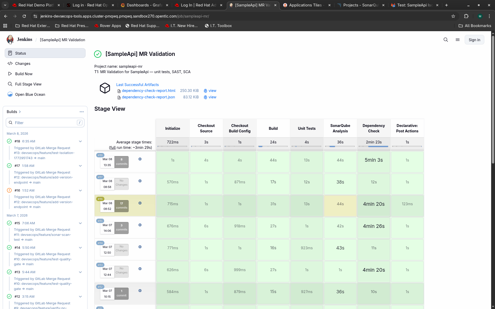
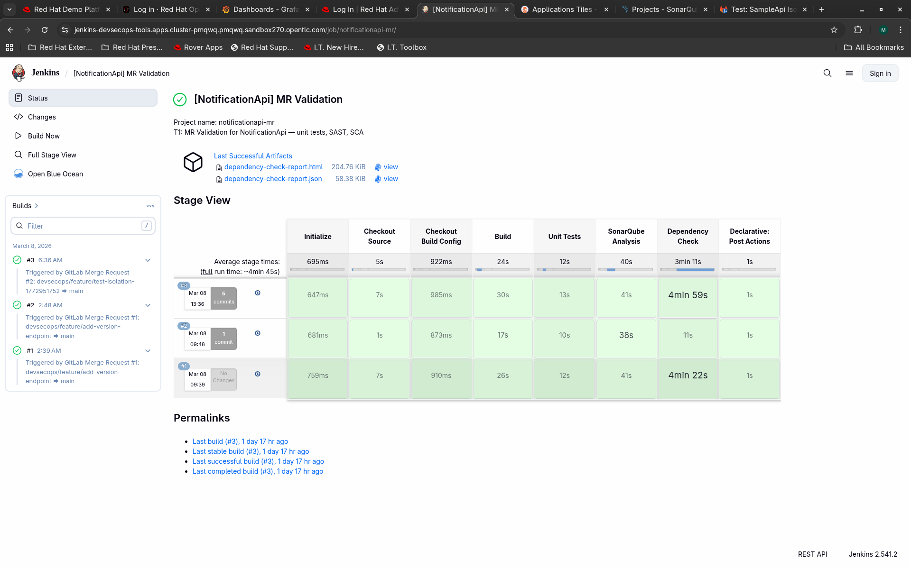
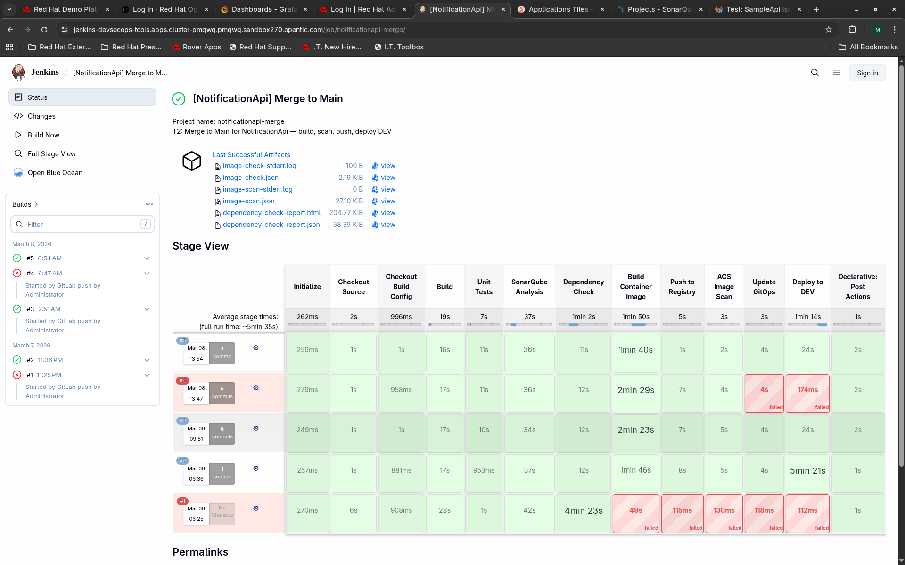
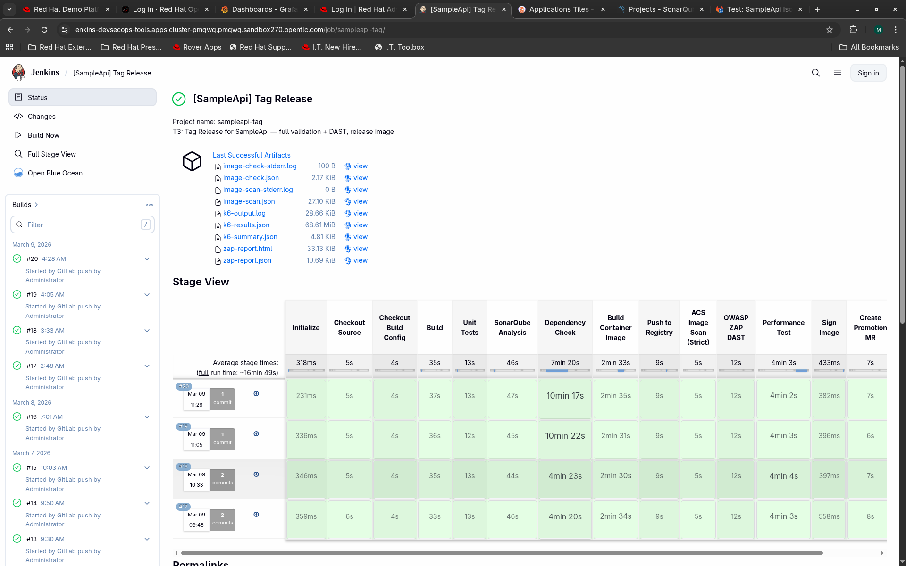
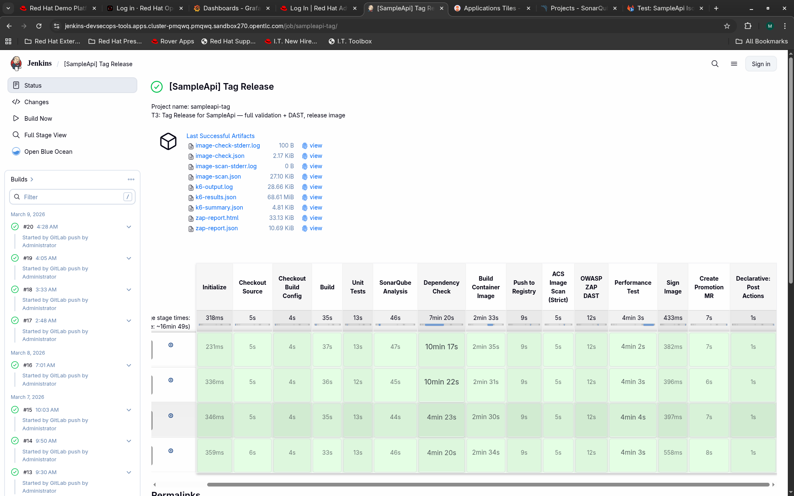

# Module 8: The 3-Trigger Pipeline

| Duration | Track | Prerequisites |
|----------|-------|---------------|
| ~75 min | Integration (M8-M10) | Modules 1-7 complete, Jenkins running with shared library, GitLab with 5 repos, SonarQube + ACS operational |

---

## What You Will Learn

By the end of this module you will understand:

- Why Trunk-Based Development uses three separate pipeline triggers instead of one
- How each trigger maps to a Git event, a Jenkins job, and a set of validation stages
- How progressive validation works -- each trigger adds more checks than the last
- How service-parameterized pipelines enable multi-service architectures with shared orchestrators
- How GitLab webhooks wire Git events to Jenkins pipeline jobs (7 webhooks across 3 repos)
- How a fourth trigger (T4) cascades environment promotions automatically across services
- How pipeline status flows back to GitLab MRs and commits
- How concurrent T2 pipelines from different services avoid GitOps push conflicts

---

## 1. Concepts: Why Three Triggers?

### The Problem With a Single Pipeline

Most teams start with one pipeline that does everything: build, test, scan, deploy. The problem is that running a 45-minute pipeline on every commit to a feature branch wastes compute and slows down feedback. Meanwhile, skipping security scans on feature branches means vulnerabilities slip through to main.

Trunk-Based Development solves this by recognizing that **different Git events need different levels of validation**.

### The Three Events That Matter

In TBD, exactly three things happen in the lifecycle of a code change:

1. A developer opens a Merge Request (or pushes to one)
2. That MR gets approved and merged to `main`
3. Someone tags a release (e.g., `v1.2.0`)

Each event has a different question to answer:

| Event | Question | What We Need |
|-------|----------|--------------|
| MR opened/updated | "Is this code safe to merge?" | Fast feedback: tests, SAST, SCA |
| Merged to main | "Can we deploy this to DEV?" | Everything above + container image + ACS scan + deploy |
| Tag pushed | "Is this release-ready?" | Everything from T1 + container image + ACS strict + DAST + perf test + signing (NO deploy) |

This is **progressive validation** -- each trigger includes everything the previous one did, then adds more.

### The Flow (Multi-Service)

```
 Developer pushes feature branch (to app-source or notificationapi-source)
        |
        v
  +--[ T1: MR Pipeline ]--+      <-- "Is it safe to merge?"
  | checkout               |          ~5 min, lightweight
  | build (.NET)           |          Result: pass/fail on GitLab MR
  | unit tests             |          Per-service: own job, own repo
  | SonarQube (SAST)       |
  | Dependency-Check (SCA) |
  | --> report to MR       |
  +------------------------+
        |
        | MR approved + merged
        v
  +--[ T2: Merge Pipeline ]--+   <-- "Can we ship to DEV?"
  | everything from T1        |       ~15 min
  | + build container image   |       Result: image in registry,
  | + push to registry        |               app running in DEV
  | + ACS image scan          |       Updates only THIS service's
  | + update GitOps (DEV)     |         overlay in app-gitops
  | + ArgoCD sync DEV         |
  +---------------------------+
        |
        | Team decides to release, pushes tag v1.2.0
        v
  +--[ T3: Tag Pipeline ]--------+  <-- "Is this release-ready?"
  | T1 stages + image build/push   |      ~25 min
  | + ACS scan (STRICT mode)       |      Result: release image in registry,
  | + OWASP ZAP DAST               |              SIT promotion MR created,
  | + k6 performance test          |              NO deployment
  | + Cosign image signing         |
  | + create SIT promotion MR     |
  | (NO GitOps update, NO deploy) |
  +--------------------------------+
        |
        | Lead approves + merges the SIT promotion MR
        v
  +--[ T4: Promote Pipeline ]----+  <-- "Deploy to next env"
  | detect changed service+env    |      ~5 min
  | ArgoCD sync (SIT/UAT/PROD)    |      Shared across all services
  | health verification            |      Auto-detects which service
  | cascade: create next env MR   |        changed via git diff regex
  +-------------------------------+
```

> **Key insight:** T3 produces a release-ready image but does NOT deploy it. Deployment to SIT, UAT, and PROD happens through T4 -- triggered by MR merges in the GitOps repo, not the application repo. This creates an audit trail: every promotion is an approved MR.

### Multi-Service Architecture: One Pattern, Many Services

In a microservice architecture, each service has its **own source repo, own Jenkins jobs, and own webhooks**. But the pipeline logic is shared -- the same orchestrator functions handle any service through parameterization:

```
                    app-source repo (project ID 1)
                    ├── Webhook 1 → sampleapi-mr       → pipelineMR()
                    ├── Webhook 2 → sampleapi-merge    → pipelineMerge()
                    └── Webhook 3 → sampleapi-tag      → pipelineTag()

                    notificationapi-source repo (project ID 5)
                    ├── Webhook 4 → notificationapi-mr     → pipelineMR(service: 'notificationapi')
                    ├── Webhook 5 → notificationapi-merge  → pipelineMerge(service: 'notificationapi')
                    └── Webhook 6 → notificationapi-tag    → pipelineTag(service: 'notificationapi')

                    app-gitops repo (project ID 4)
                    └── Webhook 7 → sampleapi-promote  → pipelinePromote()  [shared]
```

The `service` parameter tells the orchestrator which repo to clone, which image to build, which SonarQube project to scan against, and which GitOps overlay to update. SampleApi jobs omit the parameter (it defaults to `sampleapi`).

### Why Not Just One Pipeline With Conditional Stages?

You could use `when` blocks to skip stages based on the branch. Teams do this. Here is why we chose separate orchestrators instead:

1. **Timeouts differ.** T1 should fail after 30 minutes; T3 needs 90 minutes for DAST + performance tests.
2. **Agent pods differ.** T3 needs a ZAP sidecar container; T1 and T2 do not.
3. **Failure semantics differ.** A SonarQube failure in T1 blocks the MR. The same failure in T3 blocks a release. Different audiences, different actions.
4. **Readability.** Three 50-line orchestrators are easier to debug than one 200-line conditional monolith.

---

## 2. Prerequisites

> **Environment variables:** Before running any commands, source the environment file:
> ```bash
> source ./env.sh
> ```
> This sets `$OC`, `$APPS_DOMAIN`, `$NS_TOOLS`, and all other cluster-specific variables used throughout this module. See `env.sh` for the full variable list.

Before starting this module, confirm:

```bash
# Source the environment file
source ./env.sh

# Jenkins is running and accessible
curl -sk -o /dev/null -w "%{http_code}" ${JENKINS_URL}/login
# --> Expected: 200

# GitLab is running with all 5 repos
curl -sk "${GITLAB_URL}/-/readiness" | python3 -c "import json,sys; print(json.load(sys.stdin)['status'])"
# --> Expected: ok

# Shared library is pushed to GitLab
GITLAB_TOKEN=$($OC get secret gitlab-token -n $NS_TOOLS -o jsonpath='{.data.token}' | base64 -d)
curl -sk -H "PRIVATE-TOKEN: $GITLAB_TOKEN" \
  "${GITLAB_URL}/api/v4/projects/devsecops%2Fjenkins-shared-lib/repository/tree" | python3 -m json.tool | head -5
# --> Expected: list of files including vars/

# SonarQube is healthy
SONAR_PASS=$($OC get secret sonarqube-token -n $NS_TOOLS -o jsonpath='{.data.password}' | base64 -d)
curl -sk -u "admin:${SONAR_PASS}" \
  https://sonarqube-${NS_TOOLS}.${APPS_DOMAIN}/api/system/health \
  | python3 -c "import json,sys; print(json.load(sys.stdin)['health'])"
# --> Expected: GREEN
```

You also need the following secrets already created in the `devsecops-tools` namespace:

| Secret | Purpose |
|--------|---------|
| `gitlab-token` | Username/password for Git clone operations |
| `gitlab-api-token` | API token string for GitLab REST API calls |
| `sonarqube-token` | SonarQube analysis token |
| `acs-token` | ACS/StackRox API token for `roxctl` |
| `argocd-token` | ArgoCD admin password |

---

## 3. Step 1: Understand the Job Definitions (Tell)

### Where Pipeline Logic Lives

A critical design decision in this project: **no Jenkinsfile exists in any repository.** Pipeline logic lives entirely in the Jenkins shared library. Jenkins jobs use inline CPS scripts that call shared library orchestrators.

Here is what that looks like in the JCasC ConfigMap for a SampleApi job:

```yaml
# From infra/phase7/jenkins-casc-configmap.yaml
# SampleApi jobs omit the service parameter (defaults to sampleapi).

- script: |
    pipelineJob('sampleapi-mr') {
      description('T1: SampleApi MR Validation')
      triggers {
        gitlabPush {
          buildOnMergeRequestEvents(true)   # <-- fires on MR open/update
          buildOnPushEvents(false)           # <-- ignores direct pushes
        }
      }
      definition {
        cps {
          script('''
            @Library('devsecops-shared-lib@main') _
            pipelineMR()                      # <-- defaults to sampleapi
          '''.stripIndent())
          sandbox(true)
        }
      }
    }
```

And here is the equivalent for NotificationApi -- the only difference is the job name, description, and the `service` parameter:

```yaml
# NotificationApi jobs pass service: 'notificationapi' to the shared orchestrator.

- script: |
    pipelineJob('notificationapi-mr') {
      description('T1: NotificationApi MR Validation')
      triggers {
        gitlabPush {
          buildOnMergeRequestEvents(true)
          buildOnPushEvents(false)
        }
      }
      definition {
        cps {
          script("""
            @Library('devsecops-shared-lib@main') _
            pipelineMR(service: 'notificationapi')
          """.stripIndent())
          sandbox(true)
        }
      }
    }
```

Seven jobs, four orchestrators:

| Jenkins Job | Service | Trigger Event | Calls | File |
|-------------|---------|---------------|-------|------|
| `sampleapi-mr` | sampleapi | MR opened/updated on app-source | `pipelineMR()` | `vars/pipelineMR.groovy` |
| `sampleapi-merge` | sampleapi | Push to `main` on app-source | `pipelineMerge()` | `vars/pipelineMerge.groovy` |
| `sampleapi-tag` | sampleapi | Tag pushed on app-source | `pipelineTag()` | `vars/pipelineTag.groovy` |
| `notificationapi-mr` | notificationapi | MR opened/updated on notificationapi-source | `pipelineMR(service: 'notificationapi')` | `vars/pipelineMR.groovy` |
| `notificationapi-merge` | notificationapi | Push to `main` on notificationapi-source | `pipelineMerge(service: 'notificationapi')` | `vars/pipelineMerge.groovy` |
| `notificationapi-tag` | notificationapi | Tag pushed on notificationapi-source | `pipelineTag(service: 'notificationapi')` | `vars/pipelineTag.groovy` |
| `sampleapi-promote` | shared | Push to `main` on app-gitops | `pipelinePromote()` | `vars/pipelinePromote.groovy` |

> **Why inline CPS instead of Jenkinsfile?** Because the app-source repo must contain zero CI/CD artifacts (Rule 1). The Jenkinsfile would have to live somewhere, and putting it in the app repo couples application code to pipeline logic. Inline CPS keeps the job definition in infrastructure-as-code (JCasC ConfigMap) and the logic in the shared library.

### How PipelineConfig.configureForService() Works

When an orchestrator receives `service: 'notificationapi'`, it calls `PipelineConfig.configureForService('notificationapi')`. This sets all service-specific values in one place:

```groovy
// From src/com/devsecops/PipelineConfig.groovy
@NonCPS
void configureForService(String serviceName) {
    this.activeServiceName = serviceName
    switch (serviceName) {
        case 'notificationapi':
            this.activeImageName   = this.notificationApiImageName
            this.activeSourceRepo  = "${this.gitlabUrl}/devsecops/notificationapi-source.git"
            this.activeBuildArgs   = [PROJECT_NAME: 'NotificationApi',
                                     SOLUTION_NAME: 'NotificationApi',
                                     APP_PORT: '8081']
            this.sonarProjectKey   = 'notificationapi'
            this.gitlabProjectId   = '5'    // notificationapi-source project ID
            break
        default:  // 'sampleapi'
            this.activeImageName   = this.imageName
            this.activeSourceRepo  = this.appSourceRepo      // derived in initFromEnv()
            this.activeBuildArgs   = [:]                      // Dockerfile defaults handle SampleApi
            this.sonarProjectKey   = this.appName
            break                                             // gitlabProjectId stays at '1' (default)
    }
}
```

Every downstream function -- `checkoutSource`, `buildDotnet`, `buildContainerImage`, `scanSonarQube`, `updateGitOps` -- reads from `pipelineConfig` to know which repo, image, and overlay to work with. The orchestrator code itself is identical for both services.

### The Webhook-to-Job Mapping

GitLab webhooks connect Git events to Jenkins jobs. Each webhook points at a specific Jenkins project URL. With two services, there are **7 webhooks across 3 repos**:

```
GitLab repo: app-source (project ID 1) -- SampleApi code
  Webhook 1: MR events       --> https://jenkins.../project/sampleapi-mr
  Webhook 2: Push to main    --> https://jenkins.../project/sampleapi-merge
  Webhook 3: Tag push        --> https://jenkins.../project/sampleapi-tag

GitLab repo: notificationapi-source (project ID 5) -- NotificationApi code
  Webhook 4: MR events       --> https://jenkins.../project/notificationapi-mr
  Webhook 5: Push to main    --> https://jenkins.../project/notificationapi-merge
  Webhook 6: Tag push        --> https://jenkins.../project/notificationapi-tag

GitLab repo: app-gitops (project ID 4) -- Shared GitOps manifests
  Webhook 7: Push to main    --> https://jenkins.../project/sampleapi-promote
```

Notice: three webhooks per service source repo (one per trigger type), one shared webhook on app-gitops (for promotion across all services).

---

## 4. Step 2: Wire Up GitLab Webhooks (Do)

### Create All Seven Webhooks

You need the GitLab API token and the Jenkins URL. These come from `env.sh`:

```bash
source ./env.sh
GITLAB_TOKEN=$($OC get secret gitlab-token -n $NS_TOOLS -o jsonpath='{.data.token}' | base64 -d)
export APP_SOURCE_PROJECT_ID=${GITLAB_PROJECT_APP_SOURCE}
export NOTIFICATIONAPI_SOURCE_PROJECT_ID=5
export APP_GITOPS_PROJECT_ID=${GITLAB_PROJECT_APP_GITOPS}
```

Now create all seven webhooks:

```bash
# ══════════════════════════════════════════════════════════════
# SAMPLEAPI webhooks (app-source, project ID 1)
# ══════════════════════════════════════════════════════════════

# ── Webhook 1: MR events --> T1 pipeline ──
# WHY: When a developer opens or updates an MR, we want fast feedback
# on code quality before the reviewer even looks at it.
curl -sk -X POST -H "PRIVATE-TOKEN: $GITLAB_TOKEN" \
  "${GITLAB_URL}/api/v4/projects/${APP_SOURCE_PROJECT_ID}/hooks" \
  -d "url=${JENKINS_URL}/project/sampleapi-mr" \
  -d "merge_requests_events=true" \
  -d "push_events=false" \
  -d "tag_push_events=false" \
  -d "enable_ssl_verification=false"

# ── Webhook 2: Push to main --> T2 pipeline ──
# WHY: After an MR is merged, we need to build the container image
# and deploy to DEV automatically.
curl -sk -X POST -H "PRIVATE-TOKEN: $GITLAB_TOKEN" \
  "${GITLAB_URL}/api/v4/projects/${APP_SOURCE_PROJECT_ID}/hooks" \
  -d "url=${JENKINS_URL}/project/sampleapi-merge" \
  -d "push_events=true" \
  -d "push_events_branch_filter=main" \
  -d "merge_requests_events=false" \
  -d "tag_push_events=false" \
  -d "enable_ssl_verification=false"

# ── Webhook 3: Tag push --> T3 pipeline ──
# WHY: When someone tags a release, we run the full battery of checks
# including DAST + performance tests, then produce a release-ready image.
curl -sk -X POST -H "PRIVATE-TOKEN: $GITLAB_TOKEN" \
  "${GITLAB_URL}/api/v4/projects/${APP_SOURCE_PROJECT_ID}/hooks" \
  -d "url=${JENKINS_URL}/project/sampleapi-tag" \
  -d "tag_push_events=true" \
  -d "push_events=false" \
  -d "merge_requests_events=false" \
  -d "enable_ssl_verification=false"

# ══════════════════════════════════════════════════════════════
# NOTIFICATIONAPI webhooks (notificationapi-source, project ID 5)
# ══════════════════════════════════════════════════════════════

# ── Webhook 4: MR events --> T1 pipeline ──
curl -sk -X POST -H "PRIVATE-TOKEN: $GITLAB_TOKEN" \
  "${GITLAB_URL}/api/v4/projects/${NOTIFICATIONAPI_SOURCE_PROJECT_ID}/hooks" \
  -d "url=${JENKINS_URL}/project/notificationapi-mr" \
  -d "merge_requests_events=true" \
  -d "push_events=false" \
  -d "tag_push_events=false" \
  -d "enable_ssl_verification=false"

# ── Webhook 5: Push to main --> T2 pipeline ──
curl -sk -X POST -H "PRIVATE-TOKEN: $GITLAB_TOKEN" \
  "${GITLAB_URL}/api/v4/projects/${NOTIFICATIONAPI_SOURCE_PROJECT_ID}/hooks" \
  -d "url=${JENKINS_URL}/project/notificationapi-merge" \
  -d "push_events=true" \
  -d "push_events_branch_filter=main" \
  -d "merge_requests_events=false" \
  -d "tag_push_events=false" \
  -d "enable_ssl_verification=false"

# ── Webhook 6: Tag push --> T3 pipeline ──
curl -sk -X POST -H "PRIVATE-TOKEN: $GITLAB_TOKEN" \
  "${GITLAB_URL}/api/v4/projects/${NOTIFICATIONAPI_SOURCE_PROJECT_ID}/hooks" \
  -d "url=${JENKINS_URL}/project/notificationapi-tag" \
  -d "tag_push_events=true" \
  -d "push_events=false" \
  -d "merge_requests_events=false" \
  -d "enable_ssl_verification=false"

# ══════════════════════════════════════════════════════════════
# GITOPS webhook (app-gitops, project ID 4) -- shared across services
# ══════════════════════════════════════════════════════════════

# ── Webhook 7: Push to main on app-gitops --> T4 pipeline ──
# WHY: When a promotion MR is merged, deploy to the target environment
# and cascade to the next one. T4 auto-detects which service changed.
curl -sk -X POST -H "PRIVATE-TOKEN: $GITLAB_TOKEN" \
  "${GITLAB_URL}/api/v4/projects/${APP_GITOPS_PROJECT_ID}/hooks" \
  -d "url=${JENKINS_URL}/project/sampleapi-promote" \
  -d "push_events=true" \
  -d "push_events_branch_filter=main" \
  -d "merge_requests_events=false" \
  -d "tag_push_events=false" \
  -d "enable_ssl_verification=false"
```

### Verify Webhooks Were Created

```bash
echo "=== app-source webhooks (sampleapi) ==="
curl -sk -H "PRIVATE-TOKEN: $GITLAB_TOKEN" \
  "${GITLAB_URL}/api/v4/projects/${APP_SOURCE_PROJECT_ID}/hooks" \
  | python3 -c "
import json, sys
hooks = json.load(sys.stdin)
for h in hooks:
    events = []
    if h.get('merge_requests_events'): events.append('MR')
    if h.get('push_events'): events.append('push')
    if h.get('tag_push_events'): events.append('tag')
    print(f\"  {h['url']}  events={events}\")
"
# --> Expected:
#   .../project/sampleapi-mr     events=['MR']
#   .../project/sampleapi-merge  events=['push']
#   .../project/sampleapi-tag    events=['tag']

echo "=== notificationapi-source webhooks ==="
curl -sk -H "PRIVATE-TOKEN: $GITLAB_TOKEN" \
  "${GITLAB_URL}/api/v4/projects/${NOTIFICATIONAPI_SOURCE_PROJECT_ID}/hooks" \
  | python3 -c "
import json, sys
hooks = json.load(sys.stdin)
for h in hooks:
    events = []
    if h.get('merge_requests_events'): events.append('MR')
    if h.get('push_events'): events.append('push')
    if h.get('tag_push_events'): events.append('tag')
    print(f\"  {h['url']}  events={events}\")
"
# --> Expected:
#   .../project/notificationapi-mr     events=['MR']
#   .../project/notificationapi-merge  events=['push']
#   .../project/notificationapi-tag    events=['tag']

echo "=== app-gitops webhooks (shared promote) ==="
curl -sk -H "PRIVATE-TOKEN: $GITLAB_TOKEN" \
  "${GITLAB_URL}/api/v4/projects/${APP_GITOPS_PROJECT_ID}/hooks" \
  | python3 -c "
import json, sys
hooks = json.load(sys.stdin)
for h in hooks:
    print(f\"  {h['url']}  push={h.get('push_events')}\")
"
# --> Expected:
#   .../project/sampleapi-promote  push=True
```

> **Important: Anonymous permissions.** GitLab webhooks hit Jenkins without authentication. Jenkins must grant anonymous users `Overall/Read`, `Job/Read`, and `Job/Build` permissions. This is already configured in the JCasC ConfigMap under `authorizationStrategy.globalMatrix`. Without it, webhooks get HTTP 403 and silently fail.

---

## 5. Step 3: Walk Through T1 -- The MR Pipeline (Show)

T1 is the fast-feedback loop. A developer pushes to a feature branch and opens an MR. Within minutes, the MR shows a green checkmark or a red X.

### What Happens

```
GitLab MR webhook fires (from app-source or notificationapi-source)
  --> Jenkins {service}-mr job starts
    --> loads shared library
    --> calls pipelineMR() or pipelineMR(service: 'notificationapi')

pipelineMR() runs these stages:
  1. Initialize      -- configureForService(), report "running" to GitLab MR
  2. Checkout Source  -- clone {service}-source at the MR source branch
  3. Checkout Build Config -- clone build-config repo alongside
  4. Build            -- dotnet restore + build + publish
  5. Unit Tests       -- dotnet test with coverage
  6. SonarQube        -- SAST analysis + quality gate check
  7. Dependency Check -- SCA for known CVEs in dependencies

Post block:
  success --> green checkmark on MR + summary comment
  failure --> red X on MR + failure comment with details
```

### Key Code: Service Initialization

The first thing every orchestrator does is configure itself for the active service. This determines which repo to clone, which SonarQube project to scan, and which GitLab project to report status to:

```groovy
// From vars/pipelineMR.groovy -- Initialize stage
def serviceName = config.service ?: 'sampleapi'
pipelineConfig.initFromEnv(env)
pipelineConfig.configureForService(serviceName)
// Update env after configureForService (environment block evaluates too early)
env.GITLAB_PROJECT_ID = pipelineConfig.gitlabProjectId

echo "=== T1: MR Validation Pipeline ==="
echo "  Service: ${serviceName}"
echo "  Source repo: ${pipelineConfig.activeSourceRepo}"
echo "  Branch: ${env.gitlabSourceBranch ?: env.GIT_BRANCH ?: 'unknown'}"
echo "  MR Commit: ${env.gitlabMergeRequestLastCommit ?: 'N/A'}"
echo "  MR IID: ${env.gitlabMergeRequestIid ?: 'N/A'}"
```

After this, every downstream function reads from `pipelineConfig` -- the orchestrator code is identical regardless of which service is being built.

### Key Code: How T1 Reports to GitLab

The orchestrator uses the GitLab plugin's `updateGitlabCommitStatus` step. This works for T1 and T2 because the job has `gitLabConnection('gitlab')` in its options and the webhook payload includes `gitlabMergeRequestLastCommit`:

```groovy
// From vars/pipelineMR.groovy -- options block
options {
    // ...
    gitLabConnection('gitlab')  // <-- required for updateGitlabCommitStatus
}

// In the Initialize stage -- mark pipeline as "running" on the MR
updateGitlabCommitStatus name: 'jenkins-ci', state: 'running'

// In the post-success block -- mark as "success" (green checkmark)
updateGitlabCommitStatus name: 'jenkins-ci', state: 'success'
// Also posts a detailed comment on the MR with stage results table
commentOnMR(
    status: 'SUCCESS',
    results: results,
    pipelineConfig: pipelineConfig,
    gitlabUrl: pipelineConfig.gitlabUrl,
    projectId: pipelineConfig.gitlabProjectId
)
```

The `commentOnMR` function builds a Markdown table showing each stage's status, duration, and findings count. The reviewer sees this directly in the MR discussion without opening Jenkins.

### Key Code: How Build Config Is Cloned Separately

The application repo contains zero CI/CD files. The Dockerfile and SonarQube config live in a separate `build-config` repo. The pipeline clones both:

```groovy
// Stage: Checkout Source -- clones {service}-source into workspace root
results.checkout = checkoutSource(
    branch: branch,
    gitUrl: pipelineConfig.activeSourceRepo   // <-- service-specific repo
)

// Stage: Checkout Build Config -- clones build-config into ./build-config/
results.buildConfig = checkoutBuildConfig(
    gitUrl: pipelineConfig.buildConfigRepo    // <-- shared build-config repo
)

// After both checkouts, workspace looks like:
//   ./src/SampleApi/         <-- from app-source (or NotificationApi/ from notificationapi-source)
//   ./tests/SampleApi.Tests/ <-- from app-source (or NotificationApi.Tests/)
//   ./SampleApi.sln          <-- from app-source (or NotificationApi.sln)
//   ./build-config/          <-- from build-config repo (shared)
//     Dockerfile             <-- parameterized: --build-arg PROJECT_NAME=SampleApi
//     sonar-project.properties
//     dependency-check-suppression.xml
```

This separation means the application team never has to touch CI/CD config, and the platform team can update the Dockerfile independently. The same Dockerfile works for both services through build args (`--build-arg PROJECT_NAME=SampleApi` vs `--build-arg PROJECT_NAME=NotificationApi`).

### T1 Timeout and Scope

T1 is deliberately constrained:

- **Timeout: 30 minutes** -- if it takes longer, something is wrong
- **No container image build** -- saves 3-5 minutes
- **No ACS scan** -- nothing to scan (no image)
- **No DAST** -- no deployed target to scan against
- **No deployment** -- this is validation only

Here is the Jenkins Stage View for the SampleApi MR Validation (T1) pipeline, showing the stages and their durations:



And the NotificationApi MR Validation (T1) pipeline -- same stages, same shared library, different service:



---

## 6. Step 4: Walk Through T2 -- The Merge Pipeline (Show)

T2 fires when the MR is approved and merged. The push-to-main webhook triggers `{service}-merge`, which calls `pipelineMerge()` (or `pipelineMerge(service: 'notificationapi')`).

### What T2 Adds Over T1

```
T1 stages (repeated):
  Initialize, Checkout Source, Checkout Build Config,
  Build, Unit Tests, SonarQube, Dependency Check

T2-only stages (new):
  8.  Build Container Image  -- podman build using build-config/Dockerfile
  9.  Push to Registry       -- push to OCP internal registry
  10. ACS Image Scan         -- roxctl image check + scan
  11. Update GitOps          -- update image tag in services/{svc}/overlays/dev/
  12. Deploy to DEV          -- ArgoCD sync + health wait
```

### Key Code: Image Tagging

T2 generates a tag from the merge commit SHA. This makes every merge-to-main image uniquely identifiable and traceable back to the exact commit:

```groovy
// From vars/pipelineMerge.groovy
def gitCommit = env.GIT_COMMIT ?: sh(
    script: 'git rev-parse HEAD', returnStdout: true
).trim()
results.commitSha = gitCommit
pipelineConfig.imageTag = com.devsecops.ImageTagger.forMerge(gitCommit)
// --> produces: "main-a1b2c3d"
```

The `ImageTagger.forMerge()` method is intentionally simple -- it takes the first 7 characters of the SHA and prefixes `main-`. This convention makes it obvious from the tag alone that an image came from a merge pipeline, not a release.

### Key Code: Push BEFORE ACS Scan

Notice the stage ordering -- `Push to Registry` comes before `ACS Image Scan`. This is counterintuitive (why push an image before you know it is safe?) but necessary:

```groovy
// KNOWN FIX: Push BEFORE ACS scan -- ACS pulls from registry to scan.
// It cannot scan a local Podman image. The image must be in a registry
// that ACS has an integration configured for.
stage('Push to Registry') { /* ... */ }

stage('ACS Image Scan') {
    steps {
        script {
            results.acsScan = scanACSImage(
                imageRef: pipelineConfig.getActiveImageRef(),  // <-- registry ref for active service
                acsUrl: pipelineConfig.acsUrl
            )
        }
    }
}
```

If ACS finds critical vulnerabilities, the pipeline fails, but the image stays in the registry tagged `main-a1b2c3d`. It will never be deployed because the GitOps update stage never runs. Old undeployed images can be cleaned up by a registry retention policy.

### Key Code: GitOps Update (Per-Service Isolation)

After all scans pass, T2 updates only the active service's DEV overlay in the GitOps repo:

```groovy
// Update the image tag in services/{svc}/overlays/dev/kustomization.yaml
results.gitops = updateGitOps(
    environment: 'dev',
    imageRef: pipelineConfig.getActiveImageRef(),
    appName: pipelineConfig.activeImageName,   // <-- 'sampleapi' or 'notificationapi'
    gitopsRepo: pipelineConfig.gitopsRepo
)

// Trigger ArgoCD sync and wait for health
results.deploy = deployToEnvironment(
    app: "${pipelineConfig.activeServiceName}-dev",  // <-- "sampleapi-dev" or "notificationapi-dev"
    argocdServer: pipelineConfig.argocdServer
)
```

The `updateGitOps` function clones app-gitops, navigates to `services/{svc}/overlays/dev/`, runs `kustomize edit set image` on that service's overlay only, commits, and pushes. Each service has its own ArgoCD Application, so syncing `sampleapi-dev` does not affect `notificationapi-dev`.

### Key Code: Concurrent T2 Push Conflict Resolution

When two services merge to main at roughly the same time, both T2 pipelines try to push to app-gitops simultaneously. The second push gets rejected with "non-fast-forward". The `updateGitOps` function handles this with a retry loop:

```groovy
// From vars/updateGitOps.groovy -- push with rebase retry
def pushSuccess = false
for (int attempt = 1; attempt <= 3; attempt++) {
    def pushExit = sh(script: "git push origin ${branch} 2>&1", returnStatus: true)
    if (pushExit == 0) {
        pushSuccess = true
        break
    }
    echo "Push attempt ${attempt} failed — pulling and rebasing..."
    sh "git pull --rebase origin ${branch}"
    // Rebase re-applies our commit on top of the other service's commit
}
if (!pushSuccess) {
    error "GitOps push failed after 3 attempts"
}
```

This works because the two services modify different files (`services/sampleapi/overlays/dev/kustomization.yaml` vs `services/notificationapi/overlays/dev/kustomization.yaml`), so rebasing never produces conflicts.

### T2 Timeout and Security Gate

- **Timeout: 60 minutes** -- container build + ACS scan take time
- **Security gate evaluation** in the `post.always` block summarizes all scan results:

```groovy
post {
    always {
        script {
            def gateResult = com.devsecops.SecurityGate.evaluate(results, pipelineConfig)
            echo com.devsecops.SecurityGate.formatReport(gateResult)
        }
        cleanWs()
    }
}
```

`SecurityGate.evaluate()` checks SonarQube gate status, ACS critical count against threshold, dependency-check results, and coverage percentage. The formatted report prints to the console log for auditing.

Here is the Jenkins Stage View for the SampleApi Merge to Main (T2) pipeline. Notice the additional stages after Dependency Check -- Build Container Image, Push to Registry, ACS Image Scan, GitOps Update, and Deploy to DEV:


And the NotificationApi Merge to Main (T2) pipeline -- identical stage structure, different service configuration:



---

## 7. Step 5: Walk Through T3 -- The Tag Pipeline (Show)

T3 is the release gate. When someone pushes a tag like `v1.2.0`, this pipeline runs every check at maximum strictness.

### What T3 Adds Over T2

```
Stages shared with T1 and T2 (repeated):
  1-7.  Initialize, Checkout Source, Checkout Build Config,
        Build, Unit Tests, SonarQube, Dependency Check
  8.    Build Container Image
  9.    Push to Registry

T3-only stages (new or modified):
  10.  ACS Image Scan (Strict)  -- same scan, stricter mode than T2
  11.  OWASP ZAP DAST           -- dynamic scan against live DEV endpoint
  12.  Performance Test          -- k6 load test with threshold gates
  13.  Sign Image                -- Cosign cryptographic image signature
  14.  Create Promotion MR      -- auto-create SIT promotion MR in app-gitops

Stages from T2 that T3 does NOT run:
  -  Update GitOps (DEV)       -- T3 does not update any overlay
  -  Deploy to DEV             -- T3 does not deploy anywhere
```

### What T3 Does NOT Do

T3 does **not** deploy. It does not update any GitOps overlay for DEV (that was T2's job). It does not sync ArgoCD. The only deployment action is creating a Merge Request in app-gitops that, when approved and merged, will trigger T4 to deploy to SIT.

This is deliberate: a release image should be validated in SIT/UAT/PROD through an approval process, not automatically deployed.

### Key Code: ZAP Sidecar Architecture

T3 needs OWASP ZAP for DAST scanning. ZAP is too large to include in the agent image, so T3 overrides the agent definition to add a ZAP sidecar container:

```groovy
// From vars/pipelineTag.groovy -- agent block
agent {
    kubernetes {
        inheritFrom 'devsecops-agent'   // <-- keep all existing tools
        yaml """
apiVersion: v1
kind: Pod
spec:
  securityContext:
    runAsUser: 0
  containers:
  - name: zap
    image: ghcr.io/zaproxy/zaproxy:stable
    command:
    - zap.sh
    args:
    - -daemon
    - -host
    - '0.0.0.0'
    - -port
    - '8090'
    - -config
    - api.addrs.addr.name=.*
    - -config
    - api.addrs.addr.regex=true
    - -config
    - api.disablekey=true
    resources:
      requests:
        cpu: 200m
        memory: 256Mi
      limits:
        cpu: 500m
        memory: 1Gi
"""
    }
}
```

The `inheritFrom 'devsecops-agent'` directive keeps the jnlp container with dotnet, podman, and roxctl. The ZAP container runs alongside as a sidecar. The `scanOWASPZAP` function communicates with ZAP via its REST API on `localhost:8090` (pods share the network namespace):

```groovy
// From vars/scanOWASPZAP.groovy (simplified)
// Step 1: Spider the target to discover endpoints
curl "${zapUrl}/JSON/spider/action/scan/?url=${target}"

// Step 2: Wait for passive scan (runs automatically during spider)
// Step 3: Optionally run active scan

// Step 4: Get alert counts
curl "${zapUrl}/JSON/alert/view/alertsSummary/?baseurl=${target}"

// Step 5: Generate and archive HTML + JSON reports
curl "${zapUrl}/OTHER/core/other/htmlreport/" -o zap-report.html
```

### Key Code: Performance Test Quality Gate

After DAST, T3 runs a k6 load test against the DEV endpoint. If latency or error rate exceeds thresholds, the pipeline fails and the promotion MR is not created (the image is already pushed at this point -- Push to Registry runs before Performance Test):

```groovy
// From vars/pipelineTag.groovy -- Performance Test stage (after DAST, before Sign)
stage('Performance Test') {
    steps {
        script {
            // DEV route URL is computed from pipelineConfig.gitlabUrl
            def appsDomain = pipelineConfig.gitlabUrl
                .replace('https://gitlab-devsecops-gitlab.', '')
            def devRoute = "https://${pipelineConfig.appName}-${pipelineConfig.appName}-dev.${appsDomain}"

            results.perfTest = runPerformanceTest(
                targetUrl: devRoute,
                testScript: 'build-config/tests/performance/load-test.js',
                serviceName: serviceName,
                abortOnFailure: true
            )
            // runPerformanceTest handles threshold breaches internally --
            // k6 exit code 99 means thresholds breached, which the function
            // translates to FAILURE status. No manual error() call needed.
        }
    }
}
```

The k6 script defines threshold gates:

```javascript
// From build-config/tests/performance/load-test.js (thresholds section)
export const options = {
  thresholds: {
    http_req_duration: [
      'p(95)<800',                        // 95th percentile under 800ms
      { threshold: 'p(99)<2000',          // 99th percentile under 2 seconds
        abortOnFail: true,
        delayAbortEval: '30s' },          // Give 30s to stabilize first
    ],
    http_req_failed: [
      { threshold: 'rate<0.01',           // Less than 1% errors
        abortOnFail: true },
    ],
    errors: ['rate<0.05'],                // Custom check error rate under 5%
    forecast_latency: ['p(95)<500'],      // Business endpoint under 500ms p95
  },
};
```

k6 exits with code 99 when thresholds are breached. `runPerformanceTest.groovy` captures this exit code and marks the stage as failed. The promotion MR description includes a performance results row (p90, p95, max latency, error rate, total requests) so reviewers see the numbers.

### Key Code: Tag Name Resolution

When GitLab sends a tag push webhook, the tag name arrives in various formats depending on the context. The `ImageTagger.forTag()` method normalizes it:

```groovy
// From vars/pipelineTag.groovy -- Initialize stage
def rawTag = env.gitlabBranch ?: env.GIT_BRANCH ?: env.TAG_NAME ?: ''
def tagName = com.devsecops.ImageTagger.forTag(rawTag)
// rawTag might be: "v1.2.0", "refs/tags/v1.2.0", or "origin/tags/v1.2.0"
// tagName will be: "v1.2.0" in all cases
```

> **Gotcha: Annotated tags and commit SHAs.** For annotated tags (created with `git tag -a`), the webhook's `gitlabAfter` field contains the tag object SHA, not the commit SHA. The actual commit SHA is only known after checkout. That is why T3 posts the "running" status to GitLab after checkout, not in Initialize:

```groovy
// After checkout, resolve the REAL commit SHA
results.commitSha = sh(
    script: 'git rev-parse HEAD', returnStdout: true
).trim()
// NOW we can post status to GitLab with the correct commit
setGitLabPipelineStatus('running', results.commitSha, pipelineConfig)
```

### Key Code: ACS Strict Mode

T3 passes `strict: true` to the ACS scan, which makes it fail on any policy violation:

```groovy
results.acsScan = scanACSImage(
    imageRef: pipelineConfig.getActiveImageRef(),
    acsUrl: pipelineConfig.acsUrl,
    strict: true   // <-- T3 only: zero tolerance for violations
)
```

In T2, the same scan runs in non-strict mode -- it reports findings but does not block the pipeline unless critical vulnerabilities exceed the threshold. In T3, any violation is a hard stop.

### Key Code: Automatic Promotion MR

After all gates pass, T3 creates a Merge Request in app-gitops to promote the release to SIT:

```groovy
results.promotionMR = createPromotionMR(
    imageTag: pipelineConfig.imageTag,   // e.g., "v1.2.0"
    targetEnv: 'sit',
    results: results,                     // <-- full scan results (including perfTest)
    pipelineConfig: pipelineConfig,
    gitopsRepo: pipelineConfig.gitopsRepo,
    gitlabUrl: pipelineConfig.gitlabUrl
)
```

The `createPromotionMR` function:
1. Clones app-gitops
2. Creates a branch `promote/sampleapi/v1.2.0-to-sit` (includes service name to avoid collisions between services)
3. Navigates to `services/{activeImage}/overlays/sit/` (per-service path)
4. Runs `kustomize edit set image` on the SIT overlay
5. Commits and pushes
6. Creates a GitLab MR via API with a description containing all T3 scan results
7. Posts a commit status on the source branch so the MR shows a green pipeline

The MR description is a formatted Markdown table with build, test, SAST, SCA, ACS, DAST, performance test, and signing results. The team lead reviewing the MR sees everything without opening Jenkins.

### Key Code: GitLab Status Reporting for T3

T3 cannot use the GitLab plugin's `updateGitlabCommitStatus` because inline CPS jobs do not reliably match the correct GitLab project. Instead, T3 uses the GitLab Commit Status API directly:

```groovy
// From vars/pipelineTag.groovy -- setGitLabPipelineStatus()
withCredentials([string(credentialsId: 'gitlab-api-token', variable: 'GITLAB_TOKEN')]) {
    sh """
        curl -sf -X POST \
            -H "PRIVATE-TOKEN: \${GITLAB_TOKEN}" \
            "${gitlabUrl}/api/v4/projects/${projectId}/statuses/${commitSha}" \
            -d "state=${state}" \
            -d "name=jenkins/tag-pipeline" \
            -d "ref=${tagName}" \
            -d "target_url=${buildUrl}" \
            -d "description=${description}"
    """
}
```

This posts the pipeline status on the tag's commit in the service's source repo, so it shows up in GitLab's commit/pipeline UI.

### T3 Timeout

- **Timeout: 90 minutes** -- ZAP spidering + active scanning can take 10+ minutes, and k6 load tests run for 4+ minutes

Here is the Jenkins Stage View for the SampleApi Tag Release (T3) pipeline. Notice the additional stages compared to T2 -- OWASP ZAP DAST, Performance Test, and Create Promotion MR. There is no Deploy stage because T3 produces a release image without deploying:





And the NotificationApi Tag Release (T3) pipeline:


---

## 8. Step 6: Walk Through T4 -- The Promote Pipeline (Show)

T4 is the deployment and cascading promotion pipeline. Unlike T1-T3 which are per-service, T4 is **shared across all services**. It fires when any promotion MR is merged into app-gitops and auto-detects which service and environment changed.

### How T4 Detects Which Service Changed

```groovy
// From vars/pipelinePromote.groovy -- detect changed service+env
// Uses gitlabBefore..gitlabAfter (NOT HEAD~1..HEAD) for correct
// multi-merge detection when MRs are merged in rapid succession.

def diffFrom = env.gitlabBefore ?: ''
def diffTo = env.gitlabAfter ?: 'HEAD'
def diffRange = (diffFrom && diffFrom != '0000000000000000000000000000000000000000')
    ? "${diffFrom}..${diffTo}"
    : 'HEAD~1..HEAD'

def changedFiles = sh(
    script: "git diff --name-only ${diffRange} 2>/dev/null || echo ''",
    returnStdout: true
).trim()

// Iterate changed files and extract service + env via regex
// e.g., "services/sampleapi/overlays/sit/kustomization.yaml"
//        --> service=sampleapi, envDir=sit
def approverMap = [SIT: 'Team Lead', UAT: 'QA Lead', PROD: 'CAB']
def envsToSync = []
changedFiles.split('\n').each { file ->
    def match = (file =~ /^services\/([^\/]+)\/overlays\/([^\/]+)\//)
    if (match) {
        def service = match[0][1]    // 'sampleapi' or 'notificationapi'
        def envDir = match[0][2]     // 'sit', 'uat', 'production', or 'dev'
        // Skip DEV -- auto-synced by ArgoCD, T4 does not manage it
        if (envDir == 'dev') return
        def envLabel = envDir == 'production' ? 'PROD' : envDir.toUpperCase()
        def argoApp = envDir == 'production' ? "${service}-prod" : "${service}-${envDir}"
        if (!envsToSync.find { it.service == service && it.env == envLabel }) {
            envsToSync.add([
                service: service, app: argoApp, env: envLabel,
                envDir: envDir, approver: approverMap[envLabel] ?: 'Team'
            ])
        }
    }
}
```

> **Why `gitlabBefore..gitlabAfter` instead of `HEAD~1..HEAD`?** When two promotion MRs merge in rapid succession (e.g., sampleapi SIT then notificationapi SIT), `HEAD~1..HEAD` only sees the last commit. The webhook payload's `gitlabBefore` and `gitlabAfter` fields give the exact commit range for this push event, ensuring T4 sees the correct changes even during burst merges.

### T4 Skips DEV

DEV changes come from T2 pipelines and are auto-synced by ArgoCD. If T4 detects a DEV overlay change, it skips it inside the loop:

```groovy
// Inside the changedFiles.each loop (shown above):
if (envDir == 'dev') return   // <-- skip DEV overlay changes
```

This `return` exits the current `.each` iteration, not the entire function. DEV overlay changes (from T2 pipelines) are ignored because ArgoCD auto-syncs them.

### T4 Cascading Promotion Chain

After deploying to one environment, T4 automatically creates a promotion MR for the next:

```
T3 creates: SIT promotion MR (services/sampleapi/overlays/sit)
  --> Lead merges --> T4 fires
    --> ArgoCD syncs sampleapi-sit
    --> Health check passes
    --> Auto-creates: UAT promotion MR (services/sampleapi/overlays/uat)
      --> QA merges --> T4 fires
        --> ArgoCD syncs sampleapi-uat
        --> Auto-creates: PROD promotion MR (services/sampleapi/overlays/production)
          --> CAB merges --> T4 fires
            --> ArgoCD syncs sampleapi-prod
            --> No next env --> chain ends
```

Each promotion MR carries the full scan results from T3 forward, so every approver sees the same security evidence regardless of which environment they are approving.

### T4 GitLab Status Reporting

T4 posts commit status to project ID 4 (app-gitops), not to the service source repos. This ensures the promotion MR's Pipelines tab shows the deployment result:

```groovy
// T4 posts to app-gitops project (project ID 4)
withCredentials([string(credentialsId: 'gitlab-api-token', variable: 'GITLAB_TOKEN')]) {
    sh """
        curl -sf -X POST \
            -H "PRIVATE-TOKEN: \${GITLAB_TOKEN}" \
            "${gitlabUrl}/api/v4/projects/4/statuses/${commitSha}" \
            -d "state=${state}" \
            -d "name=jenkins/promotion" \
            -d "ref=main" \
            -d "target_url=${buildUrl}" \
            -d "description=${description}"
    """
}
```

---

## 9. Step 7: Test Each Trigger End-to-End (Do + Verify)

### Test T1: Create an MR on SampleApi

```bash
GITLAB_TOKEN=$($OC get secret gitlab-token -n $NS_TOOLS -o jsonpath='{.data.token}' | base64 -d)
GITLAB_HOST=$(echo $GITLAB_URL | sed 's|https://||')

# Clone app-source (SampleApi)
git clone https://root:${GITLAB_TOKEN}@${GITLAB_HOST}/devsecops/app-source.git /tmp/test-t1
cd /tmp/test-t1

# Create a feature branch with a small change
git checkout -b feature/test-t1-pipeline
echo "// T1 test change $(date)" >> src/SampleApi/Controllers/HealthController.cs
git add -A && git commit -m "test: trigger T1 MR pipeline"
git push origin feature/test-t1-pipeline

# Create the MR via API
curl -sk -X POST -H "PRIVATE-TOKEN: $GITLAB_TOKEN" \
  "${GITLAB_URL}/api/v4/projects/1/merge_requests" \
  -d "source_branch=feature/test-t1-pipeline" \
  -d "target_branch=main" \
  -d "title=Test T1 Pipeline"
```

**Verify T1:**

```bash
# Check Jenkins -- the sampleapi-mr job should be running or completed
curl -sk "${JENKINS_URL}/job/sampleapi-mr/lastBuild/api/json" \
  | python3 -c "import json,sys; d=json.load(sys.stdin); print(f\"Result: {d.get('result','IN_PROGRESS')}\")"
# --> Expected: Result: SUCCESS (or IN_PROGRESS if still running)

# Check GitLab MR -- should have a commit status (green checkmark or red X)
curl -sk -H "PRIVATE-TOKEN: $GITLAB_TOKEN" \
  "${GITLAB_URL}/api/v4/projects/1/merge_requests?state=opened&source_branch=feature/test-t1-pipeline" \
  | python3 -c "
import json, sys
mrs = json.load(sys.stdin)
if mrs:
    print(f\"MR !{mrs[0]['iid']}: pipeline status on commit\")
"
```

Open the MR in GitLab's web UI. You should see:
- A pipeline status indicator (green checkmark or red X) next to the commit
- A comment from Jenkins with a results table showing Build, Tests, SonarQube, and Dependency Check

### Test T2: Merge the MR

```bash
# Get the MR IID
MR_IID=$(curl -sk -H "PRIVATE-TOKEN: $GITLAB_TOKEN" \
  "${GITLAB_URL}/api/v4/projects/1/merge_requests?state=opened&source_branch=feature/test-t1-pipeline" \
  | python3 -c "import json,sys; print(json.load(sys.stdin)[0]['iid'])")

# Merge it
curl -sk -X PUT -H "PRIVATE-TOKEN: $GITLAB_TOKEN" \
  "${GITLAB_URL}/api/v4/projects/1/merge_requests/${MR_IID}/merge"

echo "MR merged -- T2 pipeline should trigger within seconds"
```

**Verify T2:**

```bash
# Wait for T2 pipeline to complete (may take 10-15 minutes)
# Check Jenkins
curl -sk "${JENKINS_URL}/job/sampleapi-merge/lastBuild/api/json" \
  | python3 -c "import json,sys; d=json.load(sys.stdin); print(f\"Result: {d.get('result','IN_PROGRESS')}\")"
# --> Expected: Result: SUCCESS

# Verify image was pushed to registry
$OC get is -n $NS_DEV
# --> Expected output:
# NAME              IMAGE REPOSITORY                                                                 TAGS                                               UPDATED
# notificationapi   image-registry.openshift-image-registry.svc:5000/sampleapi-dev/notificationapi   latest-release,v1.1.0,main-03a9411 + 3 more...     46h
# sampleapi         image-registry.openshift-image-registry.svc:5000/sampleapi-dev/sampleapi         latest-release,v1.7.0,v1.6.2,v1.6.1 + 26 more...   25h

# Verify DEV deployment is running (all services should be present)
$OC get pods -n $NS_DEV
# --> Expected output:
# NAME                               READY   STATUS    RESTARTS   AGE
# notificationapi-847754bdb8-vg2xf   1/1     Running   1          28h
# postgresql-0                       1/1     Running   2          46h
# redis-0                            1/1     Running   2          46h
# sampleapi-674bb887c9-lbm9l         1/1     Running   1          26h

# Verify app is healthy
curl -sk https://${APP_NAME}-${NS_DEV}.${APPS_DOMAIN}/healthz
# --> Expected output:
# {"status":"healthy","timestamp":"2026-03-10T05:25:02.3751347Z"}

# Verify WeatherForecast returns data with per-env location
curl -sk https://${APP_NAME}-${NS_DEV}.${APPS_DOMAIN}/api/WeatherForecast | python3 -m json.tool
# --> Expected output (location field reflects ConfigMap value per environment):
# [
#   {
#     "date": "2026-03-11",
#     "temperatureC": -8,
#     "temperatureF": 18,
#     "summary": "Scorching",
#     "location": "DEV",
#     "temperatureUnit": "Celsius"
#   },
#   {
#     "date": "2026-03-12",
#     "temperatureC": 40,
#     "temperatureF": 103,
#     "summary": "Cool",
#     "location": "DEV",
#     "temperatureUnit": "Celsius"
#   }
# ]
```

### Test T2 Concurrency: Trigger Both Services Simultaneously

This test verifies the `git pull --rebase` retry mechanism in `updateGitOps.groovy`:

```bash
# Prepare a change on notificationapi-source at the same time
git clone https://root:${GITLAB_TOKEN}@${GITLAB_HOST}/devsecops/notificationapi-source.git /tmp/test-t2-notify
cd /tmp/test-t2-notify
git checkout -b feature/test-concurrent
echo "// concurrent test $(date)" >> src/NotificationApi/Controllers/HealthController.cs
git add -A && git commit -m "test: concurrent T2"
git push origin feature/test-concurrent

# Create and immediately merge MR for notificationapi
curl -sk -X POST -H "PRIVATE-TOKEN: $GITLAB_TOKEN" \
  "${GITLAB_URL}/api/v4/projects/5/merge_requests" \
  -d "source_branch=feature/test-concurrent" \
  -d "target_branch=main" \
  -d "title=Test Concurrent T2"

NOTIFY_MR=$(curl -sk -H "PRIVATE-TOKEN: $GITLAB_TOKEN" \
  "${GITLAB_URL}/api/v4/projects/5/merge_requests?state=opened" \
  | python3 -c "import json,sys; print(json.load(sys.stdin)[0]['iid'])")

# Also push a change to sampleapi at the same time
cd /tmp/test-t1
git checkout main && git pull
git checkout -b feature/test-concurrent
echo "// concurrent test $(date)" >> src/SampleApi/Controllers/HealthController.cs
git add -A && git commit -m "test: concurrent T2"
git push origin feature/test-concurrent

curl -sk -X POST -H "PRIVATE-TOKEN: $GITLAB_TOKEN" \
  "${GITLAB_URL}/api/v4/projects/1/merge_requests" \
  -d "source_branch=feature/test-concurrent" \
  -d "target_branch=main" \
  -d "title=Test Concurrent T2 SampleApi"

SAMPLE_MR=$(curl -sk -H "PRIVATE-TOKEN: $GITLAB_TOKEN" \
  "${GITLAB_URL}/api/v4/projects/1/merge_requests?state=opened" \
  | python3 -c "import json,sys; print(json.load(sys.stdin)[0]['iid'])")

# Merge both within seconds of each other
curl -sk -X PUT -H "PRIVATE-TOKEN: $GITLAB_TOKEN" \
  "${GITLAB_URL}/api/v4/projects/5/merge_requests/${NOTIFY_MR}/merge"
curl -sk -X PUT -H "PRIVATE-TOKEN: $GITLAB_TOKEN" \
  "${GITLAB_URL}/api/v4/projects/1/merge_requests/${SAMPLE_MR}/merge"

echo "Both merged -- watch Jenkins: both sampleapi-merge and notificationapi-merge should succeed"
echo "The second pipeline to push will use git pull --rebase to resolve the conflict"
```

**Verify:**

```bash
# Both merge pipelines should succeed
curl -sk "${JENKINS_URL}/job/sampleapi-merge/lastBuild/api/json" \
  | python3 -c "import json,sys; d=json.load(sys.stdin); print(f\"sampleapi-merge: {d.get('result','IN_PROGRESS')}\")"
curl -sk "${JENKINS_URL}/job/notificationapi-merge/lastBuild/api/json" \
  | python3 -c "import json,sys; d=json.load(sys.stdin); print(f\"notificationapi-merge: {d.get('result','IN_PROGRESS')}\")"
# --> Expected: Both SUCCESS

# Both services updated in DEV
$OC get pods -n $NS_DEV -l app=sampleapi
$OC get pods -n $NS_DEV -l app=notificationapi
# --> Expected: Both Running with new image tags
```

### Test T3: Push a Tag

```bash
cd /tmp/test-t1
git checkout main && git pull

# Create and push an annotated tag
git tag -a v1.0.0-test -m "Test release v1.0.0-test"
git push origin v1.0.0-test

echo "Tag pushed -- T3 pipeline should trigger"
```

**Verify T3:**

```bash
# T3 takes longer due to DAST + perf test -- check progress
curl -sk "${JENKINS_URL}/job/sampleapi-tag/lastBuild/api/json" \
  | python3 -c "import json,sys; d=json.load(sys.stdin); print(f\"Result: {d.get('result','IN_PROGRESS')}  Duration: {d.get('duration',0)//1000}s\")"
# --> Expected: Result: SUCCESS

# Verify release image exists in registry
$OC get istag sampleapi:v1.0.0-test -n $NS_DEV
# --> Expected: image tag exists

# Verify NO deployment happened to any environment
# (DEV should still be on the main-SHA image from T2, not v1.0.0-test)
$OC get deploy sampleapi -n $NS_DEV -o jsonpath='{.spec.template.spec.containers[0].image}'
# --> Expected: .../sampleapi:main-a1b2c3d (NOT v1.0.0-test)

# Verify promotion MR was created in app-gitops
curl -sk -H "PRIVATE-TOKEN: $GITLAB_TOKEN" \
  "${GITLAB_URL}/api/v4/projects/4/merge_requests?state=opened" \
  | python3 -c "
import json, sys
mrs = json.load(sys.stdin)
for mr in mrs:
    if 'v1.0.0-test' in mr['title']:
        print(f\"Found: MR !{mr['iid']} -- {mr['title']}\")
"
# --> Expected: MR !X -- Promote sampleapi v1.0.0-test to SIT

# Check the MR description for the scan results table
# (should include Build, Tests, SAST, SCA, ACS, DAST, Perf Test, Sign results)
```

### Test T4: Approve and Merge the Promotion MR

```bash
# Get the promotion MR IID
PROMO_MR_IID=$(curl -sk -H "PRIVATE-TOKEN: $GITLAB_TOKEN" \
  "${GITLAB_URL}/api/v4/projects/4/merge_requests?state=opened" \
  | python3 -c "
import json, sys
mrs = json.load(sys.stdin)
for mr in mrs:
    if 'v1.0.0-test' in mr['title']:
        print(mr['iid'])
        break
")

# Merge the promotion MR (in production, a team lead would review first)
curl -sk -X PUT -H "PRIVATE-TOKEN: $GITLAB_TOKEN" \
  "${GITLAB_URL}/api/v4/projects/4/merge_requests/${PROMO_MR_IID}/merge"

echo "Promotion MR merged -- T4 pipeline should deploy to SIT"
```

**Verify T4:**

```bash
# Check T4 pipeline
curl -sk "${JENKINS_URL}/job/sampleapi-promote/lastBuild/api/json" \
  | python3 -c "import json,sys; d=json.load(sys.stdin); print(f\"Result: {d.get('result','IN_PROGRESS')}\")"
# --> Expected: Result: SUCCESS

# Verify SIT deployment
$OC get pods -n $NS_SIT -l app=sampleapi
# --> Expected: 2/2 Running (SIT has 2 replicas)

# Verify cascading: UAT promotion MR should have been auto-created
curl -sk -H "PRIVATE-TOKEN: $GITLAB_TOKEN" \
  "${GITLAB_URL}/api/v4/projects/4/merge_requests?state=opened" \
  | python3 -c "
import json, sys
mrs = json.load(sys.stdin)
for mr in mrs:
    if 'UAT' in mr['title'] or 'uat' in mr['title']:
        print(f\"Found cascading MR: !{mr['iid']} -- {mr['title']}\")
"
# --> Expected: MR promoting sampleapi v1.0.0-test to UAT
```

Here is the Jenkins Stage View for the [Shared] GitOps Promotion (T4) pipeline. Notice the stages -- Checkout GitOps, Detect Changes, Sync Environment, Post-Deploy Verification, and Create Next Promotion MR:


### Clean Up Test Artifacts

```bash
cd /
rm -rf /tmp/test-t1 /tmp/test-t2-notify

# Delete test tag (optional)
cd /tmp && git clone https://root:${GITLAB_TOKEN}@${GITLAB_HOST}/devsecops/app-source.git test-cleanup
cd test-cleanup && git push origin --delete v1.0.0-test 2>/dev/null
cd / && rm -rf /tmp/test-cleanup
```

---

## 10. Recap

Here is what we covered and why each piece matters:

| Concept | Why It Matters |
|---------|----------------|
| Three separate triggers | Different Git events need different validation depth |
| Progressive validation | Each trigger includes everything from the previous one, then adds more |
| Service-parameterized pipelines | Same orchestrator code handles any service via `configureForService()` |
| 7 jobs across 3 repos | Each service has its own jobs; T4 is shared and auto-detects the service |
| Inline CPS (no Jenkinsfile) | Keeps application repos clean of CI/CD artifacts |
| Webhook-to-job mapping | Each Git event type on each repo fires exactly one pipeline |
| T1: fast feedback on MRs | Developers get quality results before code review |
| T2: image + deploy DEV | Every merge produces a deployable artifact; concurrent pushes handled by rebase retry |
| T3: release gate + DAST + perf test | Release images get the strictest validation including performance thresholds |
| T4: cascading promotion | Environment promotion through auditable MR approvals; auto-detects service from git diff |
| GitLab status reporting | T1/T2 use plugin; T3 uses direct API; T4 posts to app-gitops project |
| Concurrent T2 safety | `git pull --rebase` retry loop prevents push conflicts when two services merge simultaneously |

The three triggers implement the principle: **validate early, validate often, validate harder as you get closer to production.**

---

## 11. Common Mistakes

### Mistake 1: Wrong Webhook URL

```
WRONG: ${JENKINS_URL}/job/sampleapi-mr
RIGHT: ${JENKINS_URL}/project/sampleapi-mr
                       ^^^^^^^
```

The `/project/` URL is the GitLab plugin's webhook endpoint. The `/job/` URL is for browser access. If you use `/job/`, the webhook will get a 404 or the GitLab plugin will not process the payload correctly.

### Mistake 2: Missing Anonymous Permissions

If webhooks return HTTP 403, Jenkins is blocking anonymous access. The JCasC must include:

```yaml
authorizationStrategy:
  globalMatrix:
    permissions:
      - "Overall/Read:anonymous"
      - "Job/Read:anonymous"
      - "Job/Build:anonymous"    # <-- this one is easy to forget
```

Without `Job/Build:anonymous`, GitLab can see the job but cannot trigger it.

### Mistake 3: Tag Object SHA vs. Commit SHA

For annotated tags (`git tag -a`), GitLab sends the tag object SHA in `env.gitlabAfter`, not the commit SHA. If you post a commit status using the tag object SHA, GitLab will not show it because there is no commit with that SHA.

The fix: always use `git rev-parse HEAD` after checkout to get the real commit SHA.

### Mistake 4: Push-to-Main Webhook Fires on MR Merge

When a MR is merged, GitLab fires two events: a "merge request merged" event AND a "push to main" event. If you have webhooks for both MR events and push events on the same repo, the merge will trigger both T1 (MR merged event) and T2 (push to main). This is correct behavior -- T1 reports the final status and T2 builds the image. But if it surprises you, that is why.

### Mistake 5: Using `|| true` After roxctl

```groovy
// WRONG: masks the actual exit code
sh "roxctl image check ... || true"

// RIGHT: capture the exit code explicitly
def rc = sh(script: "roxctl image check ...", returnStatus: true)
if (rc != 0) {
    echo "ACS found violations"
}
```

`|| true` swallows errors and produces empty output. `returnStatus: true` gives you the exit code to make decisions on.

### Mistake 6: SonarQube Quality Gate Polling Without Auth

SonarQube requires authentication on all API endpoints. If your quality gate poll uses `curl` without credentials, it silently returns HTML (the login page) instead of JSON, and the pipeline either hangs or falsely reports success.

```groovy
// WRONG
sh "curl ${sonarUrl}/api/qualitygates/project_status?projectKey=..."

// RIGHT
sh "curl -u \${SONAR_TOKEN}: ${sonarUrl}/api/qualitygates/project_status?projectKey=..."
//        ^^^^^^^^^^^^^^^^^ note the trailing colon (empty password)
```

### Mistake 7: Concurrent GitOps Push Without Retry

When two services merge to main at the same time, both T2 pipelines clone app-gitops, update different files, and try to push. The second push fails with "non-fast-forward rejected":

```
// WRONG: no retry
sh "git push origin main"
// --> fails if another service pushed first

// RIGHT: retry with rebase (from updateGitOps.groovy)
for (int attempt = 1; attempt <= 3; attempt++) {
    def rc = sh(script: "git push origin main 2>&1", returnStatus: true)
    if (rc == 0) break
    sh "git pull --rebase origin main"  // re-apply our commit on top
}
```

This works because different services modify different overlay files, so rebase never produces merge conflicts.

### Mistake 8: T4 Using HEAD~1..HEAD for Diff Range

When two promotion MRs merge in rapid succession, `HEAD~1..HEAD` only shows the last commit's changes. The correct approach uses the webhook payload:

```groovy
// WRONG: misses changes when MRs merge rapidly
sh "git diff --name-only HEAD~1..HEAD"

// RIGHT: uses exact commit range from webhook
sh "git diff --name-only ${env.gitlabBefore}..${env.gitlabAfter}"
```

---

## 12. Challenge: Add a Custom Stage

**Objective:** Add a `gitleaks` secret detection stage to T1, between Checkout Source and Build.

Requirements:
1. Create a new file `vars/scanGitleaks.groovy` that runs `gitleaks detect --source . --no-git`
2. It should return a structured result: `[status: 'SUCCESS'|'FAILURE', findings: count]`
3. If gitleaks finds secrets, the pipeline should fail (hard gate)
4. Add the stage to `pipelineMR.groovy` after Checkout Source
5. The stage should work for both sampleapi and notificationapi without changes (service-agnostic)

Hints:
- gitleaks is already installed in the agent image
- The `.gitleaks.toml` config file is in each service's source repo (it is one of the few non-code files allowed there)
- Use `returnStatus: true` on the `sh` step to capture the exit code
- gitleaks exit code 1 means "secrets found", exit code 0 means "clean"

---

## 13. Self-Assessment

Answer these without looking back at the module:

1. What Git event triggers T1? T2? T3?
2. Why does T2 push the image to the registry BEFORE running the ACS scan?
3. What does T3 do that T2 does not? Name four things.
4. Why does T3 not deploy to any environment?
5. What is the URL path for a GitLab webhook hitting Jenkins -- `/job/` or `/project/`?
6. For annotated tags, why can you not use `env.gitlabAfter` as the commit SHA?
7. How does the T4 pipeline know which service and environment to deploy to?
8. What permissions must anonymous users have in Jenkins for webhooks to work?
9. How many Jenkins jobs exist and how many are shared across services?
10. What happens when two services merge to main at the same time and both T2 pipelines try to push to app-gitops?

**Answers:**
1. T1: MR opened/updated. T2: Push to main (MR merged). T3: Tag pushed.
2. ACS pulls images from the registry to scan them. It cannot scan local Podman images.
3. (a) ACS strict mode, (b) OWASP ZAP DAST, (c) k6 performance test, (d) Cosign image signing, (e) creates SIT promotion MR. Any four.
4. Deployment to SIT/UAT/PROD happens through auditable MR approvals in app-gitops, not through the app pipeline. This creates an audit trail.
5. `/project/` -- the GitLab plugin endpoint.
6. For annotated tags, `gitlabAfter` contains the tag object SHA, not the commit SHA. You need `git rev-parse HEAD` after checkout.
7. It diffs `gitlabBefore..gitlabAfter` in app-gitops and uses a regex `services/([^/]+)/overlays/([^/]+)/` to extract the service name and environment from the changed file paths.
8. `Overall/Read`, `Job/Read`, and `Job/Build`.
9. 7 jobs total: 3 per service (mr, merge, tag) = 6 service-specific + 1 shared promote job. The promote job (`sampleapi-promote`) is shared -- it auto-detects which service changed.
10. The second pipeline's `git push` fails with "non-fast-forward". `updateGitOps.groovy` handles this with a `git pull --rebase` retry loop (3 attempts). It works because different services modify different overlay files, so rebase never conflicts.

---

## 14. What's Next

In **Module 9: Per-Environment Configuration**, you will learn how the same application image behaves differently in DEV, SIT, UAT, and PROD -- without rebuilding. You will see how Kustomize overlays inject per-service ConfigMaps and Secrets, how each service owns its own configuration (`sampleapi-env` vs `notificationapi-env`), and how ArgoCD selects the correct overlay per environment. This is the GitOps side of what T4 just deployed.

---

*Module 8 complete. You now understand the 3-trigger pipeline architecture with service-parameterized orchestrators, how 7 webhooks across 3 repos wire Git events to Jenkins jobs, how concurrent T2 pipelines handle GitOps push conflicts, and how progressive validation gates code from feature branch to production-ready release.*
