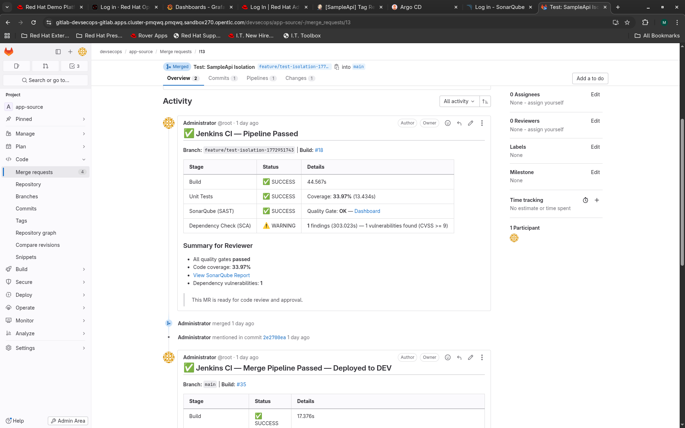
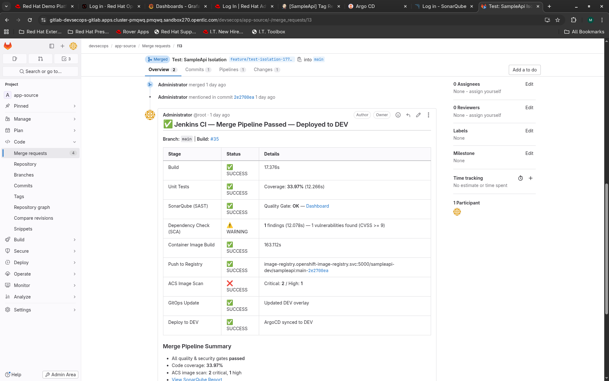
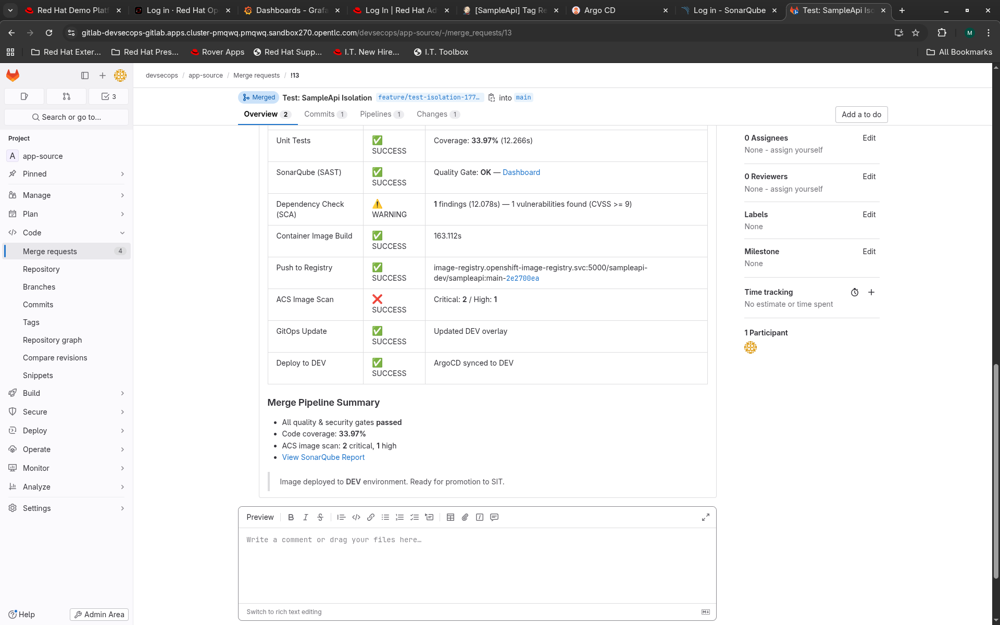
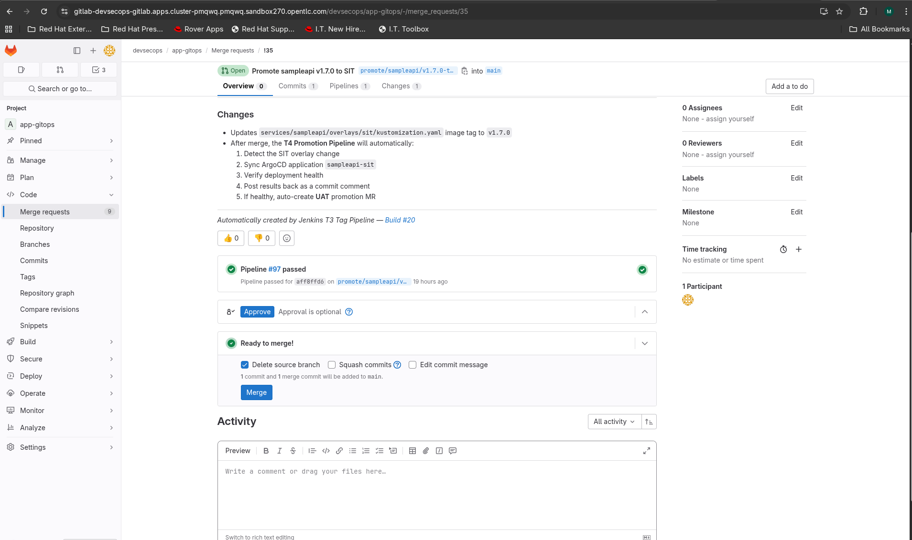
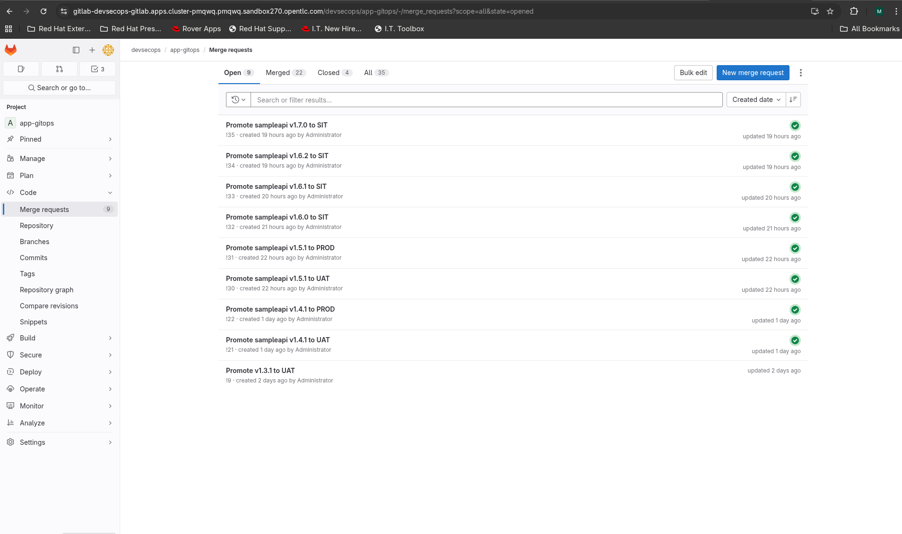
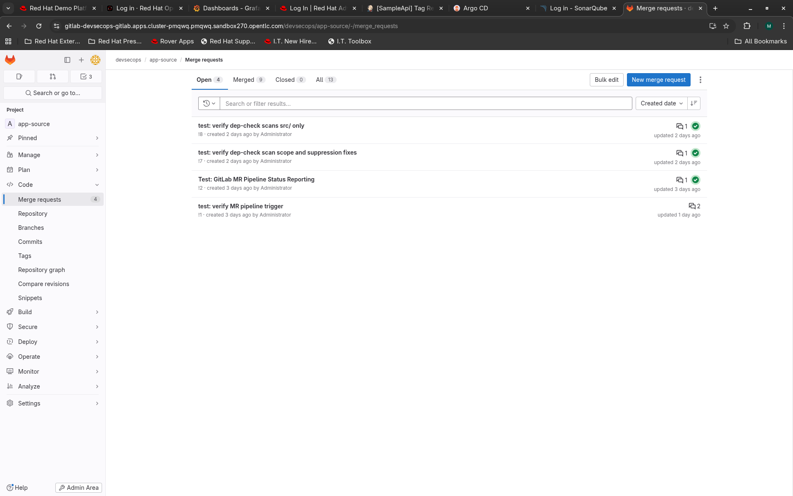
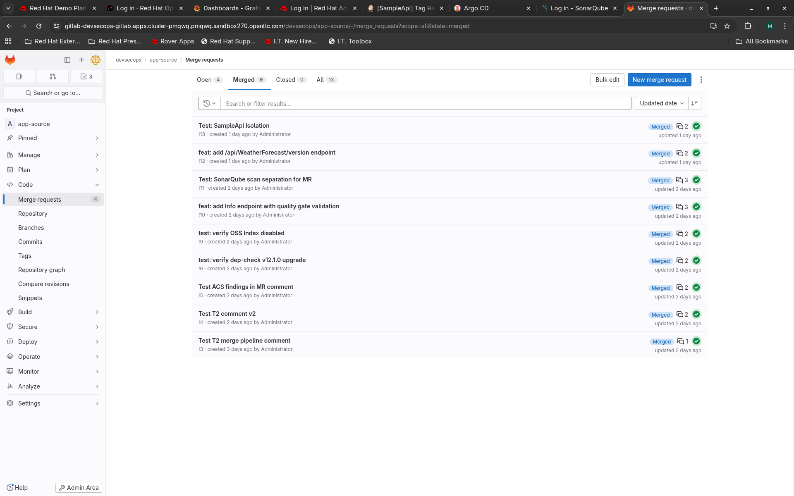

# Module 10: End-to-End DevSecOps Walkthrough

| Duration | Track | Prerequisites |
|----------|-------|---------------|
| ~90 min  | Integration | Modules 1-9 completed, all 4 pipelines working (T1/T2/T3/T4), both services deployed |

## What You Will Learn

By the end of this module you will have walked through the complete DevSecOps lifecycle for a multi-service architecture -- two application services (SampleApi and NotificationApi), two infrastructure services (PostgreSQL and Redis), five GitLab repositories, seven Jenkins jobs, and twelve ArgoCD applications. Specifically:

- How a feature moves through all four pipeline triggers (T1, T2, T3, T4) for a specific service without affecting others
- How concurrent T2 pipelines for different services resolve GitOps push conflicts automatically
- Where each security gate fires and what it checks, including performance testing in T3
- How the cascading promotion chain works per-service -- T3 creates a SIT MR, T4 creates UAT and PROD MRs automatically
- How to read pipeline results on GitLab merge requests, including the performance test metrics table
- How to verify deployments across all four environments (DEV, SIT, UAT, PROD) for all services independently
- How to roll back a single service without affecting others

---

## Prerequisites

> **Environment variables:** Before running any commands, source the environment file:
> ```bash
> source ./env.sh
> ```
> This sets `$OC`, `$APPS_DOMAIN`, `$NS_TOOLS`, and all other cluster-specific variables used throughout this module. See `env.sh` for the full variable list.

Before starting, confirm the following:

```bash
# Source your environment
source ./env.sh

# All tool namespaces healthy
$OC get pods -n $NS_TOOLS   # Jenkins, SonarQube running
$OC get pods -n $NS_GITLAB  # GitLab running
$OC get pods -n $NS_ACS     # ACS Central, Sensor running
$OC get pods -n $NS_GITOPS  # ArgoCD running

# Log in to ArgoCD (needed for all argocd commands in this module)
ARGOCD_PASS=$($OC get secret openshift-gitops-cluster -n $NS_GITOPS \
  -o jsonpath='{.data.admin\.password}' | base64 -d)
argocd login openshift-gitops-server.openshift-gitops.svc:443 \
  --username admin --password "$ARGOCD_PASS" --insecure --grpc-web
# --> 'admin:login' logged in successfully

# All 12 ArgoCD apps exist (4 sampleapi + 4 notificationapi + 4 infra)
argocd app list
# Expected: 12 apps listed

# All DEV pods running (both services + infra)
$OC get pods -n ${NS_DEV}
# Expected:
# NAME                               READY   STATUS    RESTARTS   AGE
# notificationapi-847754bdb8-vg2xf   1/1     Running   1          28h
# postgresql-0                       1/1     Running   2          46h
# redis-0                            1/1     Running   2          46h
# sampleapi-674bb887c9-lbm9l         1/1     Running   1          26h

# GitLab accessible
curl -sk ${GITLAB_URL}/-/readiness | jq .status
# Expected: "ok"
```

You should also have the GitLab root credentials and the Personal Access Token ready (see SECRETS.md for locations).

---

## The Big Picture

Before diving into the steps, study this diagram. It shows the complete path a code change takes from your editor to production for a single service. The key insight is that each service has its own independent pipeline chain -- updating SampleApi does NOT trigger NotificationApi redeployment, and vice versa.

```
Developer workstation                    GitLab
       |                                       |
       | git push feature/add-timezone         | (app-source repo, project ID 1)
       |-------------------------------------->|
       |                                       |
       |  Open Merge Request                   |
       |-------------------------------------->|
       |                                       |
       |              webhook fires            |
       |                     |                 |
       |                     v                 |
       |              +-----------+            |
       |              | T1: MR    |  <-- sampleapi-mr Jenkins job
       |              | Pipeline  |      pipelineMR() orchestrator
       |              +-----------+      (build, test, SAST, SCA)
       |                     |                 |
       |                     | pass/fail       |
       |                     |---------------->| status on MR (updateGitlabCommitStatus)
       |                                       |
       |  Approve + Merge MR                   |
       |-------------------------------------->|
       |                                       |
       |              webhook fires            |
       |                     |                 |
       |                     v                 |
       |              +-----------+            |
       |              | T2: Merge |  <-- sampleapi-merge Jenkins job
       |              | Pipeline  |      pipelineMerge() orchestrator
       |              +-----------+      (build, test, SAST, SCA,
       |                     |            image build, ACS scan,
       |                     |            push, GitOps update)
       |                     |                 |
       |                     | updates services/sampleapi/overlays/dev/
       |                     v                 |
       |              +===========+            |
       |              | DEV (1pod)|  <-- ArgoCD auto-sync (sampleapi-dev app)
       |              +===========+            |
       |                                       |
       | git tag v1.x.0                        |
       |-------------------------------------->|
       |                                       |
       |              webhook fires            |
       |                     |                 |
       |                     v                 |
       |              +-----------+            |
       |              | T3: Tag   |  <-- sampleapi-tag Jenkins job
       |              | Pipeline  |      pipelineTag() orchestrator
       |              +-----------+      (everything from T2
       |                     |            + ACS strict + ZAP DAST
       |                     |            + performance test)
       |                     |                 |
       |                     | NO deploy       |
       |                     |                 |
       |                     v                 |
       |              GitLab (app-gitops, project ID 4)
       |              +-------------------+    |
       |              | MR: promote v1.x  |  <-- auto-created by T3
       |              | sampleapi to SIT  |      with full scan + perf results
       |              +-------------------+    |
       |                     |                 |
       |  Team Lead: Approve + Merge           |
       |                     |                 |
       |                     v                 |
       |              +-----------+            |
       |              | T4: Promo |  <-- sampleapi-promote Jenkins job
       |              | Pipeline  |      pipelinePromote() orchestrator
       |              +-----------+      detects services/sampleapi/overlays/sit changed
       |                     |           syncs sampleapi-sit ArgoCD app
       |                     |           auto-creates UAT MR
       |                     v                 |
       |              +===========+   +-------------------+
       |              | SIT(2pods)|   | MR: promote v1.x  |
       |              +===========+   | sampleapi to UAT  |
       |                              +-------------------+
       |                     |                 |
       |  QA Lead: Approve + Merge             |
       |                     |                 |
       |                     v                 |
       |              +-----------+            |
       |              | T4: Promo |  <-- syncs sampleapi-uat, creates PROD MR
       |              +-----------+            |
       |                     |                 |
       |                     v                 |
       |              +===========+   +-------------------+
       |              | UAT(2pods)|   | MR: promote v1.x  |
       |              +===========+   | sampleapi to PROD |
       |                              +-------------------+
       |                     |                 |
       |  CAB: Approve + Merge                 |
       |                     |                 |
       |                     v                 |
       |              +-----------+            |
       |              | T4: Promo |  <-- syncs sampleapi-prod, end of chain
       |              +-----------+            |
       |                     |                 |
       |                     v                 |
       |              +===========+            |
       |              |PROD(3pods)|            |
       |              +===========+            |
```

Four things to notice:

1. **The developer only does three things**: push code, create an MR, and push a tag. Everything else is automated.
2. **Security gates run at every stage**: SAST and SCA on the MR, ACS on the image, DAST and performance testing on the tag. If any gate fails, the chain stops.
3. **Promotion MRs cascade**: T3 creates the SIT MR. After SIT deploys healthy, T4 creates the UAT MR. After UAT deploys healthy, T4 creates the PROD MR. No human creates MRs -- they only review and click Merge.
4. **Per-service isolation**: Each service has its own pipeline chain. The T4 pipeline detects which service changed via regex on the git diff (`services/([^/]+)/overlays/([^/]+)/`). Promoting SampleApi to SIT does not touch NotificationApi at all.

---

## The Multi-Service Architecture

Before we start the walkthrough, understand what is running in each namespace:

```
sampleapi-{env} namespace
  +----------------+     +--------------------+
  |  SampleApi     |---->|  NotificationApi   |  (internal only, no Route)
  |  (.NET 8)      |     |  (.NET 8)          |
  |  Port 8080     |     |  Port 8081         |
  |  Has Route     |     |  No Route          |
  +-------+--------+     +---------+----------+
          |                         |
  +-------v--------+     +---------v----------+
  |  PostgreSQL    |     |     Redis           |
  |  (StatefulSet) |     |  (StatefulSet)      |
  |  Port 5432     |     |  Port 6379          |
  +----------------+     +--------------------+
```

Each service has its own configuration:

| Component | ConfigMap | Secret | ArgoCD App |
|-----------|-----------|--------|------------|
| SampleApi | `sampleapi-env` | `sampleapi-secret` | `sampleapi-{env}` |
| NotificationApi | `notificationapi-env` | `notificationapi-secret` | `notificationapi-{env}` |
| PostgreSQL + Redis | (none) | `infra-secret` | `infra-{env}` |

And each service has its own GitLab repo, Jenkins jobs, and webhooks:

| Service | GitLab Repo (Project ID) | Jenkins Jobs | Webhooks |
|---------|--------------------------|--------------|----------|
| SampleApi | `app-source` (1) | `sampleapi-mr`, `sampleapi-merge`, `sampleapi-tag` | 3 on project 1 |
| NotificationApi | `notificationapi-source` (5) | `notificationapi-mr`, `notificationapi-merge`, `notificationapi-tag` | 3 on project 5 |
| Shared | `app-gitops` (4) | `sampleapi-promote` (detects both services) | 1 on project 4 |

The shared `sampleapi-promote` job uses `pipelinePromote()` which auto-detects which service and environment changed by parsing the git diff. It is not SampleApi-specific despite the name.

---

## Step 1: Write Code (Add a Feature to SampleApi)

We will add a timezone field to the WeatherForecast API. This is a small, safe change -- enough to trigger every pipeline without breaking anything.

**Why this change**: It touches the model, the controller, and the tests. That means the build, unit test, SAST, and SCA stages all have real work to do. A trivial whitespace change would pass every gate but teach you nothing about what happens when the scanners actually run.

```bash
# Clone the app-source repo (or use your existing clone)
GITLAB_TOKEN=$($OC get secret gitlab-token -n $NS_TOOLS -o jsonpath='{.data.token}' | base64 -d)
GITLAB_HOST=$(echo $GITLAB_URL | sed 's|https://||')

cd /tmp
rm -rf e2e-walkthrough && mkdir e2e-walkthrough && cd e2e-walkthrough

git clone https://root:${GITLAB_TOKEN}@${GITLAB_HOST}/${APP_GROUP}/app-source.git
cd app-source

# Create a feature branch
git checkout -b feature/add-timezone
```

Now add the timezone field to the WeatherForecast model. Open `src/SampleApi/Controllers/WeatherForecastController.cs` and update the `WeatherForecast` class at the bottom of the file:

```csharp
// ADD this property to the WeatherForecast class (line ~79, before the closing brace)
public string TimeZone { get; set; } = "UTC";
```

Update the `Get()` method to set the timezone (inside the `Select` lambda, after the `TemperatureUnit` line):

```csharp
TimeZone = TimeZoneInfo.Local.Id
```

The complete change in the `Get()` method should look like this in the `return new WeatherForecast` block:

```csharp
return new WeatherForecast
{
    Date = DateOnly.FromDateTime(DateTime.Now.AddDays(index)),
    TemperatureC = tempC,
    Summary = Summaries[Random.Shared.Next(Summaries.Length)],
    Location = _options.Location,
    TemperatureUnit = _options.TemperatureUnit,
    TimeZone = TimeZoneInfo.Local.Id         // <-- new line
};
```

Commit the change:

```bash
git add -A
git commit -m "feat: add timezone field to weather forecast response"
git push origin feature/add-timezone
```

> **What just happened**: You pushed a feature branch to `app-source` (project ID 1). Nothing triggers yet -- T1 only fires when you open a Merge Request. The branch push alone is not enough. Also note: this only affects SampleApi. NotificationApi (in a completely separate repo, project ID 5) is untouched.

### Verify Step 1

```bash
# Confirm the branch exists in GitLab
curl -sk -H "PRIVATE-TOKEN: $GITLAB_TOKEN" \
  "${GITLAB_URL}/api/v4/projects/${GITLAB_PROJECT_APP_SOURCE}/repository/branches/feature%2Fadd-timezone" \
  | jq '.name'
# Expected: "feature/add-timezone"
```

---

## Step 2: Open a Merge Request -- Watch T1

Now create the MR. This is the moment the first pipeline fires.

**Why an MR triggers a pipeline**: The GitLab webhook for `app-source` (project ID 1) is configured to send `merge_request_events` to the Jenkins job `sampleapi-mr`. Jenkins receives the webhook payload (which includes the source branch, target branch, and MR IID), and calls the shared library orchestrator `pipelineMR()`. Because the job definition omits the `service:` parameter, it defaults to `sampleapi`.

```bash
# Create the MR via GitLab API
MR_RESPONSE=$(curl -sk -X POST -H "PRIVATE-TOKEN: $GITLAB_TOKEN" \
  "${GITLAB_URL}/api/v4/projects/${GITLAB_PROJECT_APP_SOURCE}/merge_requests" \
  -d "source_branch=feature/add-timezone" \
  -d "target_branch=main" \
  -d "title=feat: add timezone field to weather forecast")

MR_IID=$(echo $MR_RESPONSE | jq '.iid')
echo "MR created: !${MR_IID}"
echo "View at: ${GITLAB_URL}/devsecops/app-source/-/merge_requests/${MR_IID}"
```

Open Jenkins immediately to watch the pipeline:

```
${JENKINS_URL}/job/sampleapi-mr/
```

> **What to watch for in the Jenkins console output**:
>
> - `=== T1: MR Validation Pipeline ===` -- confirms the correct orchestrator is running
> - `Service: sampleapi` -- confirms the service being validated
> - `Branch: feature/add-timezone` -- confirms it picked up the right branch
> - `MR IID: <number>` -- confirms the webhook payload was parsed
> - Each stage prints its own status line with duration

The T1 pipeline (`pipelineMR.groovy`) runs these stages in order:

| Stage | What It Does | How Long |
|-------|-------------|----------|
| Initialize | Reads `PipelineConfig`, configures for sampleapi, posts "running" status to GitLab | ~2s |
| Checkout Source | Clones `app-source` at the feature branch | ~5s |
| Checkout Build Config | Clones `build-config` (project ID 2) into `./build-config/` subdirectory | ~3s |
| Build | `dotnet restore` + `dotnet build` + `dotnet publish` | ~30s |
| Unit Tests | `dotnet test` with coverage report | ~15s |
| SonarQube Analysis | Sends code to SonarQube, polls quality gate | ~60s |
| Dependency Check | OWASP Dependency-Check scans `src/` for CVEs | ~60-600s |

Total: approximately 3-12 minutes depending on Dependency-Check NVD cache state.

**How pipeline status reaches GitLab**: T1 and T2 use the `updateGitlabCommitStatus` plugin function, which posts commit status directly via the GitLab connection configured in Jenkins. This works because the webhook came from the same project. The status appears as a pipeline entry on the MR.

### Verify Step 2

```bash
# Check Jenkins build status (wait for it to complete)
curl -sk "${JENKINS_URL}/job/sampleapi-mr/lastBuild/api/json" | jq '.result'
# Expected: "SUCCESS" (once finished) or null (still running)

# Check GitLab MR pipeline status
curl -sk -H "PRIVATE-TOKEN: $GITLAB_TOKEN" \
  "${GITLAB_URL}/api/v4/projects/${GITLAB_PROJECT_APP_SOURCE}/merge_requests/${MR_IID}" \
  | jq '.head_pipeline.status'
# Expected: "success" or "running"
```

---

## Step 3: Review T1 Results on the GitLab MR

Once T1 completes, go to the MR page in GitLab:

```
${GITLAB_URL}/devsecops/app-source/-/merge_requests/${MR_IID}
```

You will see three things:

1. **Pipeline status badge**: A green checkmark (or red X) next to the MR title. This comes from `updateGitlabCommitStatus name: 'jenkins-ci', state: 'success'` in the `pipelineMR.groovy` post block.

2. **Pipeline in the Pipelines tab**: Click the "Pipelines" tab on the MR. You will see a pipeline entry labeled `jenkins-ci` with status `passed`. This is the commit status posted on the MR's HEAD commit.

3. **Comment with scan summary**: The `commentOnMR()` function posts a markdown comment on the MR with a table summarizing every gate. GitLab renders the emoji shortcodes (`:white_check_mark:`) as icons:

```
## :white_check_mark: Jenkins CI — Pipeline Passed

**Branch:** `feature/add-timezone` | **Build:** [#42](...)

| Stage | Status | Details |
|-------|--------|---------|
| Build | :white_check_mark: SUCCESS | 12s |
| Unit Tests | :white_check_mark: SUCCESS | Coverage: **85%** (8s) |
| SonarQube (SAST) | :white_check_mark: SUCCESS | Quality Gate: **OK** — [Dashboard](...) |
| Dependency Check (SCA) | :white_check_mark: SUCCESS | **0** findings (45s) |
```

**Why this matters**: The MR reviewer does not need to open Jenkins. All the information they need to approve is right on the MR page. This is the feedback loop -- developers see results where they already work (GitLab), not in a separate tool.

Here is what a real MR looks like after T1 completes. Notice the green pipeline status, the "Pipeline passed" badge, and the Jenkins CI comment with stage results:


Scrolling down on the same MR, you can see the detailed scan results posted as a comment by `commentOnMR()`, followed by the T2 merge pipeline comment that appears after merging:



> **If T1 failed**: The MR will show a red X. The comment will indicate which stage failed. Fix the code on the feature branch, push again, and T1 re-runs automatically (the webhook fires on every MR update event).

---

## Step 4: Merge the MR -- Watch T2 for SampleApi

Once T1 passes, merge the MR. This triggers T2.

**Why merging triggers a different pipeline**: The push-to-main webhook on `app-source` (project ID 1) points to the `sampleapi-merge` Jenkins job, which calls `pipelineMerge()`. GitLab sends a `push` event (not a `merge_request` event) when code lands on `main`. Different event, different webhook, different pipeline.

```bash
# Merge the MR
curl -sk -X PUT -H "PRIVATE-TOKEN: $GITLAB_TOKEN" \
  "${GITLAB_URL}/api/v4/projects/${GITLAB_PROJECT_APP_SOURCE}/merge_requests/${MR_IID}/merge"

echo "MR merged -- T2 pipeline should start within seconds"
echo "Watch at: ${JENKINS_URL}/job/sampleapi-merge/"
```

The T2 pipeline (`pipelineMerge.groovy`) does everything T1 does, plus:

| Additional Stage | What It Does | Why |
|-----------------|-------------|-----|
| Build Container Image | `podman build -f build-config/Dockerfile .` (uses Dockerfile defaults: `PROJECT_NAME=SampleApi`, `APP_PORT=8080`) | Creates the OCI image. SampleApi uses Dockerfile defaults (no explicit `--build-arg`); NotificationApi passes `--build-arg PROJECT_NAME=NotificationApi --build-arg APP_PORT=8081` |
| Push to Registry | Pushes to OCP internal registry with tag `main-<shortSHA>` | Makes it pullable |
| ACS Image Scan | `roxctl image check` + `roxctl image scan` | Scans for CVEs in the image layers |
| Update GitOps | Updates `services/sampleapi/overlays/dev/kustomization.yaml` in app-gitops | Sets the new image tag for sampleapi only |
| Deploy to DEV | `argocd app sync sampleapi-dev` | Triggers ArgoCD to roll out sampleapi-dev app only |

The image tag format is `main-<7-char-SHA>`, for example `main-a3f8c21`. This tag is deterministic -- you can always trace an image back to the exact commit.

**Per-service GitOps update**: The `updateGitOps.groovy` function updates only `services/sampleapi/overlays/dev/kustomization.yaml`. It does NOT touch `services/notificationapi/overlays/dev/kustomization.yaml`. This is the key to per-service independence -- each service's image tag lives in its own file, managed by its own ArgoCD application.

### Verify Step 4

```bash
# Wait for T2 to complete (check periodically)
curl -sk "${JENKINS_URL}/job/sampleapi-merge/lastBuild/api/json" | jq '.result'
# Expected: "SUCCESS"

# Check the image was pushed
$OC get is -n ${NS_DEV}
# Expected:
# NAME              IMAGE REPOSITORY                                                                 TAGS                                               UPDATED
# notificationapi   image-registry.openshift-image-registry.svc:5000/sampleapi-dev/notificationapi   latest-release,v1.1.0,main-03a9411 + 3 more...     46h
# sampleapi         image-registry.openshift-image-registry.svc:5000/sampleapi-dev/sampleapi         latest-release,v1.7.0,v1.6.2,v1.6.1 + 26 more...   25h
```

Here is the T2 merge pipeline comment posted on the MR after merging. It shows all the additional stages -- Build Container Image, Push to Registry, ACS Image Scan, GitOps Update, and Deploy to DEV:



The Merge Pipeline Summary at the bottom confirms all quality and security gates passed, and the image was deployed to DEV:



---

## Step 5: Verify the DEV Deployment

T2 updated the GitOps repo and synced ArgoCD. Your new code should be running in DEV. Importantly, only the `sampleapi-dev` ArgoCD app was synced -- the other 11 apps were not touched.

```bash
# Check ArgoCD sync status for sampleapi-dev
argocd app get sampleapi-dev \
  --server openshift-gitops-server.openshift-gitops.svc:443 \
  --insecure --grpc-web 2>/dev/null \
  | head -15
# Expected: Sync Status: Synced, Health Status: Healthy

# Check all running pods in DEV (both services + infra)
$OC get pods -n ${NS_DEV}
# Expected:
# NAME                               READY   STATUS    RESTARTS   AGE
# notificationapi-847754bdb8-vg2xf   1/1     Running   1          28h
# postgresql-0                       1/1     Running   2          46h
# redis-0                            1/1     Running   2          46h
# sampleapi-674bb887c9-lbm9l         1/1     Running   1          26h

# Hit the SampleApi health endpoint
curl -sk https://${APP_NAME}-${NS_DEV}.${APPS_DOMAIN}/healthz
# Expected: {"status":"healthy","timestamp":"2026-03-10T05:25:02.3751347Z"}

# Hit the readiness endpoint -- shows PostgreSQL + Redis connectivity
curl -sk https://${APP_NAME}-${NS_DEV}.${APPS_DOMAIN}/readyz
# Expected: {"status":"ready","timestamp":"2026-03-10T05:25:03.6526978Z","checks":{"postgresql":{"status":"healthy"},"redis":{"status":"healthy"}}}

# Hit the weather forecast endpoint -- look for the new TimeZone field
curl -sk https://${APP_NAME}-${NS_DEV}.${APPS_DOMAIN}/api/WeatherForecast | jq '.[0]'
# Expected (note the "location" field reflects DEV ConfigMap):
# {
#   "date": "2026-03-11",
#   "temperatureC": -8,
#   "temperatureF": 18,
#   "summary": "Scorching",
#   "location": "DEV",
#   "temperatureUnit": "Celsius",
#   "timeZone": "Etc/UTC"
# }

# Confirm NotificationApi is still running with its PREVIOUS image (not rebuilt)
$OC get deploy notificationapi -n ${NS_DEV} -o jsonpath='{.spec.template.spec.containers[0].image}'
# Expected: still the old tag -- NotificationApi was NOT redeployed
```

> **If the TimeZone field is missing**: The pod might still be rolling out. Check `$OC rollout status deploy/sampleapi -n ${NS_DEV}`. ArgoCD auto-sync for DEV means it may take up to 3 minutes for the sync to complete after the GitOps repo was updated.

At this point the feature is validated (T1), built into an image, scanned (T2), and running in DEV. NotificationApi is completely unaffected. The next question is: is it ready for release?

---

## Step 6: Concurrent T2 -- NotificationApi (Optional but Instructive)

This step demonstrates that both services can merge to main simultaneously without conflicts. This is a common real-world scenario -- two teams working on two services, both merging at the same time.

```bash
# Clone the notificationapi-source repo
cd /tmp/e2e-walkthrough
git clone https://root:${GITLAB_TOKEN}@${GITLAB_HOST}/${APP_GROUP}/notificationapi-source.git
cd notificationapi-source

# Make a small change
git checkout -b feature/add-request-id
echo "// Add request tracking $(date)" >> src/NotificationApi/Controllers/NotifyController.cs
git add -A
git commit -m "feat: add request tracking to notify endpoint"
git push origin feature/add-request-id

# Create and immediately merge an MR (to trigger T2 quickly)
NOTIF_MR=$(curl -sk -X POST -H "PRIVATE-TOKEN: $GITLAB_TOKEN" \
  "${GITLAB_URL}/api/v4/projects/5/merge_requests" \
  -d "source_branch=feature/add-request-id" \
  -d "target_branch=main" \
  -d "title=feat: add request tracking" \
  | jq '.iid')

# Wait a moment for T1 to start (or skip T1 by merging immediately)
sleep 5
curl -sk -X PUT -H "PRIVATE-TOKEN: $GITLAB_TOKEN" \
  "${GITLAB_URL}/api/v4/projects/5/merge_requests/${NOTIF_MR}/merge"

echo "NotificationApi MR merged -- watch notificationapi-merge job"
echo "Watch at: ${JENKINS_URL}/job/notificationapi-merge/"
```

**What happens if both T2 pipelines run simultaneously**: Both `sampleapi-merge` and `notificationapi-merge` update the same `app-gitops` repository, but they update different files:

- `sampleapi-merge` updates `services/sampleapi/overlays/dev/kustomization.yaml`
- `notificationapi-merge` updates `services/notificationapi/overlays/dev/kustomization.yaml`

If both try to `git push` at the same time, the second one will get a "rejected -- non-fast-forward" error. The `updateGitOps.groovy` function handles this with a retry loop:

```
Attempt 1: git push --> rejected (other service pushed first)
  git pull --rebase --> rebases on top of other service's commit
Attempt 2: git push --> success
```

This retry happens up to 3 times. In the Jenkins console output, you will see:

```
Push attempt 1 failed -- pulling and rebasing...
  git pull --rebase origin main
GitOps update pushed to main
```

### Verify Step 6

```bash
# Both jobs should complete successfully
curl -sk "${JENKINS_URL}/job/sampleapi-merge/lastBuild/api/json" | jq '.result'
curl -sk "${JENKINS_URL}/job/notificationapi-merge/lastBuild/api/json" | jq '.result'
# Expected: both "SUCCESS"

# Both services running with updated images
$OC get deploy -n ${NS_DEV} -o custom-columns='NAME:.metadata.name,IMAGE:.spec.template.spec.containers[0].image'
# Expected:
#   sampleapi        ...sampleapi:main-<sha1>
#   notificationapi  ...notificationapi:main-<sha2>
# Note: the SHAs are different because they come from different repos
```

> **Why this matters**: In a real team, two developers working on different services should never block each other. The concurrent push fix ensures that service-parameterized pipelines can run in parallel without manual coordination.

---

## Step 7: Tag a Release -- Watch T3

Tagging is a deliberate act. It says: "I believe this code on main is release-worthy." T3 validates that belief with the most rigorous set of checks, including performance testing.

**Why T3 exists separately from T2**: T2 proves the code can build and deploy. T3 proves it is *release-ready*. The differences:

- ACS runs in **strict mode** (fails on any critical CVE, not just high)
- OWASP ZAP runs a **DAST scan** against the live DEV endpoint
- **k6 performance test** runs against DEV to verify latency and error rate thresholds
- The image gets an additional tag (`latest-release`)
- Cosign signing is attempted (if a signing key is configured)
- **No deployment happens** -- T3 only produces and validates the image

```bash
cd /tmp/e2e-walkthrough/app-source
git checkout main && git pull

# Create a semver tag
git tag -a v1.8.0 -m "Release v1.8.0: add timezone to weather forecast"
git push origin v1.8.0

echo "Tag pushed -- T3 pipeline should start within seconds"
echo "Watch at: ${JENKINS_URL}/job/sampleapi-tag/"
```

**How T3 pipeline status reaches GitLab**: Unlike T1/T2 which use the `updateGitlabCommitStatus` plugin, T3 uses the direct GitLab Commit Status API (`POST /api/v4/projects/1/statuses/:sha`). This is because T3 runs from an inline CPS job definition, and the plugin does not reliably match the project in that context. The pipeline status is posted to `app-source` (project ID 1) using the `gitlab-api-token` credential.

**Important**: For annotated tags, `env.gitlabAfter` contains the tag object SHA, NOT the commit SHA. The pipeline uses `git rev-parse HEAD` after checkout to get the actual commit SHA for the Commit Status API.

The T3 pipeline (`pipelineTag.groovy`) spins up a special agent pod with a **ZAP sidecar container**. The pod has two containers:

- `jnlp`: The standard agent with dotnet, podman, roxctl, dotnet-sonarscanner, k6, etc.
- `zap`: OWASP ZAP running in daemon mode on `localhost:8090`

This is why T3 takes longer than T2 -- the ZAP container needs to start, the DAST scan crawls your application's endpoints, and the k6 performance test runs a 4-minute load test.

| T3 Stage | What It Does | Duration |
|----------|-------------|----------|
| T2 shared stages | Build, test, SAST, SCA, image build | ~5 min |
| ACS Image Scan (Strict) | Same `roxctl` as T2, but with strict mode -- fails on any critical CVE | ~30s |
| OWASP ZAP DAST | Spider + active scan against DEV route | ~2-5 min |
| Performance Test | k6 load test: 50 VUs, 4 min, ~15K requests | ~4 min |
| Sign Image | Cosign sign (skips gracefully if no key) | ~5s |
| Create Promotion MR | Updates `services/sampleapi/overlays/sit/kustomization.yaml`, creates MR in app-gitops | ~10s |

### Performance Test Thresholds

The k6 test (`build-config/tests/performance/load-test.js`) enforces these quality gates:

| Metric | Threshold | Action on Breach |
|--------|-----------|-----------------|
| `http_req_duration` p(95) | < 800ms | Warn |
| `http_req_duration` p(99) | < 2000ms | **Abort after 30s** |
| `http_req_failed` rate | < 1% | **Abort immediately** |
| `forecast_latency` p(95) | < 500ms | Warn |

If k6 exits with code 99 (threshold breach), the `runPerformanceTest.groovy` function returns `FAILURE` and the pipeline stops. No promotion MR is created.

### Verify Step 7

```bash
# Wait for T3 to complete (takes longer than T2 due to DAST + perf test)
curl -sk "${JENKINS_URL}/job/sampleapi-tag/lastBuild/api/json" | jq '.result'
# Expected: "SUCCESS" or "UNSTABLE" (UNSTABLE if ZAP found medium alerts, which is acceptable)

# Check the versioned image tag exists
$OC get istag sampleapi:v1.8.0 -n ${NS_DEV}
# Expected: tag exists with creation timestamp

# Check the latest-release tag also exists
$OC get istag sampleapi:latest-release -n ${NS_DEV}
# Expected: tag exists, points to the same image
```

---

## Step 8: Review T3 Results and the Promotion MR

Open GitLab and navigate to the app-source repository's pipeline page:

```
${GITLAB_URL}/devsecops/app-source/-/pipelines
```

You will see the T3 pipeline listed with status `passed`. This commit status was posted directly via the GitLab Commit Status API (not the plugin), because T3 uses an inline CPS job definition.

In the Jenkins console output for the T3 build, look for:

```
=== T3: Tag/Release Pipeline ===
  Service: sampleapi
  Tag: v1.8.0
```

And the Security Gate report (printed in the `always` post block by `SecurityGate.formatReport()`):

```
=== Security Gate Report ===
Status: PASSED

============================
```

If any gate had failed, you would see the failures listed:

```
=== Security Gate Report ===
Status: FAILED

Failures:
  - SonarQube quality gate FAILED: gate not passed
  - ACS found 2 critical vulnerabilities (max: 0)
============================
```

Now find the auto-created SIT promotion MR in `app-gitops`:

```bash
# Find the latest MR in app-gitops
PROMO_MR=$(curl -sk -H "PRIVATE-TOKEN: $GITLAB_TOKEN" \
  "${GITLAB_URL}/api/v4/projects/${GITLAB_PROJECT_APP_GITOPS}/merge_requests?state=opened&order_by=created_at&sort=desc" \
  | jq '.[0].iid')

echo "Promotion MR: !${PROMO_MR}"
echo "View at: ${GITLAB_URL}/devsecops/app-gitops/-/merge_requests/${PROMO_MR}"
```

Open that URL. The MR description contains a complete scan results table with performance test metrics:

```
## Release v1.8.0 -- Promotion to SIT

This MR was automatically created by the **T3 Tag Pipeline** after all
quality and security gates passed.

**Action required:** Review the results below, then Approve and Merge to deploy.

### T3 Pipeline Results (Build #N)

| Stage | Status | Details |
|-------|--------|---------|
| .NET Build | ✅ SUCCESS | 12s |
| Unit Tests | ✅ SUCCESS | Coverage: **85%** (8s) |
| SonarQube (SAST) | ✅ SUCCESS | Gate: **OK** [Dashboard](...) |
| Dependency Check (SCA) | ✅ SUCCESS | **0** findings (45s) |
| Container Image | ✅ SUCCESS | 30s |
| Push to Registry | ✅ SUCCESS | sampleapi:v1.8.0 |
| ACS Image Scan (Strict) | ✅ SUCCESS | Critical: **0** / High: **0** |
| OWASP ZAP (DAST) | ✅ SUCCESS | High: **0** / Med: **2** / Low: **5** / Info: **3** |
| Performance Test (k6) | ✅ SUCCESS | p90=180.0ms, p95=245.0ms, max=1200ms, error_rate=0.0000, total_requests=15234 |
| Image Signing (Cosign) | ⏭️ SKIPPED | No signing key configured |

### Changes
- Updates `services/sampleapi/overlays/sit/kustomization.yaml` image tag to `v1.8.0`
- After merge, the **T4 Promotion Pipeline** will automatically:
  1. Detect the SIT overlay change
  2. Sync ArgoCD application `sampleapi-sit`
  3. Verify deployment health
  4. Post results back as a commit comment
  5. If healthy, auto-create **UAT** promotion MR
```

Here is what a real promotion MR looks like in GitLab. The MR title, scan results table, and changes section are all auto-generated by `createPromotionMR.groovy`:


Scrolling down, you see the pipeline status and the "Ready to merge" button. The reviewer has all the evidence needed to approve:



The `app-gitops` repository accumulates promotion MRs as the cascading chain progresses through environments:



**Why the MR contains scan results and performance metrics**: The approver (Team Lead for SIT) should not have to go hunting through Jenkins logs. Every piece of evidence they need is right on the MR -- security scan results, DAST findings, and performance characteristics. This is the audit trail: who ran the scans, what the results were, who approved, and when.

> **DAST results interpretation**: ZAP baseline scans often find medium-severity alerts like "X-Content-Type-Options header missing" or "CSP not set". These are real findings but are expected for an API that does not serve HTML. The pipeline marks itself UNSTABLE (yellow) rather than FAILED (red) when only medium/low alerts are found. High alerts would block.

---

## Step 9: Approve and Merge -- Watch the T4 Cascade

This step is where you see the cascading promotion in action. Merging the SIT promotion MR starts a chain reaction.

**How the chain works for a specific service**:

```
You merge SIT MR
  --> push to app-gitops main
  --> webhook fires (project ID 4 --> sampleapi-promote job)
  --> T4 runs (pipelinePromote.groovy)
  --> git diff detects services/sampleapi/overlays/sit changed
  --> regex extracts: service=sampleapi, env=sit
  --> argocd app sync sampleapi-sit     (NOT notificationapi-sit)
  --> verifies SIT is HEALTHY
  --> auto-creates UAT promotion MR
  --> done

Someone merges UAT MR
  --> T4 runs again
  --> git diff detects services/sampleapi/overlays/uat changed
  --> argocd app sync sampleapi-uat
  --> verifies UAT is HEALTHY
  --> auto-creates PROD promotion MR
  --> done

Someone merges PROD MR
  --> T4 runs again
  --> git diff detects services/sampleapi/overlays/production changed
  --> argocd app sync sampleapi-prod
  --> verifies PROD is HEALTHY
  --> end of chain (no next MR)
  --> done
```

**How T4 detects which service changed**: The `pipelinePromote.groovy` orchestrator uses `gitlabBefore..gitlabAfter` (from the webhook payload) as the diff range, then applies the regex `services/([^/]+)/overlays/([^/]+)/` to the changed file paths. This is more reliable than `HEAD~1..HEAD`, which can miss changes when multiple MRs merge in rapid succession. The diff range is passed by the GitLab webhook and represents exactly the commits that were just pushed.

**How T4 posts pipeline status to GitLab**: T4 uses the direct GitLab Commit Status API to post status to `app-gitops` (project ID 4). It posts on the merge commit (`gitlabAfter`) with `ref=main` so the status appears on the commit in GitLab. The `createPromotionMR.groovy` separately posts a `jenkins/quality-gates` status on the promotion branch commit so that status appears in the next promotion MR's Pipelines tab.

Merge the SIT MR now:

```bash
# Merge the SIT promotion MR
curl -sk -X PUT -H "PRIVATE-TOKEN: $GITLAB_TOKEN" \
  "${GITLAB_URL}/api/v4/projects/${GITLAB_PROJECT_APP_GITOPS}/merge_requests/${PROMO_MR}/merge"

echo "SIT MR merged -- T4 pipeline should start within seconds"
echo "Watch at: ${JENKINS_URL}/job/sampleapi-promote/"
```

Watch the Jenkins console for `sampleapi-promote`. You will see:

```
=== T4: GitOps Promotion Pipeline ===
  Triggered by merge to app-gitops main branch
  Build: #42
  Triggered by: root
  Merge commit: abc1234def5678

Diff range: <gitlabBefore>..<gitlabAfter>

Changed files:
services/sampleapi/overlays/sit/kustomization.yaml

Environments to sync: sampleapi/SIT
  sampleapi/SIT: image tag = v1.8.0

=== Syncing SIT ===
  ArgoCD App: sampleapi-sit
  Image Tag: v1.8.0
  Approved by: Team Lead (via MR)

SIT: Sync=Synced, Health=Healthy

=== Verifying SIT / sampleapi (namespace: sampleapi-sit) ===
  Pods ready: 2
  Health: HEALTHY
  Image: sampleapi:v1.8.0
  Route: https://sampleapi-sampleapi-sit.${APPS_DOMAIN}

=== sampleapi/SIT is HEALTHY — creating UAT promotion MR ===
sampleapi UAT promotion MR !<N> created
```

> **Notice the per-service detection**: T4 detected that `services/sampleapi/overlays/sit` changed. If it had detected `services/notificationapi/overlays/sit` instead (or both), it would sync the corresponding ArgoCD app(s). T4 also skips DEV changes because DEV auto-syncs and does not need promotion.

> **Notice the overlay directory mapping**: The overlay directory `overlays/production` maps to ArgoCD app `sampleapi-prod` and namespace `sampleapi-prod`. This `production` vs `prod` mismatch is a common source of confusion -- the overlay uses the full word, but the namespace and ArgoCD app use the abbreviation.

### Verify Step 9 -- SIT Deployed

```bash
# Wait for T4 to complete
curl -sk "${JENKINS_URL}/job/sampleapi-promote/lastBuild/api/json" | jq '.result'
# Expected: "SUCCESS"

# Check SIT pods -- both services should be running, but only sampleapi was updated
$OC get pods -n ${NS_SIT}
# Expected:
#   sampleapi-<hash>           Running   (2 replicas)
#   notificationapi-<hash>     Running   (2 replicas)
#   postgresql-0               Running
#   redis-0                    Running

# Confirm sampleapi has the new image tag
$OC get deploy sampleapi -n ${NS_SIT} -o jsonpath='{.spec.template.spec.containers[0].image}'
# Expected: ...sampleapi:v1.8.0

# Confirm notificationapi was NOT redeployed (still has its previous tag)
$OC get deploy notificationapi -n ${NS_SIT} -o jsonpath='{.spec.template.spec.containers[0].image}'
# Expected: whatever tag it had before -- NOT v1.8.0

# Hit the SIT health endpoint
curl -sk https://${APP_NAME}-${NS_SIT}.${APPS_DOMAIN}/healthz
# Expected: {"status":"healthy","timestamp":"2026-03-10T05:25:02.3751347Z"}

# Confirm the TimeZone field is in SIT
curl -sk https://${APP_NAME}-${NS_SIT}.${APPS_DOMAIN}/api/WeatherForecast | jq '.[0].timeZone'
# Expected: "Etc/UTC" or similar
```

Now find the auto-created UAT MR:

```bash
UAT_MR=$(curl -sk -H "PRIVATE-TOKEN: $GITLAB_TOKEN" \
  "${GITLAB_URL}/api/v4/projects/${GITLAB_PROJECT_APP_GITOPS}/merge_requests?state=opened&order_by=created_at&sort=desc" \
  | jq '.[0].iid')

echo "UAT Promotion MR: !${UAT_MR}"
echo "View at: ${GITLAB_URL}/devsecops/app-gitops/-/merge_requests/${UAT_MR}"
```

The UAT MR description is slightly different from the SIT MR. It says:

```
This MR was automatically created after **SIT** deployment was verified **HEALTHY**.

Cascading promotion: the same image that passed all T3 gates and deployed
successfully to SIT.
```

Note the difference: no service name in the text (the MR title already includes it), and markdown bold on `**SIT**` and `**HEALTHY**`.

And the results table shows the SIT deployment status instead of scan results:

```
| Stage           | Status      | Details                               |
|-----------------|-------------|---------------------------------------|
| SIT Deployment  | ✅ HEALTHY  | Pods: 2 / Image: `sampleapi:v1.8.0`  |
```

---

## Step 10: Continue the Cascade -- UAT and PROD

Repeat the merge process for UAT and then PROD.

### Promote to UAT

```bash
# Merge the UAT promotion MR
curl -sk -X PUT -H "PRIVATE-TOKEN: $GITLAB_TOKEN" \
  "${GITLAB_URL}/api/v4/projects/${GITLAB_PROJECT_APP_GITOPS}/merge_requests/${UAT_MR}/merge"

echo "UAT MR merged -- T4 will sync sampleapi-uat and create PROD MR"
echo "Watch at: ${JENKINS_URL}/job/sampleapi-promote/"
```

Wait for T4 to complete, then verify:

```bash
# Check UAT pods
$OC get pods -n ${NS_UAT} -l app=sampleapi
# Expected: 2 pods Running

# Health check
curl -sk https://${APP_NAME}-${NS_UAT}.${APPS_DOMAIN}/healthz
# Expected: {"status":"healthy","timestamp":"2026-03-10T05:25:02.3751347Z"}

# Find the PROD MR
PROD_MR=$(curl -sk -H "PRIVATE-TOKEN: $GITLAB_TOKEN" \
  "${GITLAB_URL}/api/v4/projects/${GITLAB_PROJECT_APP_GITOPS}/merge_requests?state=opened&order_by=created_at&sort=desc" \
  | jq '.[0].iid')

echo "PROD Promotion MR: !${PROD_MR}"
echo "View at: ${GITLAB_URL}/devsecops/app-gitops/-/merge_requests/${PROD_MR}"
```

### Promote to PROD

```bash
# Merge the PROD promotion MR
curl -sk -X PUT -H "PRIVATE-TOKEN: $GITLAB_TOKEN" \
  "${GITLAB_URL}/api/v4/projects/${GITLAB_PROJECT_APP_GITOPS}/merge_requests/${PROD_MR}/merge"

echo "PROD MR merged -- T4 will sync sampleapi-prod (end of chain)"
echo "Watch at: ${JENKINS_URL}/job/sampleapi-promote/"
```

Wait for T4 to complete. This is the final T4 run. The console output will show:

```
=== Syncing PROD ===
  ArgoCD App: sampleapi-prod
  Image Tag: v1.8.0
  Approved by: CAB (via MR)

PROD: End of promotion chain — no next MR needed.
```

No further MRs are created. The chain is complete.

---

## Step 11: Verify All Environments -- Both Services

Your SampleApi code change has traveled from a feature branch to production. NotificationApi is untouched. Verify every environment across all services:

```bash
echo "=== Full Environment Status (All Services) ==="
echo ""

for ENV_INFO in "dev:${NS_DEV}:1:1" "sit:${NS_SIT}:2:2" "uat:${NS_UAT}:2:2" "prod:${NS_PROD}:3:2"; do
  IFS=':' read -r ENV_NAME NS SA_PODS NA_PODS <<< "$ENV_INFO"

  echo "${ENV_NAME^^}:"

  # SampleApi
  SA_RUNNING=$($OC get pods -n ${NS} -l app=sampleapi --no-headers 2>/dev/null | grep Running | wc -l)
  SA_IMAGE=$($OC get deploy sampleapi -n ${NS} -o jsonpath='{.spec.template.spec.containers[0].image}' 2>/dev/null | sed 's|.*/||')
  SA_HEALTH=$(curl -sk --max-time 5 "https://${APP_NAME}-${NS}.${APPS_DOMAIN}/healthz" 2>/dev/null | grep -o '"healthy"' || echo '"unknown"')
  SA_TZ=$(curl -sk --max-time 5 "https://${APP_NAME}-${NS}.${APPS_DOMAIN}/api/WeatherForecast" 2>/dev/null | jq -r '.[0].timeZone // "N/A"')
  echo "  SampleApi:       Pods: ${SA_RUNNING}/${SA_PODS}  Image: ${SA_IMAGE}  Health: ${SA_HEALTH}  TimeZone: ${SA_TZ}"

  # NotificationApi (internal only -- no Route, no curl)
  NA_RUNNING=$($OC get pods -n ${NS} -l app=notificationapi --no-headers 2>/dev/null | grep Running | wc -l)
  NA_IMAGE=$($OC get deploy notificationapi -n ${NS} -o jsonpath='{.spec.template.spec.containers[0].image}' 2>/dev/null | sed 's|.*/||')
  echo "  NotificationApi: Pods: ${NA_RUNNING}/${NA_PODS}  Image: ${NA_IMAGE}  (internal, no Route)"

  # Infrastructure
  PG=$($OC get pod postgresql-0 -n ${NS} --no-headers 2>/dev/null | grep Running | wc -l)
  RD=$($OC get pod redis-0 -n ${NS} --no-headers 2>/dev/null | grep Running | wc -l)
  echo "  PostgreSQL: ${PG}/1  Redis: ${RD}/1"
  echo ""
done
```

Expected output (your image tags will differ based on your commit SHAs and tag versions):

```
DEV:
  SampleApi:       Pods: 1/1  Image: sampleapi:main-<sha>  Health: "healthy"  TimeZone: Etc/UTC
  NotificationApi: Pods: 1/1  Image: notificationapi:main-<sha>  (internal, no Route)
  PostgreSQL: 1/1  Redis: 1/1

SIT:
  SampleApi:       Pods: 2/2  Image: sampleapi:v1.8.0  Health: "healthy"  TimeZone: Etc/UTC
  NotificationApi: Pods: 2/2  Image: notificationapi:v1.1.0  (internal, no Route)
  PostgreSQL: 1/1  Redis: 1/1

UAT:
  SampleApi:       Pods: 2/2  Image: sampleapi:v1.8.0  Health: "healthy"  TimeZone: Etc/UTC
  NotificationApi: Pods: 2/2  Image: notificationapi:v1.1.0  (internal, no Route)
  PostgreSQL: 1/1  Redis: 1/1

PROD:
  SampleApi:       Pods: 3/3  Image: sampleapi:v1.8.0  Health: "healthy"  TimeZone: Etc/UTC
  NotificationApi: Pods: 2/2  Image: notificationapi:v1.1.0  (internal, no Route)
  PostgreSQL: 1/1  Redis: 1/1
```

> **Notice that SampleApi and NotificationApi have different image tags**: SampleApi shows v1.8.0 across SIT/UAT/PROD (from the promotion chain you just completed), while NotificationApi remains at whatever version it was before (e.g., v1.1.0). Each service has its own release lifecycle.
>
> **Notice that DEV has different tag formats**: DEV uses `main-<sha>` tags from T2 (continuous deployment), while SIT/UAT/PROD use semver tags from T3 (controlled release).

Check ArgoCD for a unified view of all 12 apps:

```bash
argocd app list \
  --server openshift-gitops-server.openshift-gitops.svc:443 \
  --insecure --grpc-web 2>/dev/null
```

Expected:

```
NAME                    CLUSTER     NAMESPACE       STATUS  HEALTH   SYNC POLICY
sampleapi-dev           in-cluster  sampleapi-dev   Synced  Healthy  Auto
sampleapi-sit           in-cluster  sampleapi-sit   Synced  Healthy  Manual
sampleapi-uat           in-cluster  sampleapi-uat   Synced  Healthy  Manual
sampleapi-prod          in-cluster  sampleapi-prod  Synced  Healthy  Manual
notificationapi-dev     in-cluster  sampleapi-dev   Synced  Healthy  Auto
notificationapi-sit     in-cluster  sampleapi-sit   Synced  Healthy  Manual
notificationapi-uat     in-cluster  sampleapi-uat   Synced  Healthy  Manual
notificationapi-prod    in-cluster  sampleapi-prod  Synced  Healthy  Manual
infra-dev               in-cluster  sampleapi-dev   Synced  Healthy  Auto
infra-sit               in-cluster  sampleapi-sit   Synced  Healthy  Manual
infra-uat               in-cluster  sampleapi-uat   Synced  Healthy  Manual
infra-prod              in-cluster  sampleapi-prod  Synced  Healthy  Manual
```

All 12 apps: 4 per service (sampleapi, notificationapi) plus 4 for shared infrastructure (PostgreSQL + Redis). DEV apps auto-sync, everything else is manual sync triggered by T4.

---

## Step 12: Security Gate Test -- ACS Blocking a Vulnerable Image

This step demonstrates what happens when a security gate blocks a deployment. We will try to deploy a known-vulnerable image to DEV and watch ACS reject it.

```bash
# Try to set a known-vulnerable image on the sampleapi deployment
$OC set image deployment/sampleapi sampleapi=docker.io/library/nginx:1.14 -n ${NS_DEV} 2>&1
# Expected: ACS admission controller should block this change because:
#   1. nginx:1.14 has critical CVEs
#   2. nginx runs as root
#   3. docker.io is not in the trusted registry list
```

If ACS is in enforcement mode, you will see an error like:

```
Error from server: admission webhook "policyeval.stackrox.io" denied the request:
Policy: "Docker CIS - User" - Violated: Container runs as root user
```

If ACS is in monitoring mode (not enforcing), the change will apply but ACS will generate a violation alert visible in the ACS Central UI.

Either way, revert to the GitOps-defined state:

```bash
# Revert DEV to the state defined in the GitOps repo
argocd app sync sampleapi-dev \
  --server openshift-gitops-server.openshift-gitops.svc:443 \
  --insecure --grpc-web 2>/dev/null

echo "DEV reverted to GitOps state"

# Confirm the correct image is back
$OC get deploy sampleapi -n ${NS_DEV} -o jsonpath='{.spec.template.spec.containers[0].image}'
# Expected: the original sampleapi:main-<sha> image
```

> **Why this matters**: ACS acts as the last line of defense. Even if someone bypasses the pipeline and manually deploys a vulnerable image, the admission controller catches it at the Kubernetes API level. This is defense in depth -- the pipeline catches issues early (shift left), and ACS catches anything that slips through (shift right).

---

## Step 13: Rollback a Single Service

One of the key benefits of per-service ArgoCD applications is the ability to roll back a single service without affecting others. Suppose the v1.8.0 release of SampleApi has a bug in production. You need to roll back SampleApi to the previous version while leaving NotificationApi untouched.

```bash
# Check the sync history for sampleapi-prod
argocd app history sampleapi-prod \
  --server openshift-gitops-server.openshift-gitops.svc:443 \
  --insecure --grpc-web 2>/dev/null
# Shows the list of previous sync revisions

# Rollback sampleapi-prod to the previous revision
argocd app rollback sampleapi-prod 0 \
  --server openshift-gitops-server.openshift-gitops.svc:443 \
  --insecure --grpc-web 2>/dev/null
# 0 = previous revision

# Verify the rollback
$OC get deploy sampleapi -n ${NS_PROD} -o jsonpath='{.spec.template.spec.containers[0].image}'
# Expected: the previous sampleapi image tag (e.g., sampleapi:v1.7.0)

# Confirm NotificationApi was NOT affected
$OC get deploy notificationapi -n ${NS_PROD} -o jsonpath='{.spec.template.spec.containers[0].image}'
# Expected: still notificationapi:v1.1.0 -- completely untouched

# Confirm infrastructure was NOT affected
$OC get pods -n ${NS_PROD}
# Expected (3 sampleapi + 2 notificationapi + infra + completed backup job):
# NAME                               READY   STATUS      RESTARTS   AGE
# notificationapi-849fbbfd-pkmcb     1/1     Running     1          26h
# notificationapi-849fbbfd-pww2l     1/1     Running     1          28h
# postgresql-0                       1/1     Running     2          47h
# postgresql-backup-29551800-sq2gz   0/1     Completed   0          3h
# redis-0                            1/1     Running     2          47h
# sampleapi-5c9cbb84d5-n945l         1/1     Running     1          28h
# sampleapi-5c9cbb84d5-sk824         1/1     Running     1          28h
# sampleapi-5c9cbb84d5-x5mhn         1/1     Running     1          26h

# Re-sync to restore the v1.8.0 state (once the bug is fixed)
argocd app sync sampleapi-prod \
  --server openshift-gitops-server.openshift-gitops.svc:443 \
  --insecure --grpc-web 2>/dev/null
```

> **Per-service isolation in action**: Rolling back `sampleapi-prod` only affects the SampleApi deployment. The `notificationapi-prod` and `infra-prod` ArgoCD apps are completely separate -- they have different source paths in the GitOps repo (`services/notificationapi/overlays/production/` and `infra/overlays/production/` respectively) and are synced independently.

> **Warning: Rollback and auto-sync on DEV**: The rollback procedure above works for SIT, UAT, and PROD because those ArgoCD applications use **manual sync**. If you attempt to roll back `sampleapi-dev`, ArgoCD's **auto-sync** policy will immediately revert your rollback to match the Git state. To roll back DEV, you must update the image tag in `services/sampleapi/overlays/dev/kustomization.yaml` in the GitOps repo itself -- auto-sync will then deploy the reverted tag. Never use `argocd app rollback` on a DEV app with auto-sync enabled; the rollback will be undone within the sync interval (typically 3 minutes).

---

## Recap: The Complete Multi-Service Loop

Here is what happened end to end, with every trigger and its purpose:

```
1.  Developer pushed feature branch to app-source  --> nothing happens yet
2.  Developer opened MR on app-source              --> T1 fires (sampleapi-mr job)
3.  T1 passed, posted results on MR                --> reviewer has evidence
4.  Reviewer merged MR to main                     --> T2 fires (sampleapi-merge job)
5.  T2 built sampleapi image, pushed, deployed DEV --> sampleapi-dev app synced
6.  (Concurrent: notificationapi T2 also ran)      --> notificationapi-dev app synced
7.  Developer pushed tag v1.8.0 on app-source      --> T3 fires (sampleapi-tag job)
8.  T3 ran DAST + perf test + strict ACS           --> image is release-ready
9.  T3 auto-created SIT promotion MR (app-gitops)  --> Team Lead reviews
10. Team Lead merged SIT MR                        --> T4 fires (sampleapi-promote job)
11. T4 detected services/sampleapi/overlays/sit    --> synced sampleapi-sit app
12. T4 deployed SIT, verified healthy              --> auto-created UAT MR
13. QA Lead merged UAT MR                          --> T4 fires again
14. T4 detected services/sampleapi/overlays/uat    --> synced sampleapi-uat app
15. T4 deployed UAT, verified healthy              --> auto-created PROD MR
16. CAB merged PROD MR                             --> T4 fires again
17. T4 detected services/sampleapi/overlays/production --> synced sampleapi-prod app
18. T4 deployed PROD, end of chain                 --> v1.8.0 in production
19. NotificationApi was unaffected throughout       --> per-service independence
```

**Total human actions**: push code (1), open MR (2), merge MR (3), push tag (4), merge SIT MR (5), merge UAT MR (6), merge PROD MR (7). Seven clicks, four environments, nine security and performance checks.

**Total pipeline runs**: T1(1) + T2(1 or 2 if concurrent) + T3(1) + T4(3) = 6-7 pipeline executions.

**Audit trail**: Every action is recorded as a GitLab MR with approver name, timestamp, and pipeline results. Every image can be traced back to a commit SHA. Every promotion has a full scan and performance report attached. The performance test metrics (p90, p95, max latency, error rate, total requests) are embedded in every T3-generated promotion MR.

Here is the `app-source` MR list showing the history of merge requests with pipeline status indicators -- a complete audit trail of every code change:





**Per-service independence**: SampleApi went through the full lifecycle. NotificationApi was untouched (unless you ran the optional Step 6). Each service has its own:
- GitLab source repo and webhooks
- Jenkins jobs (3 per service)
- ArgoCD applications (4 per service)
- Image tags in the GitOps repo (`services/{svc}/overlays/{env}/kustomization.yaml`)
- ConfigMaps and Secrets (`{svc}-env` and `{svc}-secret`)

---

## Common Mistakes

### 1. Not Waiting for T4 to Complete Before Merging the Next MR

T4 runs when the promotion MR is merged. It needs time to sync ArgoCD, verify health, and create the next MR. If you merge the UAT MR before T4 finishes creating it, you will get a race condition -- the MR might not exist yet.

**Fix**: Always wait for the `sampleapi-promote` build to complete before merging the next promotion MR. Check `${JENKINS_URL}/job/sampleapi-promote/` -- the build should show SUCCESS.

### 2. Confusing Overlay Directory Names with Namespace/App Names

The overlay directories are `overlays/sit`, `overlays/uat`, and `overlays/production`. But the namespaces are `sampleapi-sit`, `sampleapi-uat`, and `sampleapi-prod`. And the ArgoCD apps are `sampleapi-sit`, `sampleapi-uat`, and `sampleapi-prod`.

The mismatch is `production` (overlay dir) vs `prod` (namespace and ArgoCD app). This mapping is hardcoded in `pipelinePromote.groovy`.

**Fix**: Never assume the directory name matches the namespace. Always check the mapping in `pipelinePromote.groovy`.

### 3. Expecting T3 to Deploy

T3 does NOT deploy anywhere. It builds and validates an image, then creates a promotion MR. The actual deployment only happens when T4 runs after the MR is merged.

This is intentional -- the release image should exist and be fully scanned (including performance tested) before any human decides where to deploy it.

### 4. Expecting the MR Approval Flow to Enforce Roles

In our setup, GitLab CE does not enforce "only Team Leads can merge SIT MRs." The MR *documents* who the approver should be (in the description), but CE does not enforce approval rules. GitLab Premium/Ultimate has Approval Rules for this. In CE, you rely on process discipline and the audit trail.

### 5. Forgetting That DEV Uses a Different Tag Format

DEV images are tagged `main-<sha>` (from T2). Promoted environments use semver tags like `v1.8.0` (from T3). If you look at the DEV overlay and wonder why the tag does not match SIT/UAT/PROD, this is why.

### 6. Confusing the Promote Job as SampleApi-Specific

The Jenkins job is named `sampleapi-promote`, but it handles promotions for ALL services. The `pipelinePromote()` orchestrator auto-detects which service changed by parsing `services/([^/]+)/overlays/([^/]+)/` from the git diff. If you promote NotificationApi, the same job runs and correctly syncs `notificationapi-sit` instead of `sampleapi-sit`.

### 7. Assuming Concurrent T2 Pipelines Will Conflict

Two services merging to main simultaneously both update `app-gitops`, but they update different files under `services/`. The `updateGitOps.groovy` function handles push conflicts with a `git pull --rebase` retry loop (3 attempts). You do not need to serialize merges across services.

### 8. Trying to curl NotificationApi Directly

NotificationApi has no Route -- it is internal only (port 8081, ClusterIP service). You cannot `curl` it from outside the cluster. To test it, use `oc exec` to run curl from inside the namespace, or test it indirectly by calling SampleApi endpoints that invoke NotificationApi (like `/api/WeatherForecast` which sends a notification).

---

## Challenge: Full Cycle With a Security Gate Failure

Try this on your own. The goal is to see a security gate block the pipeline and understand what happens.

### Scenario

Add a hardcoded password to the source code and push a tag. T3 should detect it via SonarQube (SAST) or gitleaks.

```bash
cd /tmp/e2e-walkthrough/app-source
git checkout main && git pull

# Add a "secret" to the code
cat >> src/SampleApi/Controllers/WeatherForecastController.cs << 'EOF'
// INTENTIONAL: This is a hardcoded secret for testing security gates
// var dbPassword = "SuperSecret123!";
EOF

git add -A
git commit -m "test: intentional security issue for gate testing"
git push origin main

# Wait for T2 to complete (it should still pass -- the password is in a comment)
# Then tag it
git tag -a v1.8.1-test -m "Test: security gate"
git push origin v1.8.1-test
```

### What to Observe

1. Does T3 pass or fail?
2. Which gate caught the issue (if any)?
3. Was a promotion MR created?
4. What does the MR description say? Does it include performance test results?

### Cleanup

```bash
# Remove the test code
cd /tmp/e2e-walkthrough/app-source
git checkout main
# Revert the last commit
git revert HEAD --no-edit
git push origin main

# Delete the test tag
git tag -d v1.8.1-test
git push origin --delete v1.8.1-test
```

> **Expected outcome**: Because the password is in a comment, most SAST tools will not flag it. This demonstrates that security gates are not magic -- they catch known patterns, not every possible issue. For actual secret detection, `gitleaks` runs as a pre-commit hook (configured in `.gitleaks.toml` and `.pre-commit-config.yaml`), which is the first line of defense before code ever reaches the repository.

---

## Self-Assessment

Answer these questions to confirm you understand the complete flow:

1. **Which pipeline trigger is responsible for deploying to DEV?**
   T2 (merge to main). T1 only validates. T3 only builds the release image. T4 handles SIT/UAT/PROD.

2. **If T3 fails at the ACS strict scan, what happens?**
   The pipeline stops. No promotion MR is created. The image exists in the registry but has no promotion path. The developer must fix the vulnerability, re-tag, and try again.

3. **How many T4 pipeline runs happen for a full promotion (SIT to PROD)?**
   Three. One for SIT (detects `services/{svc}/overlays/sit` change), one for UAT (detects `services/{svc}/overlays/uat` change), one for PROD (detects `services/{svc}/overlays/production` change). Each is triggered by merging the respective MR.

4. **Why does the SIT promotion MR contain T3 scan results and performance metrics, but the UAT MR contains SIT deployment status?**
   Because `createPromotionMR()` checks what data is available. When called from T3, it has `results.build`, `results.sonarqube`, `results.perfTest` (with a summary string containing p90, p95, max, error\_rate, total\_requests), etc. When called from T4 (cascading), it has `results.syncResults` with deployment health data. The function adapts its MR description based on the caller.

5. **What is the overlay directory for the production environment?**
   `overlays/production` (not `overlays/prod`). The ArgoCD app is `sampleapi-prod` and the namespace is `sampleapi-prod`, but the Kustomize overlay directory uses the full word.

6. **Can you deploy to PROD without going through SIT and UAT?**
   Technically yes -- you could manually create a branch that modifies `services/sampleapi/overlays/production` directly. But the cascading chain enforces the order by design: T3 only creates a SIT MR, T4 only creates the next MR in the chain after verifying health. Bypassing requires deliberate manual action, which the MR audit trail would capture.

7. **How many ArgoCD applications exist and why?**
   Twelve. Four per application service (sampleapi-dev/sit/uat/prod, notificationapi-dev/sit/uat/prod) plus four for shared infrastructure (infra-dev/sit/uat/prod). Each app syncs a different path in the GitOps repo: `services/{svc}/overlays/{env}/` or `infra/overlays/{env}/`. This enables per-service, per-environment isolation -- rolling back SampleApi in PROD does not affect NotificationApi or the database.

8. **If two developers merge to main simultaneously (one on SampleApi, one on NotificationApi), what prevents a GitOps push conflict?**
   The `updateGitOps.groovy` function has a `git pull --rebase` retry loop (3 attempts). Each service updates a different file (`services/sampleapi/overlays/dev/kustomization.yaml` vs `services/notificationapi/overlays/dev/kustomization.yaml`), so the rebase always succeeds cleanly. The second push rebases on top of the first and pushes successfully.

9. **How does T4 know which service was promoted?**
   It uses the git diff between `gitlabBefore` and `gitlabAfter` (from the webhook payload) and applies the regex `services/([^/]+)/overlays/([^/]+)/` to extract the service name and environment. This is more reliable than `HEAD~1..HEAD` because it handles rapid sequential merges correctly.

---

## What's Next

In **Module 11: Logging with LokiStack**, you will set up OpenShift Logging with Vector and Loki to aggregate logs from all four environments across both services. You will learn how to trace a request from the PROD route through SampleApi, to NotificationApi, and into PostgreSQL/Redis -- following the call chain across service boundaries. You will also learn how to correlate pipeline events with application behavior using LogQL queries. This closes the observability gap -- right now you can see *what* deployed, but not *how it is behaving* at runtime.
